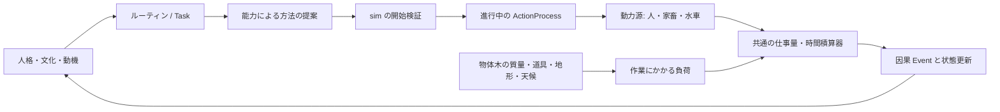

# 時間と負荷で進む行動（設計案）

状態: 2026-09-26のコード監査に基づく設計。実行器、セーブ形式、対照テストは未実装。まず独立 `local_food_v2`、次に90日世界へ適用する。

## 現行実装

`advanceLocalV2` は1分ごとに `phase` を呼び、毎分全人物の到着予定を走査する。移動では出発時に距離と積荷から全体力費・荷車摩耗を計算し、一括控除して到着時刻を固定する。荷積み・農作業・市場勤務・購入も個別の時刻でまとめて費用を払い、休息は終了時にまとめて回復する。配送帰路と買物係の出発には通常の `travel` と別の移動費計算がある。配送帰路は能力提案の `expectedEffort` を実支払に使っており、本人の見積りと世界の実費を分けていない。

したがって「イベントのたびに物理全体を再計算する」実装ではない。しかし分単位の走査と、物体取引時の世界全体の `structuredClone`・包含木の全量検査がある。規模拡大時の実測値はない。さらに出発後の雨、渋滞、賊、疲労による中断を、既払い費用と固定到着時刻のままでは正しく表せない。

## 共通の進行境界

人格・文化・ルーティンは「何をしたいか」、能力エージェントは方法と予想を提案する。実際に資産、時間、動力源の余力、物体の状態を確定するのは sim の共通実行器だけとする。**エネルギーの収支は動力を供給する実体だけに持たせる**。初期対象は人・馬・牛・水車の駆動系であり、荷車、食料、財布、道はエネルギーを支払わない。

`ActionProcess` は Event ではなく保存される進行状態。最低限 `id`、種類、実施者/道具/対象ID、現在地または経路区間、必要作業量と達成量、前回積算時刻、active/paused/completed/failed、起点Event IDを持つ。移動の単位は距離、荷役は重量か数量、農作業は作業量というように、種類ごとの単位を明示する。異なる単位を一つの数値に混ぜない。

各行動は `powerSourceIds`（実際に動力を出す人・家畜・機構）と `loadIds`（動かす対象・道具）を結ぶ。動力源は「この作業で単位時間に供給できる仕事量」と「その出力で減る自身の余力/燃料」を持つ。物体木の質量、移動距離、高低差、摩擦・ぬかるみ、道具の効率から、対象をどれだけ動かせるかを求める。荷車の摩耗は**動力消費ではなく**、車輪が実際に回った距離に従う結果である。作業率を道具の任意の体力値から生やさない。

水車では水の流れ・落差が供給源で、水車はその動力を伝える装置である。人や馬の疲労と同じ「水車体力」を減らさない。必要なら水量・貯水・流量を水系の正本に、軸や歯車の摩耗を装置の状態に持つ。川の水流を有限資源としてモデル化する段階までは「区間ごとの利用可能出力」という境界条件でよい。人・家畜の余力は食事/休息/飼葉で変わるが、回復は動力を使った結果ではないため別の生理・資源移転として扱う。

最初の「仕事量」と「余力」はゲーム内の固定単位であり、ジュールやカロリーへの厳密換算を主張しない。荷車が重すぎて動かない場合は、累積時間が長ければいつか動く扱いにせず、必要牽引力と動力源・道具の瞬間的な出力/牽引上限を先に検査する。動かせるときだけ出力×時間を積算する。水車を含め、供給の正本がどこかと、仕事率をどこで制限するかを混同しない。

すべてを一つの定数式にするのではなく、`WorkLaw.evaluate(action, powerSources, load, environment)` が「動力供給率・負荷に対する進行率・動力源の消費率」を返す。歩行、牽引、荷役、製粉にはそれぞれ必要な仕事量の定義が要る。ただし**動力を供給し、時間だけ仕事量を積算し、進んだ量で物体を変える手順**は一つにする。係数と修飾子は版付きコンテンツに置き、同じ効果を行動ごとに重複計算しない。社会行為をすべて物理式に還元せず、約束の成立や商品の所有権変更は明示的な完了条件と原子的取引で処理する。

条件が一定の区間だけ `Δ供給仕事量 = Σ動力源の仕事率 × Δt`、`Δ進捗 = 変換効率と負荷から求めた進行率 × Δt`、`Δ余力 = 動力源自身の消費率 × Δt` と積算する。摩耗は進んだ距離・回転数などの**結果量**から導く。供給できる仕事量、進捗、消費の関係は非負・上限付きとし、出力不足なら進まない。空転/停滞時に消費を続けるかは装置と作業の状態で明示し、停止した荷車の牽引費を無条件に払い続けない。次の境界は、予定された外部変化、作業完了、動力源/道具の限界、予約・場所・対象の変更の最も早い時刻。その時点まで進め、状態とEventを確定し、仕事率と次の境界を再計算する。行動していない全人物を毎分走査しない。時刻と資源は決定的な整数/固定小数点単位で保存し、端数と同時刻イベント順序を契約化する。

例: 人が21食を荷車に積むとき、21食と容器の質量から必要な荷役仕事量を得る。担当者の出せる仕事率と余力消費率で積める速さと限界時刻が決まり、積めた分だけ荷の親が荷車へ変わる。馬が荷車を引くときは、馬が動力源、荷車・人・21食が負荷、道路が抵抗条件。進んだ距離で馬の余力と車輪状態を更新する。御者が歩くなら本人の歩行も別の動力源として数え、乗車しているだけなら牽引力を二重計上しない。

## 道中と中断

移動の現在地は `from/to` と経路上の進捗を正本とする。食料は荷車の子、金は財布の子のまま、物体木から現在重量を読む。条件が変わるときは旧条件でその時点まで積算してから変更する。

| 入力 | 実行器の処理 |
| --- | --- |
| 雨 | 旧速度・旧消費率で現在時刻まで進め、道路条件を変え、新しい到着時刻を出す。 |
| 渋滞・封鎖 | 進行率を下げる/0にする。動力を止めた待機中は牽引労働を払わず、別に必要な生理的消費だけ扱う。解除時に再開する。 |
| 賊 | 現地点で `paused` にし、襲撃Eventから護衛/戦闘Taskを起動する。積荷と所有権は現所在地に残す。 |
| 動力源の余力枯渇・道具故障 | 到達可能な地点まで進めて停止し、到着/配達を発生させない。救援・交代・休息は別Taskとする。 |

雨や賊の時刻・位置もseed、Command、保存済みキューから再現する。遠方の人物の認識には報告が届くまで入れない。本人の見積りは後で追加できるが、実際の天候・費用を決めない。

荷積みは達成済み量だけを物体取引で確定し、残量をprocessに保持する。最初は明示的な小口/バッチ境界で動かし、毎瞬間ロットを分割しない。容量・予約・同所性は各バッチで検証し、積み込んだだけで所有権や売上を変えない。

## 計算負荷と移行

イベント駆動にしても、現在の `physicalTransaction` が毎回世界を複製して全木を検査すると大規模化は難しい。親→子索引と祖先方向の質量/数量集計を持ち、物体の追加・分割・移動・消費時に影響した枝だけ更新・検査する。完全な `checkPhysical` はセーブ検証/デバッグ監査に残す。雨Eventでは木集計を変更しない。局所化前後で保存則、所有権、容量の同じ対照テストを通す。性能改善は実測してから報告する。

1. 独立小fixtureに `ActionProcess`、`WorkLaw`、動力源、決定的イベントキュー、保存/再開を作る。人が荷を運ぶ、馬が荷車を牽く、重すぎて動かない、雨・停止・再開・枯渇・同時刻Eventを試す。水車は供給源と装置を分ける設計対照を置くが、E1に実装を要求しない。
2. E1の徒歩/荷車の三つの別実装を一つの移動processに移し、実際に動力を出す人物の余力と、進んだ距離による車輪摩耗を計上する。食料/通貨保存、3日売買、因果Event、保存再開を再検証する。旧体力値・ハッシュは暗黙の合格条件にしない。
3. 荷役・農作業・市場勤務・休息を共通進行と完了時効果へ移す。荷積み途中の中断と再開を試す。
4. 物体木を局所更新へ移し、旧 `checkPhysical` と対照する。20人・1,000人・30,000人の時間とメモリを別途測る。

本編90日世界・軍補給・伝令も最終的には同じ移動processを使う。先にE1で保存形式の版上げと対照試験を済ませ、既存M0〜M3受入を維持する。LLM・NNは物理実行器ではなく人格/能力の判断側に接続する。
