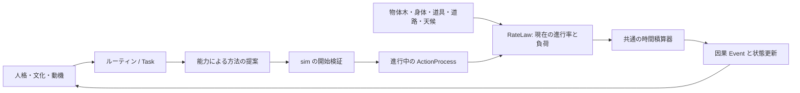

# 時間と負荷で進む行動（設計案）

状態: 2026-09-26のコード監査に基づく設計。実行器、セーブ形式、対照テストは未実装。まず独立 `local_food_v2`、次に90日世界へ適用する。

## 現行実装

`advanceLocalV2` は1分ごとに `phase` を呼び、毎分全人物の到着予定を走査する。移動では出発時に距離と積荷から全体力費・荷車摩耗を計算し、一括控除して到着時刻を固定する。荷積み・農作業・市場勤務・購入も個別の時刻でまとめて費用を払い、休息は終了時にまとめて回復する。配送帰路と買物係の出発には通常の `travel` と別の移動費計算がある。配送帰路は能力提案の `expectedEffort` を実支払に使っており、本人の見積りと世界の実費を分けていない。

したがって「イベントのたびに物理全体を再計算する」実装ではない。しかし分単位の走査と、物体取引時の世界全体の `structuredClone`・包含木の全量検査がある。規模拡大時の実測値はない。さらに出発後の雨、渋滞、賊、疲労による中断を、既払い費用と固定到着時刻のままでは正しく表せない。

## 共通の進行境界

人格・文化・ルーティンは「何をしたいか」、能力エージェントは方法と予想を提案する。実際に資産、時間、体力、摩耗を確定するのは sim の共通実行器だけとする。

`ActionProcess` は Event ではなく保存される進行状態。最低限 `id`、種類、実施者/道具/対象ID、現在地または経路区間、必要作業量と達成量、前回積算時刻、active/paused/completed/failed、起点Event IDを持つ。移動の単位は距離、荷役は重量か数量、農作業は作業量というように、種類ごとの単位を明示する。異なる単位を一つの数値に混ぜない。

`RateLaw.evaluate(process, truth, context)` は、現時点の **作業量/時間、人物ごとの体力消費/時間、道具ごとの摩耗/時間** を返す。休息なら回復率を返す。歩行・荷車・荷役で率の計算法は異なるが、外側の積算処理は一つにする。係数と修飾子は版付きコンテンツに置く。社会行為をすべて物理式に還元せず、約束の成立や商品の所有権変更は明示的な完了条件と原子的取引で処理する。

条件が一定の区間だけ `Δ作業量 = 作業率 × Δt`、`Δ体力 = 消費率 × Δt`、`Δ摩耗 = 摩耗率 × Δt` と積算する。次の境界は、予定された外部変化、作業完了、体力/道具の限界、予約・場所・対象の変更の最も早い時刻。その時点まで進め、状態とEventを確定し、率と次の境界を再計算する。行動していない全人物を毎分走査しない。時刻と資源は決定的な整数/固定小数点単位で保存し、端数と同時刻イベント順序を契約化する。

## 道中と中断

移動の現在地は `from/to` と経路上の進捗を正本とする。食料は荷車の子、金は財布の子のまま、物体木から現在重量を読む。条件が変わるときは旧条件でその時点まで積算してから変更する。

| 入力 | 実行器の処理 |
| --- | --- |
| 雨 | 旧速度・旧消費率で現在時刻まで進め、道路条件を変え、新しい到着時刻を出す。 |
| 渋滞・封鎖 | 進行率を下げる/0にする。待機中の基礎消費と移動労働を分け、解除時に再開する。 |
| 賊 | 現地点で `paused` にし、襲撃Eventから護衛/戦闘Taskを起動する。積荷と所有権は現所在地に残す。 |
| 体力枯渇・故障 | 到達可能な地点まで進めて停止し、到着/配達を発生させない。救援・交代・休息は別Taskとする。 |

雨や賊の時刻・位置もseed、Command、保存済みキューから再現する。遠方の人物の認識には報告が届くまで入れない。本人の見積りは後で追加できるが、実際の天候・費用を決めない。

荷積みは達成済み量だけを物体取引で確定し、残量をprocessに保持する。最初は明示的な小口/バッチ境界で動かし、毎瞬間ロットを分割しない。容量・予約・同所性は各バッチで検証し、積み込んだだけで所有権や売上を変えない。

## 計算負荷と移行

イベント駆動にしても、現在の `physicalTransaction` が毎回世界を複製して全木を検査すると大規模化は難しい。親→子索引と祖先方向の質量/数量集計を持ち、物体の追加・分割・移動・消費時に影響した枝だけ更新・検査する。完全な `checkPhysical` はセーブ検証/デバッグ監査に残す。雨Eventでは木集計を変更しない。局所化前後で保存則、所有権、容量の同じ対照テストを通す。性能改善は実測してから報告する。

1. 独立小fixtureに `ActionProcess`、`RateLaw`、決定的イベントキュー、保存/再開を作り、雨・停止・再開・枯渇・同時刻Eventを試す。
2. E1の徒歩/荷車の三つの別実装を一つの移動processに移し、経過した区間だけ体力と摩耗を払う。食料/通貨保存、3日売買、因果Event、保存再開を再検証する。旧体力値・ハッシュは暗黙の合格条件にしない。
3. 荷役・農作業・市場勤務・休息を共通進行と完了時効果へ移す。荷積み途中の中断と再開を試す。
4. 物体木を局所更新へ移し、旧 `checkPhysical` と対照する。20人・1,000人・30,000人の時間とメモリを別途測る。

本編90日世界・軍補給・伝令も最終的には同じ移動processを使う。先にE1で保存形式の版上げと対照試験を済ませ、既存M0〜M3受入を維持する。LLM・NNは物理実行器ではなく人格/能力の判断側に接続する。
