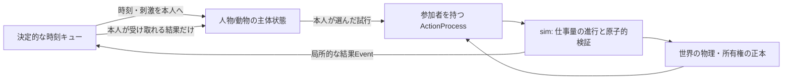

# 行動中の状態と本人主導の進行（現行監査と設計案）

状態: 2026-09-26のコード監査と次段階の設計。型・イベントキュー・各人の自律実行は**未実装**。関連する[人格境界](AGENT_INTERFACES_v2.md)、[日課ルーティン](DAILY_LIFE_ROUTINES.md)、[動力と行動](ACTION_PROCESS_DESIGN.md)を接続する。

## 現在の「開始から終了まで」

| 領域 | 保存されている中間状態 | 進めている主体 | 欠けているもの |
| --- | --- | --- | --- |
| E1 v2の移動 | 人物の `journey` に出発地/到着地、出発/固定到着時刻、輸送中の物理親、出発時に支払った総体力費 | `advanceLocalV2` が毎分 `phase`、全人物の到着予定を走査 | 道中の実進捗・残余仕事・途中体力変化・本人の判断/中断 |
| E1 v2の仕事 | `LocalTaskV2` に担当ID、予定開始/終了、accepted/completed/refused、原因Event。配送には別の `ShipmentV2` 状態 | `phase` の固定時刻分岐が農作業・荷役・販売・食事・休息を開始/完了 | 作業途中の状態、本人の次の判断時刻、部分完成。`offerTask` の承諾は欠勤/重複だけで即決 |
| 90日世界の人物移動/面談 | `Person.journey`、`Audience.status/arriveAt/finishAt`、`Message.arriveAt` | 共通の1分刻み `advance` が `arrivals` 等を呼び、外交/伝令コードが到着を処理 | 道中の位置/仕事量、各参加者の行動状態と途中の再判断 |
| 90日世界の軍 | 部隊の `destination/arriveAt/intent` と個人の軍籍・疲労 | 到着時刻と時間ごとの軍処理。移動開始時に疲労を加算 | 兵士や馬の個別動力・道中補給/危険への反応 |
| 90日世界の民間 | 人物の職業・空腹等と日ごとの `Activity` | `dailyEconomy` が適格な全員の生産/賃金/食事を確定 | 人物ごとの受諾・開始・中断・完了。`Activity` は主に日次結果の記録 |

現行の承諾や政策反応、敵君主の `OrdinaryPlanner` に局所的判断はある。しかし行動の継続制御は中央の時刻分岐にあり、「全員が自分の仕事を見て次の一歩を選ぶ」モデルではない。人物の `journey` とTaskは保存されるので、何も残していないわけでもない。ここを区別する。

## 次の所有境界

**世界に単一の真実と時計は必要だが、単一の意思決定者は要らない。** 時計/イベントキューは、いつ誰に局所的な刺激を届けるかと、同時刻の原子的操作の順序だけを管理する。人物・馬・牛のように動力と行動選択を持つ存在が、自身の行動状態と、本人に届いた刺激から次の行動を選ぶ。水車は動力装置だが意思を持たない。荷車は動力源でも意思主体でもない。



概念上、`ActorState` は主体ID、人格/習慣の持続状態、現在の意図と日課参照、`currentActionId`、`nextDecisionAt` を持つ。`ActionProcess` は参加者/動力源/道具/対象ID、種類、開始原因、進行量、最後に物理積算した時刻、`active/paused/completed/failed` を持つ。`currentActionId` は参照であり、進捗の正本は process に一つだけ。複数人の共同作業では、各人の受諾と現在行動を個別に持ち、共有Taskは依存関係と契約を表すだけにする。無人で回る水車のprocessには稼働開始の原因と使用権者があっても、架空の意思主体を割り当てない。

```ts
// 設計用の最小境界。現行APIではない。
type ActorState = {
  actorId: string;
  currentActionId?: string;
  intentionRef?: string;      // 本人の持続する目的/日課。物理進捗ではない
  nextDecisionAt?: number;
};
type ActionProcess = {
  id: string; kind: string; targetIds: string[];
  participantIds: string[]; powerSourceIds: string[];
  progress: number; lastIntegratedAt: number;
  status: "active" | "paused" | "completed" | "failed";
  causeEventId: string;
};
```

本人が起きる契機は、現在行動の完了/限界の予測時刻、本人への伝令、近くで観察できる危険、空腹/疲労などの身体閾値、ルーティンの次の時間窓である。`nextDecisionAt` は本人の判断を再実行する時刻であり、道中の進捗を毎分更新する時刻ではない。特別な入力がなければ単純なルールで次の一歩を選べる。異常・競合では同じ人格境界をより高度なモデルで実装できるが、世界が本人の代わりに仕事を決めない。

本人の持続する意図が「市場まで運ぶ」なら、数分ごとに移動を選び直す必要はない。進行中は物理だけを進め、完了・障害・新しい刺激で[人格境界v2](AGENT_INTERFACES_v2.md)を起こし、同じ意図の続行・中断・別方法を提案させる。人物に届く刺激と現在の主観状態を入力にし、結果は型付きの開始/続行/停止の試行としてsimへ渡す。Rule/NN/LLM/人間をここで別々の「世界運営者」にせず、同じ人格契約の実装方法とする。

`ActionProcess` の仕事量・体力・物体変化はsimが真の状態から確定する。本人の行動選択や予想は本人の認識だけを使う。たとえば運搬人は「荷を積む→出発」を自分のTaskとして選び、21食の重量を調べる/推定する。simは真の積荷と本人・道具の出力を検査する。途中で雨が降れば現在時点まで物理を積算し、運搬人が雨を感じる位置なら刺激を渡す。本人は続行・待機・引き返しを選び直せる。遠方の君主が雨をまだ知らなくても、その物理影響は起こる。

馬/牛も主体にできるが、人間の人格と同じ語彙を強制しない。命令や手綱は刺激、馴化した行動は単純な規則、恐怖・疲労は自分の状態とする。御者が命じても動物が動けない/拒むことがある。水車は自発的な判断を持たず、設置者や水門操作と水流の条件で動く。**動力を持つことと意思を持つことは独立した属性**である。

## 中央の仕事を減らす移行順

1. E1の `journey` とTaskを監査用の基準に保ちつつ、1人の「本人状態→ActionProcess→結果→次の判断」小fixtureを作る。出発・雨・停止・再開・到着で、本人が選ばなかった進路変更を中央が勝手に行わないことを試す。
2. `phase` の移動開始/到着を本人ごとの起床Eventと共通物理実行器へ移す。承諾・辞退・再計画は `ActorState` の判断を通し、同じ3日資産保存/因果Event/保存再開を維持する。
3. 荷役・農作業・食事・休息の日課を本人ごとに起動する。共有Routine/Taskは役割依存を調整するが、各担当者の判断を代行しない。
4. 90日世界の伝令・面談・軍を同じ境界に移す。`dailyEconomy` の中央生産を最後まで残したまま「全員自律」と報告しない。1,000人以上でイベント数、保存量、実行時間を計測する。

受入では、同一seed/Command/保存状態の再現、誰がいつ判断したかの原因Event、本人に届かない情報の遮断、動力源の余力・物資・所有権の保存、途中で人が欠けた際の部分完了を確認する。性能は未計測。
