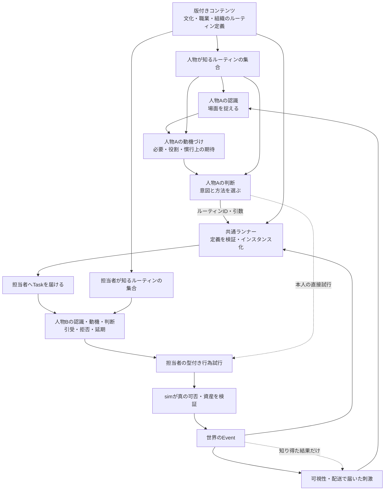

# 人格の認知・行動インターフェース v2（設計案）

状態: 文書設計。現行ゲームへの実装・保存形式の移行は未着手。v1 は設計履歴であり、v2 と互換ではない。本人と世界を接続する外側の契約は[自律行動の外側のインターフェース](AUTONOMY_INTERFACE_CONTRACT.md)で定める。

## 何をインターフェースにするか

**認識、動機づけ、判断、行為の試行、結果の受け取り**を、意味の異なるブロックとして分ける。Rule・NN・LLM・人間はこれらのインターフェースの実装方法であり、インターフェース名でも固定の担当工程でもない。一つのブロックを複数の方法で実装してよく、一つの実装が複数ブロックを一体で処理してもよい。ただし、ブロック間で交換する情報の意味、本人が知り得る範囲、因果 ID は守る。

**人格インターフェースは「誰がどう捉え、何を選ぶか」の契約、ルーティンデータは「その場面をどう進めるか」の共有定義、ランナーは「選ばれた手順の仕事を実在の人へ渡し、進捗を追う」仕組み**である。これらは競合する別システムではない。図の矢印は情報と仕事の受渡しであり、全人物が毎回全ブロックを順番に実行するという命令ではない。習慣的な行動では人格のルール実装が既定のルーティンをすぐ選べるし、例外時には再判断できる。



人物ごとに固有 ID と持続する人格状態を持つ。文化、経験、信用、習慣、役割に関する**本人の知識**が認識と動機を左右する。役職や居場所など世界が管理する値も、本人へ渡すときはその人物にアクセス可能な投影にする。文化は「行動の得点係数」だけではなく、出来事の分類、原因の帰属、言葉の意味、義務の認定にも作用する。たとえば同じ徴税の報を、共同体の負担分担、君主による搾取、約束違反のどれと捉えるかが変わり、その後の動機と行動も変わる。

複雑な職務では、本人の人格がTaskを引き受けた後、同じ人物に結びつく[能力エージェント](CAPABILITY_AGENTS_DESIGN.md)が専門的な実行案を作る。運び屋の配車や積載がその例である。能力エージェントは別人格・別人物ではなく、本人の知識・熟練・委任範囲を使う下位の判断境界である。馬車などの物が持つ容量・牽引等の能力は供用可能性として計画に入り、物に自動的な人格を与えない。提案後の世界効果は引き続きsimのみが確定する。

文化にはさらに、訪問・伝令・護衛・弔い・職務などの場面で、誰が何をどう準備するかという**社会的慣行**を含める。高位者の訪問時に護衛を手配するのは、その都度危険を最適化して発明する行動ではなく、場面に応じて起動する既定の方法である。慣行は認識に場面の意味を与え、動機に役割上の期待を与え、意図を複数人のTaskへ展開する。[慣行の境界と訪問の因果例](SOCIAL_PRACTICES.md)を参照。

多くの行動も同様に、場面からルーティンを起動し、仕事を配置し、Eventに応じて次の手順へ進める。職業・文化・組織ごとの違いは、可能な限り版付き[ルーティンデータ](DATA_DRIVEN_ROUTINES.md)として追加できるようにする。データが任意の世界効果を実行するのではなく、既知の行為プリミティブをsimが検証する。

訪問のような対人行動だけでなく、食事・排泄・仕事・睡眠にも同じ関係を用いる。[日常生活ルーティン](DAILY_LIFE_ROUTINES.md)は時刻や身体信号から自分のTaskを起動する例で、依頼人と担当者が同じ人物でよい。本人が感じる空腹・疲労などは認識の入力、生活の習慣は既知ルーティン、実際に食料が減る/眠れることはsimの結果に属する。

### 一つの訪問を両方の仕組みで追う

| 時点 | 人格インターフェース | ルーティンデータとランナー |
| --- | --- | --- |
| 君主が訪問を考える | 届いた依頼と文化・立場から「公式訪問」の場面を認識し、訪問する意図と既知の方法を選ぶ | コンテンツは公式訪問の適用条件、護衛・書記・伝令の役割、手順を定義する。データ自体は判断しない |
| 君主が方法を起動する | 選んだルーティンID・対象・根拠を提案する | ランナーが定義を検証し、訪問インスタンスと人物別Taskを作る。人がまだ動いたとは記録しない |
| 家臣・書記・伝令・護衛が仕事を受ける | **各担当者が別々に**届いたTaskを認識し、職務や利害から引受・拒否・延期を決める | ランナーはTaskの順序・期限・代役の分岐を追う。人物の選択を代行しない |
| 実際に移動・面談する | 担当者が行為を試み、知り得た結果を後で受け取る | simが位置・時間・資産・接触を検証してEventを作り、ランナーが進捗を更新する |

慣行を選ぶ判断と、慣行を実行する手順は別である。通常の護衛手配はルーティンの既定手順なので君主が毎回危険を予測する必要はないが、護衛が不足した場合の単独訪問・延期は新しい判断になる。相手は自分の文化から「護衛付きの訪問」を別の意味に解釈してよい。ルーティンの進行状態は世界側の協調情報であり、本人には届いたTaskと知り得た進捗だけを渡す。

## ブロックの入力と出力

| ブロック | 入力 | 出力 | 境界が保証するもの |
| --- | --- | --- | --- |
| 到達・可視性 | 世界 Event、位置、伝令・会話の配送 | `ReceivedStimulus[]` | 本人に届いた内容・時刻・原因だけ。隠された真実を渡さない |
| 認識 | 刺激、文化の解釈枠、既存の主観記憶、本人が知る状況、身体信号 | `PerceptionResult` | 「観察内容」と「本人による解釈」を分け、根拠と不確実性を残す |
| 動機づけ | 主観的認識、文化規範、本人の必要、仕事・対人約束・長期意図 | `MotivationResult` | 仕事と対人約束を混同せず、衝突する動機を表現できる |
| 判断 | 主観的認識、動機、既存意図、知っているルーティンと行動語彙、判断時刻 | `DecisionDraft` | 探索・予測の有無を決めず、型付きのルーティン起動・意図・行為試行・延期を返す |
| ルーティン起動・進行 | 人物が選んだルーティンIDと引数、版付き定義、担当者のEvent | `RoutineInstance`、人物別Task | 定義を検証して仕事を配置・追跡する。人物の承諾や世界効果を代行しない |
| 実行と結果 | 型付き試行、世界の真実、権限・時間・所有権 | `Event[]` と後続刺激 | sim だけが実行可否・資産・人口を更新し、結果が届くまで人物には知らせない |

これはデータの契約であり、`PerceptionPort` にルール、`MotivationPort` に NN、`DeliberationPort` に LLM を割り当てる図ではない。実装の組合せや内部の細分化は人格モデルの構成として版管理する。各ブロックは同一人物の人格状態を読み書きし、別人格として独立させない。

```ts
type ReceivedStimulus = {
  id: Id;
  kind: "observation" | "communication" | "somatic" | "known_outcome";
  schemaId: string;
  occurredAt: SimTime;
  receivedAt: SimTime;
  sourcePersonId?: PersonId;
  causeEventIds: EventId[];
  payload: JsonValue; // 届いた内容。真実と同義ではない
};

type SituatedContext = {
  at: SimTime;
  knownPlace?: PlaceRef;
  knownRoles: RoleRef[];
  knownRelations: RelationRef[];
  activeTasks: TaskRef[];
  knownCommitments: CommitmentRef[];
  sourceRefs: Id[];
};

type CulturalFrame = {
  id: Id;
  version: string;
  knownConcepts: ConceptRef[];
  knownNorms: NormRef[];
  // 概念・規範の内容は版付きカタログ/本人の学習状態から解決する。
};

type KnownRoutineRepertoire = {
  contentVersion: string;
  routineRefs: { id: Id; version: string }[]; // 文化・職業・組織・経験から本人が知る定義
};

type SituationFrame = {
  id: Id;
  kind: string;            // 例: 公式訪問の依頼
  evidenceRefs: Id[];
};

type PerceptionInput = {
  personId: PersonId;
  stimuli: ReceivedStimulus[];
  culture: CulturalFrame;
  knownRoutines: KnownRoutineRepertoire;
  context: SituatedContext;
  priorSubjectiveState: SubjectiveStateRef;
};

type InterpretedClaim = {
  id: Id;
  proposition: TypedProposition;
  stance: "accept" | "suspect" | "reject" | "uncertain";
  evidenceStimulusIds: Id[];
  // 信頼度・重要度・原因帰属などは必要な場合のみ版付き拡張に置く。
};

type PerceptionResult = {
  personId: PersonId;
  receivedStimuli: ReceivedStimulus[]; // 届いた内容を、解釈が空でも次の判断まで保持
  interpretations: InterpretedClaim[];
  situations: SituationFrame[]; // この人物が認識した場面。空でもよい
  subjectiveStateUpdate?: VersionedStateUpdate;
  acknowledgedStimulusIds: Id[]; // 受信処理済み。真実と認定した意味ではない
};
```

`ReceivedStimulus` は世界そのものではなく、見聞きした断片、届いた手紙、感じた空腹、知った結果である。手紙の本文が虚偽でも配送された事実は残る。`SituatedContext` の関係や仕事も「本人が知る状況」であって、内部台帳の全内容ではない。認識は刺激を単純に写す関数ではない。同じ刺激でも文化、現在の役割、空腹、相手との関係、過去の裏切りによって、注目する点や意味づけが変わる。`InterpretedClaim` は本人の主張であり、世界の真実へ書き戻さない。

残る二つの契約は、内部アルゴリズムを固定しない最小形にする。

```ts
type MotivationInput = {
  personId: PersonId;
  perception: PerceptionResult;
  subjectiveState: SubjectiveStateRef;
  culture: CulturalFrame;
  knownRoutines: KnownRoutineRepertoire;
  context: SituatedContext;
};
type MotivationResult = {
  personId: PersonId;
  pressures: MotivationalPressure[]; // 必要・仕事・約束・意図などを併存させる
  subjectiveStateUpdate?: VersionedStateUpdate;
  causeRefs: Id[];
};
type DeliberationInput = {
  personId: PersonId;
  perception: PerceptionResult; // 未解釈の受信内容も含む
  motivations: MotivationResult;
  subjectiveState: SubjectiveStateRef;
  context: SituatedContext;
  knownRoutines: KnownRoutineRepertoire;
  actionVocabularyVersion: string;
  window: DecisionWindow;
};
type DecisionDraft = {
  proposals: (TypedIntention | TypedRoutineInvocation | TypedPlan | TypedActionAttempt)[];
  wait?: TypedDefer; // 提案0件なら必須。再起床条件を持つ
  subjectiveStateUpdate?: VersionedStateUpdate;
  evidenceRefs: Id[];
  diagnostics?: { schemaId: string; payload: JsonValue };
};

type TypedRoutineInvocation = {
  kind: "invoke_routine";
  routineRef: { id: Id; version: string };
  targetRefs: Id[];
  args: JsonValue;           // 定義スキーマで検証する
  evidenceRefs: Id[];
};

interface PerceptionPort {
  perceive(input: PerceptionInput): PerceptionResult;
}
interface MotivationPort {
  motivate(input: MotivationInput): MotivationResult;
}
interface DeliberationPort {
  deliberate(input: DeliberationInput): DecisionDraft;
}
```

`MotivationalPressure` は互いに比較可能な単一スコアを要求しない。期限、対象、由来、対人義務か自分の必要かなどを型で識別する。`DeliberationInput` の行動語彙は**行為の文法**であって、真の実行可能候補一覧ではない。判断ブロックが予測を使う場合、その予測は本人の期待として主観状態に置き、真実の可否と混ぜない。予測器、候補生成器、固定段階順序は共通契約に含めない。

`KnownRoutineRepertoire` は本人が知る定義への参照で、全コンテンツを全員へ公開する意味ではない。人格の認識・動機・判断はいずれも参照できる。`TypedRoutineInvocation` は定義ID/版、対象、引数、根拠を持つ提案で、ランナーが型と利用権を検証してからインスタンスを作る。ランナー内部のTask進捗や別人物の秘密は人格入力に混ぜない。

認識できない刺激でも`receivedStimuli`は判断まで保持し、受信確認と事実認定を分ける。`proposals`は上限付きの順序ある試行群で、個別の可否を受け取る。物理的な複数作業を同時に実行してよい意味ではない。`wait`の起床契約、試行と結果の確定は[外側の契約](AUTONOMY_INTERFACE_CONTRACT.md)に置く。[仮接続調査](INTERFACE_DRY_RUN.md)の指摘を反映した設計修正であり、コードへの適用はまだない。

これらの `Port` は「何を受けて何を返すか」の契約であり、実装クラスの数を指定しない。ひとつの実装が三つとも満たせる。各 `subjectiveStateUpdate` は人格 ID・基準改訂・原因参照を持つ共通の版付き変更として判断中に順に組み立て、後続ブロックには更新後の本人の状態を渡す。永続化は草案の採用時にまとめて行い、途中の未採用結果を確定しない。再評価する場合も改訂と原因を残す。

## 人格、組合せ、再現性

`PersonalityState` は人物 ID、人格 ID、改訂番号、文化・価値傾向、版付き主観状態を保存する。認識・動機づけ・判断の実装はこの**同じ人格**を構成する。各ブロックを別プロセスに置いても、共有重みを多数の人物に使っても、人物固有の経験・信用・意図は混ぜない。複数ブロックを一体で計算する実装でも、届いた刺激・採用した提案・主観状態の変更は同じ意味で記録する。認識や動機の中間診断は実装が意味のある値を出せる場合のみ記録し、架空の解釈・スコアを強制しない。

Gateway は人物・人格 ID、版、時刻、根拠参照、提案型、状態変更を検証し、**採用した草案とその時点の主観更新**を原子的に記録する。sim は各行為試行を別に判定し、原因でつながる Event を作る。拒否や後の失敗を「最初から聞かなかった」ことにせず、成功した記憶は本人へ結果が届いた後にのみ作る。伝令、面談、呼び出し、仕事、約束の履行、戦闘は担当人物の実際の行為を必要とする。デバッグ表示では全人物の「届いた刺激→解釈→動機→提案→実行 Event→後で知った結果」を ID でたどれるようにする。ただし秘密や誤認もデバッグ上で区別する。

決定的な実装は seed、Command、保存済み人格状態、入力、実装版から再現する。非決定的または外部の実装は、採用済み各ブロックの出力・状態変更と DecisionResponse をログへ保存し、再生時に呼び直さない。実装変更には状態移行と版更新が必要である。

## 検証と移行

1. 現行の文化・価値・信用・記憶を二重台帳にせず人物の人格状態へ対応付ける。
2. 現行ルール AI を各ブロックの最初の実装として包む。全員の日課、書記・伝令・面談、政策反応、約束、戦闘を同じ境界で通す。
3. 同じ税の通知を、異なる文化・関係・仕事・記憶を持つ人物へ渡し、認識の分類・意味づけが変わり、動機と行動にも差が出ることを検証する。同じ文化でも状況だけを変える対照例を作る。
4. 本人へ届かない事実を認識できないこと、虚偽の伝達を事実として確定しないこと、全人物の因果追跡、資産保存則、保存再開・再実行、通常 AI の90日シナリオを回帰検証する。新設計の性能は未計測。

BDI の信念・願望・意図と Generative Agents の記憶・反省・計画は、各ブロックの中身を考える**研究上の参考**であり、共通インターフェースそのものではない。参考: [Rao & Georgeff, BDI Agents (1995)](https://cdn.aaai.org/ICMAS/1995/ICMAS95-042.pdf)、[Park et al., Generative Agents (2023)](https://arxiv.org/abs/2304.03442)。
