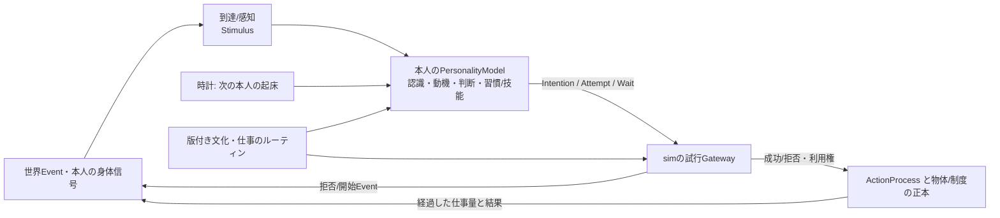

# 自律行動の外側のインターフェース

状態: 2026-09-26の**実装前の設計契約**。既存の[人格v2](AGENT_INTERFACES_v2.md)の外側を明確にする。新しいコードAPI・セーブ形式・受入テストはまだ存在しない。最初は20人の経済に使うが、職業、文化、動物、資源や判断実装の種類をここへ列挙しない。

## 結論

人格v2の「到達→認識→動機→判断→試行→結果」は正しい**意味の分割**なので維持する。ただしv2単体は「仕事の競合・待機・資産の実移動」を定義しない。これらを人格型へ足すのではなく、**届く刺激、主体の応答、世界での試行、進行と結果**という四つの境界で接続する。Rule/NN/LLM/人間は本人の同じモデル境界を実装する方法であり、四つの境界の別種ではない。



時計は誰を起こすか、同時刻の処理順、世界の変更を管理する。**次に何をしようとするかは本人のモデルが返す。** 共同Taskのランナーは依存関係と担当候補を追い、依頼を届けるが、担当者の承諾や行動を決めない。`ActionProcess` は実際に進行中の仕事を一度だけ保存し、物理変化はsimが確定する。人格が持つ意図はこれと別で、実際の進捗や資産を勝手に変更しない。

## 最小のデータ契約（擬似型）

```ts
type Stimulus = {
  id: Id; recipientId: ActorId; occurredAt: Time; receivedAt: Time;
  kind: string; content: TypedContent; causeEventIds: EventId[];
  // 現地観察・身体信号・伝達それぞれの到達根拠を記録する。
};

type ActorInput = {
  actorId: ActorId; at: Time;
  stimuli: Stimulus[];                  // 本人に届いた内容。未解釈でも失わない
  subjectiveState: SubjectiveStateRef; // 本人の記憶・文化・意図の正本
  knownContext: KnownContext;          // 既知の場所・仕事・権限。真のWorldではない
  currentAction?: ActionRef;
  knownRoutines: RoutineRef[];
};

type ActorResponse = {
  subjectiveUpdate?: StateChange;      // 「決めた/聞いた」と「成功した」を混同しない
  intentionUpdate?: IntentionChange;
  attempts: TypedActionAttempt[];      // 0件でもよい。各試行に本人/根拠/順番
  wait: WakeSpec;                       // 次の時刻または届く刺激の種類。真実への購読ではない
};

type ActionOutcome = {
  attemptId: Id; status: "rejected" | "started" | "progressed" | "paused" | "completed" | "failed" | "cancelled";
  processId?: Id; eventIds: EventId[]; reason?: TypedReason;
};
```

`ActorInput → ActorResponse` は持続する**本人**の判断契約で、人格v2の認識・動機・判断と本人の能力提案は内側で一体でも分離でもよい。解釈/動機の中間診断は出せる方式だけが記録し、架空の値を強制しない。上限付きの複数試行を順序付きで受け、個別に可否を返す。複数の物理労働を同時に開始してはいけないが、仕事の依頼と待機中の意図は並存できる。外部のプレイヤーCommandも、誰の権限による試行かを付けて同じGatewayへ合流させる。

`ActorResponse`の採用時に、受信確認・決めた意図・その時点の主観更新を改訂番号と原因ID付きで確定する。世界での試行結果と進捗は別の確定点であり、採用済みの判断を後から消さない。拒否や失敗を知る刺激が本人へ届いた後で初めて、本人はその結果を記憶・再判断する。保存再開と再実行ではこの順序を保ち、同じ時刻の試行順・上限・起床順を決定的にする。

`Stimulus` は世界Eventそのものではない。対象の近くにいて感知したか、会話/手紙が届いたか、身体が感じたかで内容を作る。`occurredAt` と `receivedAt` を区別し、未到達の注文や遠方の在庫をモデルへ渡さない。配送された刺激は人格が解釈できなくても受信済みとして保持する。重複配送を同じIDで二度解釈/行動しない。

`WakeSpec` は将来の時刻、本人へ届く刺激の種類、期限を指定できる。資源が空いたことは権限を持つ待機者へのEvent/刺激として届ける。モデルが世界の隠れた値を直接監視する条件式は受け付けない。待機が期限切れなら本人を起こし、本人に延期/別仕事を選ばせる。即時失敗→同時刻の無限再試行は抑止し、キューが空なのに未完の仕事が残る場合は診断Eventを作るだけで代行しない。

## 世界側の一つの試行境界

Gatewayは型付き試行を真の位置・権限・資産・時間・動力と照合して受理/拒否する。受理した物理行動だけが[進行中のActionProcess](ACTION_PROCESS_DESIGN.md)を作る。作業の進み、部分完了、事故での停止、体力と道具状態、所有権や現金の移動を同じ世界の正本で確定する。受理は完了を意味しない。Gatewayの同期応答は世界Eventであり、本人が結果を知るのは感知・通知されたときだけ。

利用権もこの境界の一種である。`Claim` は対象ID、数量/枠、権限者、占有者、期限、原因を持つ。畑枠、荷車、積荷ロット、市場の現金に同じ取得/解放の意味を適用する。取得は原子的で、容量超過・他者の占有は理由付きで拒否する。完了、取消し、期限切れ、担当者不在では規則に従い解放する。同時刻の衝突順は決定的にするが、毎日同じIDが優先される制度的偏りは別の公開された輪番/待ち順で調整できる。人格が見積もる空きとsimの実際の空きは別である。

通常の仕事の依頼は、型付き`TaskOffer`を相手へ届ける刺激である。相手は同じ`ActorResponse`で承諾/拒否/延期を試みる。受諾後のTask記録は依存関係・契約・期限の正本だが、その人が毎時実際に働いた証拠ではない。人を追加する職業ごとに新しい人格インターフェースは作らない。

賃金や売上分配はTask/契約から発生する**権利・債務**と、現金が実際に移る**物体行為**を分ける。市場から家への現金は、人の財布などに入れて運ぶ。権利があっても遠隔の金庫に通貨は出現しない。保守は担当者の仕事量、道具の状態、必要な現物を入力とする通常の行為で、労働だけで回復できる状態の範囲をその道具の世界法則に置く。`WagePort` や `RepairPort` を人格へ追加しない。

## 五要件への対応

| 要件 | 受ける境界 | 最小対照 |
| --- | --- | --- |
| 誰がいつ知るか | `Stimulus` と `ActorInput` | 農場の収量を、未訪問の運搬人は知らない。届いた依頼は空の認識実装でも失われない。 |
| 同時利用・予約解放 | Gateway の `Claim` と `ActionOutcome` | 1台の荷車を2人が要求しても二重占有せず、失敗/中断/期限で解放する。 |
| 待機・再起床 | `ActorResponse.wait` と時刻キュー | 依頼不達・資源待ちの人が期限に再判断し、無限再試行や永久待機がない。 |
| 仕事の依頼と現金の帰路 | `TaskOffer`刺激、本人の返答、物体移転の試行 | 売り手が運搬人へ依頼し、会計担当から世帯へ現金が実在人物と共に届く。 |
| 保守の資源境界 | `ActionProcess` と物体/道具の世界法則 | 担当者がいなければ直らず、部品が必要な破損は現物なしで回復しない。 |

この五要件は全て同じ四境界と既存の物体/ルーティン正本で扱える。ただし「同じインターフェースで表せる」と「現在のコードが受入済み」は別である。実装では小fixtureでこの五対照、本人状態と世界結果の因果性、seed/Command/保存再開を先に試す。
