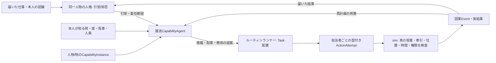

# 能力エージェントと仕事・道具の市場

状態: 2026-09-26にL0の運送ルール提案とsim側の実力検査・二台馬車の積載出発を`packages/sim/transport-capability.ts`へ実装し、独立試験で検証した。既存の[人格境界v2](AGENT_INTERFACES_v2.md)、[ルーティン](DATA_DRIVEN_ROUTINES.md)、[物体・包含モデル](PHYSICAL_OBJECT_MODEL.md)を接続する全体設計である。E1人物への能力インスタンス接続、技能市場、コンテンツ/保存形式の移行は未実装。

## 能力を第一級の対象にする

「運び屋」は職名だけではない。荷の種類と数量、複数の馬車、荷台容量、車体の重さ、馬の牽引力、道の勾配、積み下ろしに使う人と時間を見て、実行可能な便を組む**能力**である。定例の仕事はルーティンにできるが、ルーティンが「どの車に何を積むか」を魔法のように確定しない。担当人物が持つ運送技能の実装が、本人に見えている情報から計画を提案する。初版は決定的なルールでよい。後からNN/LLM/人間による同じ契約の実装へ替えられる。

四つの意味を分ける。

| 概念 | 担い手と意味 | 例 |
| --- | --- | --- |
| `CapabilityInstance` | 人または物に結びつく能力の実体。定義ID/版、熟練度や状態、使用条件を参照 | 運送人の積載技能、馬車の荷台、馬の牽引能力 |
| `CapabilityPort` | 人/物の能力を同じ仕事から照会する契約。評価と制約を返し、世界を変更しない | 馬車は荷台容量、馬は今回の道の牽引限界を返す |
| `CapabilityAgent` | `CapabilityPort`のうち、人の人格の一部として、受けた仕事をどう遂行するか提案・再計画するもの。独立した新人物ではない | 運送人が馬車A/Bへの割当と出発順を考える |
| `ActionPrimitive` | simが型付き試行として検証し、真の世界を変更する操作 | ロット分割、積載、馬車の出発、受領 |

前のルーティン文書で`Capability`と呼んでいた`deliver`/`travel`/`transfer`等は、実際には主に`ActionPrimitive`である。新しいルーティン定義では`requiresCapability`（誰/何の能力が必要か）と`action`（何をsimへ試みるか）を別の欄にする。E1コンテンツの`routines[].capability`は現行の固定語彙として残し、移行時に意味を変えず明示変換する。

物が持つ能力は通常、**供用可能性**であって意思ではない。馬車の能力モジュールも同じ`CapabilityPort`に答えるが、容量・車輪の状態・利用権を評価するだけで、荷積みを自分で決断しない。人が持つ技能エージェントは、依頼を引き受けた本人の人格・経験・文化・疲労と同じ主体に属する。本人の「引受/拒否/延期」と、引受後の専門的な計画は異なる判断だが、権限と責任は同じ人物IDに残す。自律的な機械や動物の判断を後から入れるなら、その物に固有の状態と意思決定契約を追加し、ただの荷台能力から暗黙に人格を生成しない。



能力エージェントと`CapabilityPort.assess`の入力は世界の真実ではない。本人が数えた荷、聞いた道路情報、雇用者が提示した道具、過去の失敗、主観的な費用見積りを受ける。馬車の真の破損を知らなければ、能力照会から秘密が漏れない。simは積載時・出発時・道中・受領時に真の状態を再検証する。計画が誤れば、担当者IDと原因Eventを伴う失敗/部分完了になり、本人が知った時だけ再計画できる。

## 最小のインターフェース

```ts
type CapabilityInstance = {
  id: string; definitionId: string; version: number; bearerId: string;
  // 熟練・状態・資格・使用権は定義に対応する型付き状態から解決する
};
type CapabilityRequest = {
  taskId: string; principalPersonId: string; capabilityId: string;
  goal: TypedGoal; deadline: number; authorityRef: string;
  causeEventIds: string[];
};
type CapabilityContext = {
  perceivedObjectRefs: string[]; knownRouteRefs: string[];
  knownWorkers: string[]; knownTools: string[];
  subjectiveStateRef: string; evidenceRefs: string[];
};
type CapabilityAssessment = {
  estimatedUsable: boolean; estimatedLimits: TypedConstraintEstimate[];
  uncertainty: TypedUncertainty[]; evidenceRefs: string[];
};
type CapabilityProposal = {
  bindings: { role: string; bearerId: string }[];
  steps: TypedActionAttempt[]; expectedCost: ResourceEstimate;
  expectedFinishAt: number; uncertainty: TypedUncertainty[];
  evidenceRefs: string[]; fallback?: TypedPlanRef;
};
interface CapabilityPort {
  assess(request: CapabilityRequest, context: CapabilityContext): CapabilityAssessment;
}
interface CapabilityAgent extends CapabilityPort {
  propose(request: CapabilityRequest, context: CapabilityContext): CapabilityProposal[];
  revise(request: CapabilityRequest, context: CapabilityContext, outcomeRefs: string[]): CapabilityProposal[];
}
```

これは意味の境界であり、人格と別のプロセスを必須にしない。人格モデルが専門能力まで一体で提案しても、上記の仕事ID・本人ID・根拠・計画・結果は同じ意味で取り出せるようにする。Rule/NN/LLM/人間は能力エージェントの実装方式で、能力定義や`ActionPrimitive`の別名ではない。複数案を返しても、本人の人格が委任した範囲を超える契約・賃金・危険を勝手に引き受けない。超える案は本人の再判断と新たな承諾を要する。

`CapabilityInstance`は全人物/物体に共通のID参照だけを保存する。熟練度、資格、馬車の耐久などは各能力定義に対応する型付き状態で保存し、何でも入るパラメータ辞書にしない。技能の習得・劣化には実際の仕事、訓練、負傷、修繕などの原因Eventを付ける。共有モデルの重みと個人の経験/技能状態を分け、保存・再生に必要な採用済み提案と状態改訂を記録する。

## 二台の馬車を積んで運ぶ例

食料150負荷点を運ぶ。馬車A/Bの荷台上限は各100、車体重量は各30。割り当て可能な馬X/Yは、今回の経路でそれぞれ総牽引重量120までとする。各馬車に馬1頭と実在する御者1人が必要で、積載作業には荷役人と時間が要る。この便で各車が実際に運べる食料は`min(荷台上限100, 牽引上限120 - 車体30) = 90`。運送人はAへ90、Bへ60を提案できる。荷台上限だけを足した200を輸送可能量として扱わない。馬が1頭しかいなければ、同時に動かせる馬車は1台で、150を一便に積んで出せない。

道がぬかるんで馬の経路別総牽引上限が各100へ下がれば、1台の上限は70、二台でも140であり、150を一便で出せない。これは馬車の荷台上限が変わらなくても結果が変わる対照である。荷役人がいなければ計画を作れても荷積みTaskは進まず、食料は出発地に残る。

運送技能のルール実装は、候補車両・馬・御者・荷役人と本人の既知の道を安定ID順に探索し、積載の提案と作業時間、運賃・飼葉・体力の見積りを返せる。文化や習慣は「護衛なしで街道に出ない」「荷主の封印を解かない」等の既定方法にも作用する。本人の期待が誤っていれば出発時にsimが止める。荷台、車体、馬の能力、道路条件、人物の時間枠、積荷の物理的親子関係はそれぞれ唯一の正本から検証し、失敗で食料を複製/消失させない。

この例の`maxTow`は経路条件に依存する馬の能力、荷台上限は馬車という物の能力で、どちらも[物体モデル](PHYSICAL_OBJECT_MODEL.md)の重量集計を使う。積載計画の比較や代役探しは能力エージェント、実際の積載・移動・消費はsim、荷役と御者の配置はルーティンTaskである。

## 技能・人材・道具の市場

仕事の依頼者は「必要な能力ID・数量/品質の最低条件・場所・時間・報酬上限」を提示できる。人は就労可能な時間、技能、希望賃金、過去の履行、所属や文化に基づく条件から引受/交渉/拒否する。馬車の所有者は車両の利用権を貸し出せるが、馬車を借りることと御者の労働を買うことは別契約である。能力があるだけで市場へ自動出品されず、本人または正当な代理人のOfferと受諾が必要。

市場が照合する能力は、依頼者に**知られた資格・評判・価格**と公開された空き時間であり、隠れた真の熟練度ではない。受諾後に実際の時間枠と道具使用権を予約し、働いた結果に応じて実在する現金から賃金・運賃を払う。不足なら未払債務や契約違反を記録し、架空の現金を作らない。技術の希少性、熟練による効率、信頼、移動費が採用・報酬・交渉へ影響する。人物そのものを売買可能な物体にはしない。

## 段階的な検証

1. 物体L0の容量/重量契約に、馬車の荷台上限と馬の経路別牽引上限を別々に加える。二台・150負荷点の基準と、一頭だけ/道路悪化/荷役人欠勤を対照にする。
2. E1内部移行時に、運搬人Cへ最小の`carry_food`能力インスタンスと決定的なルール実装を結ぶ。既存3日結果、因果Event、保存/再生を維持する。人格v2全体の実装がなくても、引受の固定ルールと能力の提案境界を混同しない。
3. E2で複数の労働者・道具のOffer、契約、賃金と技能差の受入fixtureを作る。市場性を画面の職名表示だけで達成としない。
4. E3で軍の輜重・護衛・補給係のTaskへ同じ能力境界を接続する。補給の失敗が実際の在庫と兵士個人の欠食に影響することを確認する。

L0の運送ルールと検査は実装済みだが、全職業が使う共通能力層と市場は未実装で、人数規模/複数便の性能は未計測。各段階で「誰が知り、判断し、働き、どの物が動き、誰が報酬を受けたか」を人物ID・物体ID・Task ID・Event原因で追う。
