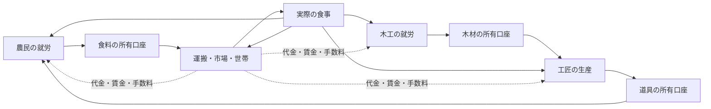

# 市民の生活ルーティンだけで生産・流通が続くか

状態: 設計上の思考実験。ゲームコードは未変更。[日常生活ルーティン](DAILY_LIFE_ROUTINES.md)と[データ駆動ルーティン](DATA_DRIVEN_ROUTINES.md)の閉路を検査する。ここでの「回る」は90日間の人口・資産保存だけではなく、必要な財が実際に生産・運搬・交換・消費され、仕事をする人の生活も続くことを指す。

## 結論

**身体的要求と個人の日課だけでは、完全な市民エコシステムにはならない。** 空腹は食料需要を作り、習慣は就労を続けられる。しかし誰が職業を担うか、投入材と製品の所有者は誰か、遠方の食料を誰が運ぶか、何で賃金を払い、売れない品の生産をどう止めるかは、身体だけからは出てこない。これらは職業・世帯・市場・雇用などの**制度的ルーティン**と、simの取引・効果検証が必要である。高度な個人予測を毎日実行する必要はない。定型的な発注、在庫目標、勤務、買物、配送をルールで回せる。

「生活が回る」の判定を三段に分ける。

1. **身体と時間:** 住民が食べ、休み、排泄し、同時に二つの場所で働かない。
2. **実物の循環:** 食料・材料・道具が生産者から実在の所有者を経て必要な場所・人へ届き、使われる。
3. **社会経済の循環:** 生産物に買い手がいて代金が支払われ、賃金・手数料・税の原資が枯れず、欠員や不足に応じて仕事量・役割を調整できる。

1だけを満たしても、倉庫に物が増える横で遠方の人が飢える可能性がある。3まで成立して初めて、小さくても自律的な地域経済と言える。

## 閉路を作る職業群の例

人口20人の仮想集落を考える。8人の農民、2人の木工、1人の工匠、2人の運搬人、1人の市の売り手、1人の調理人、残り5人を扶養家族・予備労働力とする。人数は検証用の仮値であり、実装済みの配置ではない。

| 人/役割 | 既定ルーティン | 必要な入力・収入 | 次の人への出力 |
| --- | --- | --- | --- |
| 農民 | 起床→食事→畑で就労→休息 | 労働時間、道具、土地への利用権、売上または賃金 | 食料を生産して保管・販売 |
| 木工 | 木材を集める/加工する→保管 | 労働時間、作業場所、売上または賃金 | 工匠・調理用の木材 |
| 工匠 | 木材と時間を使って道具を作る→販売 | 木材の購入、工房、道具の買い手 | 摩耗した農具・運搬具の交換 |
| 運搬人 | 集荷→道を移動→納品 | 荷、運搬容量、道路、料金の支払者 | 食料・木材・道具を必要な拠点へ届ける |
| 売り手 | 入荷を記録→注文をまとめる→引渡し | 売主の在庫、買主の代金、手数料 | 世帯の食料と職場の材料を仲介 |
| 調理人 | 材料を買う→調理/配膳→片付け | 食料・燃料、代金または世帯内の労働分担 | 実際の食事が身体の空腹を減らす |
| 扶養家族等 | 食事・排泄・休息、可能なら手伝い | 世帯の食料と扶養関係 | 消費と将来/臨時の労働力 |

現行の生産率を仮に当てると、農民8人は最大24食分/日を作り、20人は20食分/日を要する。木工2人は木材4/日を作り、工匠1人が2を使って道具1/日を作る。残る木材2を調理の燃料とするなら、道具も**実際に摩耗・交換される**必要がある。そうでなければ工匠の在庫が無限に増える。食料も最大4/日の余剰を在庫目標、休業、備蓄、交易、腐敗のどれかで処理しなければ、作り続けるだけになる。調理と摩耗・燃料は現行ゲームにない世界効果で、あくまで設計例である。



この図の点線の金銭は「食べたから自動的に給料が湧く」という意味ではない。実際には買主→売主、事業口座→労働者、売主/買主→運搬人・売り手の移転をそれぞれ記録する。扶養家族には同じ世帯の所得から食事を配分する。初期の運転資金と食料・道具の備蓄は必要だが、**初期備蓄が尽きた後も取引が続くか**を検査しなければ循環の証明にならない。

## ルーティンから出る要求と、別に必要な仕組み

```text
本人の空腹 → 食事ルーティン → 世帯の食料を使う試行
世帯の不足 → 買物ルーティン → 代金つき購入依頼
市場の不足 → 売り手の発注ルーティン → 農民への発注・運搬Task
農民の職務 → 就労ルーティン → 実際の労働時間と生産Event
道具の摩耗 → 補充ルーティン → 工匠への注文と木材調達
売上・納品 → 雇用/取引規則 → 賃金・手数料・税の移転
```

上の矢印を成立させるには、次の契約が要る。

- **役割と稼働:** 職業は人物の既定ルーティンを選ぶが、負傷・軍務・移動・睡眠中は働けない。どの仕事を誰が引き受けるかは実在のPersonとTaskで追う。職業の初期配置だけでは、死亡・徴兵後の欠員を埋められないため、再配置または欠員を受け入れる制度を定める。
- **発注と取引:** 「食べたい」は本人の必要であり、所有物をただで取る権利ではない。世帯・職場の在庫目標から型付きの購入/販売/配送依頼を作り、代金・期限・受渡し・失敗を記録する。市場の照合は制度的処理でよいが、物と通貨の所有者変更はsimだけが確定する。
- **場所と物流:** 農民が作った食料はまず生産者/職場の場所にある。遠方の世帯が購入しても運搬が終わるまでは食べられない。運搬人の仕事、道路、容量、遅延、未達を必要とする。
- **レシピと需要:** 職業データは何を何時間/どの材料から作るかを定める。買い手の注文、在庫上限、道具摩耗等が生産量を制限する。材料や販売先がなければ就労しても製品が生まれない/売れない。
- **所得と公的仕事:** 世帯の購買資金、労働者の賃金、売り手・運搬人の手数料、公務員や衛兵の税財源を分ける。働いていない日も全員へ同額を払うなら、それは生産の結果ではなく扶助制度として財源を要する。
- **身体と共同生活:** 食事・睡眠・排泄は本人の身体状態で起動するが、家計の配給、調理、便所や寝床の利用は世帯・施設のルールに依存する。個人の需要と共同資源の配分を分ける。

これらは必ずしも各人の複雑な合理計算を要しない。例えば「家に食料が2日分未満なら世帯の買物係が注文」「市場在庫が目標未満なら農家へ定期発注」「注文がなければ工匠は道具の生産を休む」を版付きのデータとして定義できる。ただし発注・配送・労働・支払いの**実結果**はデータ定義だけで発生させない。

## 現行実装での対照

現行の`generate.ts`は人口ごとに45%前後の農民、10%木工、10%工匠、10%商人、残り行政職を割り当てる（宮廷職への変更あり）。`dailyEconomy`は農民/木工/工匠から生産し、国別の共同事業口座で賃金と世帯向け食料販売を清算する。商人の搬送・販売行動はない。世帯は同じ国の共同口座から距離に関係なく食料を買える。木材は工匠の入力になるが、装備の毎日の買い手・摩耗はない。商人と行政職も共同事業口座から賃金を受け取る。

読取専用の確認（2026-09-25、`newGame()`、1,000人）では、1日目の生産は食料1,116、木材200、装備100。5日目の共同事業口座の装備は合計500で、装備の消費は0。初期の世帯食料備蓄があるため1〜2日目は共同事業口座から食料販売が起きず、その口座の通貨は30,000→28,140→26,280に減った。3〜5日目には世帯の購入が始まり、残高は26,238となった。これは一つのseed・短期間の結果であり、長期均衡の証明ではない。

反事実の確認（seed 42、5日）では、商人100人の`job`だけを`administrator`へ替えても、総生産・総消費・共同事業口座残高・空腹人数は同じだった。`Activity`の職名などは変わるので世界全体のハッシュが同じという主張ではない。この比較は、現行の「商人」が物流・販売の必須の行動者になっていないことを示す。

## 設計上の不足と優先度

| 優先 | 不足 | これがないと起きること |
| --- | --- | --- |
| 必須 | 食事・就労・睡眠の時間占有と、実労働に基づく生産/賃金 | 一人が同時に働き、移動し、休み、対価だけ受け取れる |
| 必須 | 場所と所有者を持つ在庫、注文、代金、運搬の完了 | 遠方の食料が即時に食卓へ届き、商人がいてもいなくても同じ |
| 必須 | 生産レシピの投入材と、売れ残りに応じた仕事量 | 材料なしの生産や、不要な装備の無限蓄積が起きる |
| 必須 | 家計・雇用・市場サービスの支払い元と扶養 | 売上がない職へ賃金を払い続け、初期資金が不足すると突然止まる |
| 必須 | 欠員時の再配置または不足の明示 | 一人の運搬人/工匠の不在で閉路が切れても、システムが説明できない |
| 後続 | 可変価格・融資・政治的な労働紛争 | 固定価格と定型の再配置でも、まず最小閉路は検証できる |

最初に全経済を作り直す必要はない。**食料だけの局所的な閉路**（農民→実在庫→運搬人→市場→世帯→食事、買主から売主へ通貨が戻る）を受入fixtureにし、その後に木材・道具・賃金・公的サービスを加える。各段階で「運搬人が不在」「買主に金がない」「農民が軍務で働けない」「道具が足りない」を対照条件にする。結果が変わらなければ、その職業/資源はまだエコシステムへ組み込まれていない。

新しいルーティンランナー・市場・物流は未実装。上記の小集落と反事実は設計案/読取専用の確認であり、受入テスト、90日性能、長期の安定性は未検証。
