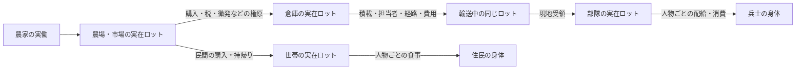
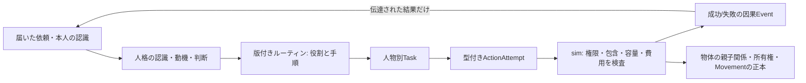

# 平時と戦時に共通する物資・輸送の設計

状態: 2026-09-26の実装前設計。E1の実装と旧M2軍事コードを照合し、物理的正本は[物体・包含モデル](PHYSICAL_OBJECT_MODEL.md)へ改訂した。共通物流層、軍補給への接続、受入試験は**未実装**。E1の3日間の成功を軍兵站の成功とみなさない。

## 共通にする理由と境界

農場→市場→家と、倉庫→補給隊→部隊→兵士は、物資を必要な場所へ運び、実際に受け取って消費するという同じ問題である。軍専用の食料を別に生成せず、平時の農民・市場・徴税・調達から同じロットを移す。出征した人物は同じPerson IDのまま軍務へ入り、その人の勤務時間が農業などから失われる。軍が食べる食料は世帯の食料と同じ保存式に一回だけ含める。

ただし「共通」は全行動を一つの巨大な命令型にすることではない。世界側の物資・保管・輸送・受領・消費を共通の実行境界とし、民間の注文/売買、軍の徴発/補給命令/配給は異なる制度的ルーティンとして置く。人格の認識・動機・判断とルーティンの関係は[人格境界v2](AGENT_INTERFACES_v2.md)および[ルーティン設計](DATA_DRIVEN_ROUTINES.md)に従う。どの実装モデルを使っても、真実の在庫・移動・所有権を更新するのはsimだけである。

## 物体モデルへの改訂

E1の食料ロット・現金容器、軍の輸送口座を別々の物資台帳として増やさない。[物体・包含・所有権の共通モデル](PHYSICAL_OBJECT_MODEL.md)を物理的な正本にする。先の`AssetLot + Holder.anchor`案にあった「Holderの入れ子を許さない」という制約は撤回する。**現金ロット→財布→人→家/道路**、**食料ロット→荷車→道路**という親子関係が必要だからである。

各物体は固有ID・型・一つの`parentId`を持つ。位置と積荷重量は親をたどって導出する。財布や荷車が移れば中身の所在地を一つずつ更新しない。現金・食料など同質の財は、ID付き数量ロットを物体として扱う。人や荷車は個体物体で数量1。人の身体・人格、商人の価格判断、部隊編成などの固有状態は型付きの別コンポーネントに置き、汎用物体へ無限の欄を増やさない。

`parentId`は物理的包含だけを表す。`ownerId`は所有可能な資産の権利、`custodianId`やTaskは預かり/アクセス、世帯・職場・軍の所属は社会関係として別に持つ。人は所有物ではなく、兵士は同じPerson IDのまま軍籍に入る。親に入るには型の受入タグ、重量/個数の容量、行為者の権限、同所性、時間、費用をすべて検査する。親だけ書き換えれば遠隔の物が移るというAPIにはしない。

輸送依頼、担当人物のTask、道路上のMovement、物体の親子関係、現地受領はそれぞれ別の事実である。売買は物品と通貨の親・所有権を一つの原子的操作で変える。予約は独立記録とし、失敗時に資産・親・予約を半端に更新しない。道中で運搬人を失えば荷車と中身は最後の実在位置に残る。部隊がいない到着先から国庫へ瞬間返送しない。Rule/NN/LLM/人間という人格の実装方法はこのsim境界を変えない。

## 軍補給で必ず区別する時点

1. 軍の需要は部隊の実員数、予定行程、現在地の在庫から生じる。君主/補給係が知る需要は伝令や帳票が届いた時点の情報であり、世界の真実とは分ける。
2. 調達や徴税が成立して、初めて倉庫に実物がある。国庫の数字だけを前線在庫とはしない。
3. 輸送依頼を担当者が引受け、空き時間・荷車・容量・出発地の実物を検査して積む。護衛は必要な慣行なら別の人物Taskとして手配する。担当者なしに時刻だけ進む便は作らない。
4. 道中の物資は荷車/携行者にある。経路変更、敗走、襲撃、運搬人の欠員は、最後の実在位置と実量を保ったままEventにする。目的地に部隊がいなければ、便を瞬間的に首都へ返さず、待機・転送・帰路を新たなTaskで決める。
5. 現地で受領してから部隊在庫へ移す。部隊が移動中なら所在と受取権限を再確認する。到着予定は受領ではない。
6. 配給時は部隊にある食料を兵士ごとに一食ずつ消費し、欠食者を本人IDで記録する。世帯は従軍中の同じ人物へ重ねて食事を出さない。個人携行食を使う場合は先にそのロットを消費し、部隊在庫から同じ食事を二重に引かない。

兵士の装備、給与、戦利品もこの物資/通貨の所在と所有権を通す。ただし戦闘の損害・士気・指揮判断は軍事側の効果であり、物流層には埋め込まない。

## 現行コードとの対応と移行順

E1の`FoodLot`、`CashContainer`、`FoodCart`、`Journey`、`LocalTask`、Eventはこの契約の小さな実証である。今は食料専用の`Place`と数量上限、固定の時刻相、単一運搬人であり、共通の物体包含/輸送Taskインターフェースにはまだなっていない。現金もE1世界だけの正本で、旧世界の`accounts.money`と共有していない。

旧M2の`DISPATCH_SUPPLY`は国別`accounts.food`を輸送口座へ移し、経路距離から`arriveAt`を置く。`Shipment`には担当人物、荷車、容量、途中の位置、積降ろしTask、費用がない。到着時に部隊がいなければ食料を国庫口座へ直ちに戻す。旧徴兵時も国別口座から部隊口座へ食料を直接移す。これらは現在のゲームが遊べるための簡略化であり、本契約の物理補給ではない。旧世界の`accounts`と新ロットを同じ食料の二つの正本として同居させない。

1. **L0（共通操作の契約試験）:** UI/ネットワークなしの小世界で財布→人→家、食料→荷車→道路の入れ子、所有権、予約、容量、同所性、移動、失敗時の原子性を検証する。人の判断や市場価格をここへ入れない。
2. **L1（E1の内部移行）:** E1の3日fixtureを物体の親子関係とMovementへ置き換える。外部のシナリオ結果、食料60/通貨120、人物Taskと原因連鎖、4つの反事実を回帰させる。内部IDやEventの追加でworldHashが変わるなら新しい基準を記録し、同一新版の保存再開/再実行一致を確認する。旧E1セーブは明示変換するか版違いとして拒否し、暗黙に読み込まない。
3. **E2（長期の民間経済）:** 実働、賃金/事業資金、体力回復、運搬に必要な物的/金銭的費用を同じ正本から支払う。30〜90日でも食料・現金・勤務時間が循環するか実測する。
4. **E3の前半（複数財と軍の小fixture）:** 木材/装備、調達、徴兵による農家欠員、倉庫→実在便→部隊受領→兵士配給を独立した小世界でつなぐ。これが通るまで旧本編の補給を一括置換しない。
5. **E3の後半（本編移行）:** 旧口座の食料/通貨/装備を、所有者と実在位置が確定する分だけ一回だけ移行する。場所を推測できない旧セーブは理由を明示して拒否するか、根拠ある移行表を用意する。旧`Shipment`/`accounts`経路は世界単位で排他的に止める。旧90日ゲームの軍事結果と新結果の差を記録し、勝敗の一致を無理に要求しない。

L0では「財布に現金5、箱に現金5、食料5のうち3を予約」を開始状態にして、財布の同じ5通貨による二重支払い、**別の依頼による**予約済み食料3の積載、残量2を超える追加予約、過積載、遠隔からの移転、同一人物/車両の二重移動を拒否する。同じ依頼の積載は予約を引き継いで一回だけ許す。拒否前後で全財・所有者・保管先が一致することを検査する。注文成立時には食料と現金が同時に移るか、どちらも移らない。

軍の最小fixtureは「倉庫に食料10、容量6の荷車1、運搬人1、前線に4人の兵士、初期前線食料0」とする。受領後に4人が1食ずつ食べれば倉庫4・部隊2・消費4で合計10。前線が持つのは受領済みの6だけで、残り4は距離があっても食べられない。運搬人なし、荷車なし、容量不足、輸送費不足、部隊移動、道の遮断、補給係不在、徴兵で農民減少を一つずつ変え、実在庫・到着・個人欠食・軍事結果の変化を確認する。到着後に部隊が移動していたら倉庫への瞬間返送も前線での食事も起きない。

全財の保存、人物の勤務時間非重複、因果Event、seed/Command/保存状態からの再現を各段階で検査する。新小世界の単体試験が通っても本編の90日・複数便・画面性能は未達とし、実測するまで合格としない。UIのデバッグ表示では人物・車両・財布・ロットの親子関係をたどり、所有者、預かり手、現在位置、積載/上限、予約、移動費用、最終Eventを選択時に表示する。
