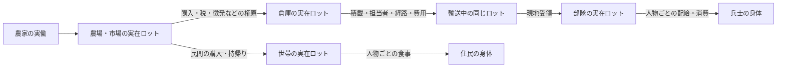
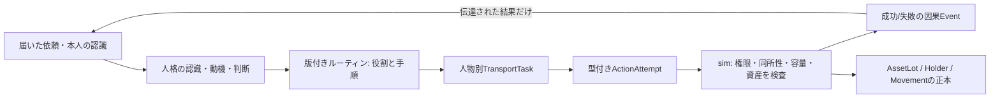

# 平時と戦時に共通する物資・輸送の設計

状態: 2026-09-26の実装前設計。E1の実装と旧M2軍事コードを照合し、下記の正本・位置・原子的操作へ設計を修正した。共通物流層、軍補給への接続、受入試験は**未実装**。E1の3日間の成功を軍兵站の成功とみなさない。

## 共通にする理由と境界

農場→市場→家と、倉庫→補給隊→部隊→兵士は、物資を必要な場所へ運び、実際に受け取って消費するという同じ問題である。軍専用の食料を別に生成せず、平時の農民・市場・徴税・調達から同じロットを移す。出征した人物は同じPerson IDのまま軍務へ入り、その人の勤務時間が農業などから失われる。軍が食べる食料は世帯の食料と同じ保存式に一回だけ含める。

ただし「共通」は全行動を一つの巨大な命令型にすることではない。世界側の物資・保管・輸送・受領・消費を共通の実行境界とし、民間の注文/売買、軍の徴発/補給命令/配給は異なる制度的ルーティンとして置く。人格の認識・動機・判断とルーティンの関係は[人格境界v2](AGENT_INTERFACES_v2.md)および[ルーティン設計](DATA_DRIVEN_ROUTINES.md)に従う。どの実装モデルを使っても、真実の在庫・移動・所有権を更新するのはsimだけである。



## 最小の世界契約

| 概念 | 共通の不変条件 | 軍での具体例 |
| --- | --- | --- |
| `AssetLot` | 財、整数数量、唯一の所有者、唯一の保管先ID、取得原因Event。現金も含み、移動中も一度だけ数える | 国庫所有の食料が荷車上にあり、前線にはまだない |
| `Holder` / `Carrier` | 人物・荷車・倉庫・部隊置場は負荷容量を持つ。所在地は保管先の固定地点または人物/車両/部隊の位置から導出する | 兵士の携行食、輜重車、駐屯地の食料庫 |
| `TransferIntent` | 依頼者、権原、財、数量、出発地、目的地、受取先、期限、原因を指定。依頼だけでは物資を移さない | 君主の補給命令、担当家臣による調達・出荷依頼 |
| `TransportTask` | 実在人物と運搬手段、時間占有、荷、経路、積降ろし、費用、失敗時の所在を追う | 輜重担当と護衛が倉庫から部隊へ運ぶ |
| `Receipt` | 目的地で受取権限・相手の所在・容量を再検証し、実量だけ引き渡す。所有権変更・支払・徴税の成立時点を別に定義する | 部隊長/補給係が到着貨物を検収する |
| `Consumption` | 食事・飼葉・修繕などは所在する実物を減らし、誰の需要を満たしたかをEventへ残す | 兵士ごとの配給。欠食は個人の空腹・疲労・士気へ反映 |

所有権と保管責任は別である。輸送中は国庫または商人が所有し、運搬人が預かることがある。部隊の置場に入っても国庫所有のままという制度も選べる。どの時点で所有権が移るかを取引/徴発/配給のルールで定め、`holderId`の変更を所有権変更と同一視しない。E1の現金容器は共通化時に「容器に入った通貨ロット」へ移す。軍の補給依頼が常に現金売買になるわけではない。徴税、現物納入、軍の予算からの購入を異なる権原として記録する。

容量は財の単位数だけでは複数財に共通化できない。E1の「食料21食」を保ったまま、複数財に進む時は版付きの財データに輸送負荷（重量または抽象負荷点）を定め、`Σ数量×負荷 <= 容器容量`を検査する。容積、腐敗、馬、道路、護衛、賃金は必要な効果と受入試験を定めてから増やす。費用は人物の体力と時間だけで終わらせず、どの食料・飼葉・通貨・道具が誰から消費/移転したかを明示する。支払不能や疲労では便を出せないか、途中で止まる。

## 実装前監査で変更する点

E1の`FoodLot.place`と`CashContainer.place`は所在地を別々に保持し、現金は容器の`amount`、食料はロットの`quantity`が正本である。新しい財ごとにこの二系統を増やすと、荷車・人物・部隊の移動時に所在と容量の更新箇所が増える。さらに`cargo:<shipmentId>`は便を指すが荷車を指さないため、便と荷車の対応を毎回推定している。共通層では**財の正本を一種類のロット、所在の正本を保管先のアンカー**に改める。旧E1のセーブとハッシュを無断で書き換えず、新版への変換を別に定義する。

概念上の最小型は次のとおり。名前は実装時に調整できるが、二重正本を作らない依存方向は固定する。

```ts
type AssetLot = {
  id: string; goodId: string; quantity: number; ownerId: string;
  holderId: string; causeEventId: string;
};
type Holder = {
  id: string; anchor: { kind: "site" | "person" | "vehicle" | "unit"; id: string };
  capacityLoad: number; custodianId?: string;
};
type Reservation = {
  id: string; purposeId: string; lotId: string; quantity: number;
  // 受取先の空き容量も拘束する場合は別の capacityHold を持つ
};
type Movement = {
  id: string; routeId: string; fromSiteId: string; toSiteId: string;
  start: number; expectedArrival: number; participantIds: string[];
  vehicleIds: string[]; causeEventId: string;
};
```

`Holder.anchor`は一つだけ持つ。家の箱は建物site、携行袋はperson、荷台はvehicle、部隊補給所はunitに固定する。アンカーの現在位置は人物/車両/部隊の`Movement`から導出し、各ロットや財布へ複製しない。移動中は経路上の進捗として保持し、出発地でも目的地でもない。車両を動かす`Movement`には実在の牽引者を含め、護衛が必要な慣行なら別の参加者Taskを含める。アンカー参照の循環と、二つのMovementへの同時参加は禁止する。最初はHolderの入れ子を許さず、袋・箱・荷台をアンカー直下の保管先として扱う。

現金も整数数量の`goodId: "money"`のロットにする。同じ所有者の現金が財布と箱に分かれても、所有者別残高はロットからの投影であり別の書込先ではない。貨幣の一枚ごとのIDは不要。装備を個体別の耐久で扱う段階では、数量1の個別ロットか別の個体情報を参照し、数量だけの装備を二重正本にしない。

ロットの予約は別レコードの合計から利用可能量を導出し、`lot.reserved`の二重更新をやめる。容量も現在の積載負荷と受取用の容量拘束を合わせて検査する。`goodId`ごとの整数負荷係数をコンテンツに置き、ロット分割・合流の前後で数量と所有者の合計を保つ。出発時の運搬費は、人物の体力・時間と必要な現物/通貨を事前検査し、各区間の開始時に実際に消費する。E1の一行程前払式は移行するまでそのまま残す。

共通simの操作は`reserve`、`release`、`moveLot`、`startMovement`、`arriveMovement`、`receive`、`consume`、`produce`に絞る。各操作は権限、同所性、予約、容量、担当者の時区間、原因Eventを先に検査し、**成功なら状態差分とEventを一括確定、失敗なら資産と予約を変えず理由Eventを残す**。売買は複数の`moveLot`（品物と現金）を一つのトランザクションとして確定する。軍の徴発・調達・配給も同じ原子的境界を使うが、権原と本人の判断は各制度が与える。失敗後に例外で世界を途中変更したままにしない。

`TransportOrder`は依頼と期限、`TransportTask`は担当人物の引受/拒否と時間占有、`Movement`は実際の経路上の移動、`AssetLot`は運ぶ実物であり、互いに代用しない。便が失敗してもロットは現在のHolderに残る。到着後に部隊が不在・置場が満杯なら、受領失敗Eventを出し、担当者と貨物を現地の車両に留める。待機/転送/帰還は新しいTaskと移動費用を要する。情報は担当者や受取人へ届いたEventだけから認識へ入れ、世界の正本を人格へ直接渡さない。



この矢印は契約上の情報・実行境界を示す。人格はルーティンを参照してもよく、ルーティンが人格に仕事を提案してもよい。Rule/NN/LLM/人間は人格ブロックの実装方法であり、物流APIの型を変えない。simはTaskを受けただけで成功扱いせず、毎段階の真実を再検証する。

## 軍補給で必ず区別する時点

1. 軍の需要は部隊の実員数、予定行程、現在地の在庫から生じる。君主/補給係が知る需要は伝令や帳票が届いた時点の情報であり、世界の真実とは分ける。
2. 調達や徴税が成立して、初めて倉庫に実物がある。国庫の数字だけを前線在庫とはしない。
3. 輸送依頼を担当者が引受け、空き時間・荷車・容量・出発地の実物を検査して積む。護衛は必要な慣行なら別の人物Taskとして手配する。担当者なしに時刻だけ進む便は作らない。
4. 道中の物資は荷車/携行者にある。経路変更、敗走、襲撃、運搬人の欠員は、最後の実在位置と実量を保ったままEventにする。目的地に部隊がいなければ、便を瞬間的に首都へ返さず、待機・転送・帰路を新たなTaskで決める。
5. 現地で受領してから部隊在庫へ移す。部隊が移動中なら所在と受取権限を再確認する。到着予定は受領ではない。
6. 配給時は部隊にある食料を兵士ごとに一食ずつ消費し、欠食者を本人IDで記録する。世帯は従軍中の同じ人物へ重ねて食事を出さない。個人携行食を使う場合は先にそのロットを消費し、部隊在庫から同じ食事を二重に引かない。

兵士の装備、給与、戦利品もこの物資/通貨の所在と所有権を通す。ただし戦闘の損害・士気・指揮判断は軍事側の効果であり、物流層には埋め込まない。

## 現行コードとの対応と移行順

E1の`FoodLot`、`CashContainer`、`FoodCart`、`Journey`、`LocalTask`、Eventはこの契約の小さな実証である。今は食料専用の`Place`と数量上限、固定の時刻相、単一運搬人であり、共通`AssetLot`/Holder/輸送Taskインターフェースにはまだなっていない。現金もE1世界だけの正本で、旧世界の`accounts.money`と共有していない。

旧M2の`DISPATCH_SUPPLY`は国別`accounts.food`を輸送口座へ移し、経路距離から`arriveAt`を置く。`Shipment`には担当人物、荷車、容量、途中の位置、積降ろしTask、費用がない。到着時に部隊がいなければ食料を国庫口座へ直ちに戻す。旧徴兵時も国別口座から部隊口座へ食料を直接移す。これらは現在のゲームが遊べるための簡略化であり、本契約の物理補給ではない。旧世界の`accounts`と新ロットを同じ食料の二つの正本として同居させない。

1. **L0（共通操作の契約試験）:** UI/ネットワークなしの小世界で複数財・現金、所有者と保管先、予約、容量、同所性、移動、失敗時の原子性を検証する。人の判断や市場価格をここへ入れない。
2. **L1（E1の内部移行）:** E1の3日fixtureを新ロット/Holder/Movementへ置き換える。外部のシナリオ結果、食料60/通貨120、人物Taskと原因連鎖、4つの反事実を回帰させる。内部IDやEventの追加でworldHashが変わるなら新しい基準を記録し、同一新版の保存再開/再実行一致を確認する。旧E1セーブは明示変換するか版違いとして拒否し、暗黙に読み込まない。
3. **E2（長期の民間経済）:** 実働、賃金/事業資金、体力回復、運搬に必要な物的/金銭的費用を同じ正本から支払う。30〜90日でも食料・現金・勤務時間が循環するか実測する。
4. **E3の前半（複数財と軍の小fixture）:** 木材/装備、調達、徴兵による農家欠員、倉庫→実在便→部隊受領→兵士配給を独立した小世界でつなぐ。これが通るまで旧本編の補給を一括置換しない。
5. **E3の後半（本編移行）:** 旧口座の食料/通貨/装備を、所有者と実在位置が確定する分だけ一回だけ移行する。場所を推測できない旧セーブは理由を明示して拒否するか、根拠ある移行表を用意する。旧`Shipment`/`accounts`経路は世界単位で排他的に止める。旧90日ゲームの軍事結果と新結果の差を記録し、勝敗の一致を無理に要求しない。

L0では「財布に現金5、箱に現金5、食料5のうち3を予約」を開始状態にして、財布の同じ5通貨による二重支払い、**別の依頼による**予約済み食料3の積載、残量2を超える追加予約、過積載、遠隔からの移転、同一人物/車両の二重移動を拒否する。同じ依頼の積載は予約を引き継いで一回だけ許す。拒否前後で全財・所有者・保管先が一致することを検査する。注文成立時には食料と現金が同時に移るか、どちらも移らない。

軍の最小fixtureは「倉庫に食料10、容量6の荷車1、運搬人1、前線に4人の兵士、初期前線食料0」とする。受領後に4人が1食ずつ食べれば倉庫4・部隊2・消費4で合計10。前線が持つのは受領済みの6だけで、残り4は距離があっても食べられない。運搬人なし、荷車なし、容量不足、輸送費不足、部隊移動、道の遮断、補給係不在、徴兵で農民減少を一つずつ変え、実在庫・到着・個人欠食・軍事結果の変化を確認する。到着後に部隊が移動していたら倉庫への瞬間返送も前線での食事も起きない。

全財の保存、人物の勤務時間非重複、因果Event、seed/Command/保存状態からの再現を各段階で検査する。新小世界の単体試験が通っても本編の90日・複数便・画面性能は未達とし、実測するまで合格としない。UIのデバッグ表示では人物・車両・Holder・ロットのアンカーをたどり、所有者、預かり手、現在位置、積載/上限、予約、移動費用、最終Eventを選択時に表示する。
