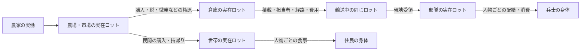

# 平時と戦時に共通する物資・輸送の設計

状態: 2026-09-26の設計判断。E1の実装と旧M2軍事コードを照合した。以下の共通物流層、軍補給への接続、受入試験は**未実装**。E1の3日間の成功を軍兵站の成功とみなさない。

## 共通にする理由と境界

農場→市場→家と、倉庫→補給隊→部隊→兵士は、物資を必要な場所へ運び、実際に受け取って消費するという同じ問題である。軍専用の食料を別に生成せず、平時の農民・市場・徴税・調達から同じロットを移す。出征した人物は同じPerson IDのまま軍務へ入り、その人の勤務時間が農業などから失われる。軍が食べる食料は世帯の食料と同じ保存式に一回だけ含める。

ただし「共通」は全行動を一つの巨大な命令型にすることではない。世界側の物資・保管・輸送・受領・消費を共通の実行境界とし、民間の注文/売買、軍の徴発/補給命令/配給は異なる制度的ルーティンとして置く。人格の認識・動機・判断とルーティンの関係は[人格境界v2](AGENT_INTERFACES_v2.md)および[ルーティン設計](DATA_DRIVEN_ROUTINES.md)に従う。どの実装モデルを使っても、真実の在庫・移動・所有権を更新するのはsimだけである。

## 最小の世界契約

| 概念 | 共通の不変条件 | 軍での具体例 |
| --- | --- | --- |
| `StockLot` | 財、整数数量、唯一の所有者、唯一の実在位置、予約量、取得原因Event。移動中も一度だけ数える | 国庫所有の食料が荷車上にあり、前線にはまだない |
| `Container` / `Carrier` | 人物・荷車・倉庫・部隊置場は種類別の容量を持つ。携行品と荷車上の品を二重計上しない | 兵士の携行食、輜重車、駐屯地の食料庫 |
| `TransferIntent` | 依頼者、権原、財、数量、出発地、目的地、受取先、期限、原因を指定。依頼だけでは物資を移さない | 君主の補給命令、担当家臣による調達・出荷依頼 |
| `TransportTask` | 実在人物と運搬手段、時間占有、荷、経路、積降ろし、費用、失敗時の所在を追う | 輜重担当と護衛が倉庫から部隊へ運ぶ |
| `Receipt` | 目的地で受取権限・相手の所在・容量を再検証し、実量だけ引き渡す。所有権変更・支払・徴税の成立時点を別に定義する | 部隊長/補給係が到着貨物を検収する |
| `Consumption` | 食事・飼葉・修繕などは所在する実物を減らし、誰の需要を満たしたかをEventへ残す | 兵士ごとの配給。欠食は個人の空腹・疲労・士気へ反映 |

所有権と保管責任は別である。輸送中は国庫または商人が所有し、運搬人が預かることがある。部隊の置場に入っても国庫所有のままという制度も選べる。どの時点で所有権が移るかを取引/徴発/配給のルールで定め、`place`の変更を所有権変更と同一視しない。通貨もE1の現金容器を将来の共通資産へ接続するが、軍の補給依頼が常に現金売買になるわけではない。徴税、現物納入、軍の予算からの購入を異なる権原として記録する。

容量は財の単位数だけでは複数財に共通化できない。E1の「食料21食」を保ったまま、複数財に進む時は版付きの財データに輸送負荷（重量または抽象負荷点）を定め、`Σ数量×負荷 <= 容器容量`を検査する。容積、腐敗、馬、道路、護衛、賃金は必要な効果と受入試験を定めてから増やす。費用は人物の体力と時間だけで終わらせず、どの食料・飼葉・通貨・道具が誰から消費/移転したかを明示する。支払不能や疲労では便を出せないか、途中で止まる。

## 軍補給で必ず区別する時点

1. 軍の需要は部隊の実員数、予定行程、現在地の在庫から生じる。君主/補給係が知る需要は伝令や帳票が届いた時点の情報であり、世界の真実とは分ける。
2. 調達や徴税が成立して、初めて倉庫に実物がある。国庫の数字だけを前線在庫とはしない。
3. 輸送依頼を担当者が引受け、空き時間・荷車・容量・出発地の実物を検査して積む。護衛は必要な慣行なら別の人物Taskとして手配する。担当者なしに時刻だけ進む便は作らない。
4. 道中の物資は荷車/携行者にある。経路変更、敗走、襲撃、運搬人の欠員は、最後の実在位置と実量を保ったままEventにする。目的地に部隊がいなければ、便を瞬間的に首都へ返さず、待機・転送・帰路を新たなTaskで決める。
5. 現地で受領してから部隊在庫へ移す。部隊が移動中なら所在と受取権限を再確認する。到着予定は受領ではない。
6. 配給時は部隊にある食料を兵士ごとに一食ずつ消費し、欠食者を本人IDで記録する。世帯は従軍中の同じ人物へ重ねて食事を出さない。個人携行食を使う場合は先にそのロットを消費し、部隊在庫から同じ食事を二重に引かない。

兵士の装備、給与、戦利品もこの物資/通貨の所在と所有権を通す。ただし戦闘の損害・士気・指揮判断は軍事側の効果であり、物流層には埋め込まない。

## 現行コードとの対応と移行順

E1の`FoodLot`、`CashContainer`、`FoodCart`、`Journey`、`LocalTask`、Eventはこの契約の小さな実証である。今は食料専用の`Place`と数量上限、固定の時刻相、単一運搬人であり、共通`StockLot`/容器/輸送Taskインターフェースにはまだなっていない。現金もE1世界だけの正本で、旧世界の`accounts.money`と共有していない。

旧M2の`DISPATCH_SUPPLY`は国別`accounts.food`を輸送口座へ移し、経路距離から`arriveAt`を置く。`Shipment`には担当人物、荷車、容量、途中の位置、積降ろしTask、費用がない。到着時に部隊がいなければ食料を国庫口座へ直ちに戻す。旧徴兵時も国別口座から部隊口座へ食料を直接移す。これらは現在のゲームが遊べるための簡略化であり、本契約の物理補給ではない。旧世界の`accounts`と新ロットを同じ食料の二つの正本として同居させない。

1. E2で民間の所得循環と体力回復/輸送費を先に閉じ、3日を超える物流を検証する。その際、財・容器・移動・Taskの小さい共通操作をE1から抽出する。E1の動作・保存・再生を保ったまま段階的に置き換える。
2. E3で木材/装備、徴税/調達、徴兵による民間欠員を同じ世界状態に入れる。旧口座の食料/通貨/装備を、所有者と実在位置が確定する分だけ一回だけ移行する。場所を推測できない旧セーブは明示して拒否するか、根拠ある移行表を用意する。
3. 軍の補給は倉庫→実在便→部隊受領→兵士配給へ差し替える。旧`Shipment`/`accounts`経路は世界単位で排他的に止める。旧90日ゲームの軍事結果と新結果の差を記録し、勝敗の一致を無理に要求しない。

受入対照は「同じ初期食料で運搬人なし、荷車なし、容量不足、輸送費不足、部隊移動、道の遮断、補給係不在、徴兵で農民減少」をそれぞれ単独に変える。いずれも基準と異なる実在庫・到着・個人欠食・軍事結果になるかを確認する。全財の保存、人物の勤務時間非重複、因果Event、seed/Command/保存状態からの再現を各段階で検査する。複数日・複数便の負荷と画面性能は実測するまで合格としない。
