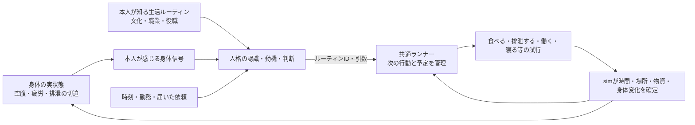

# 日常生活をルーティンとして扱う設計

状態: 設計案。ゲームコード・コンテンツ形式は未変更。[人格インターフェースv2](AGENT_INTERFACES_v2.md)と[データ駆動ルーティン](DATA_DRIVEN_ROUTINES.md)の、食事・排泄・仕事・睡眠への適用例。

## 答え

適用できる。むしろ一日の生活を反復する**上位ルーティン**とし、その中で食事・排泄・職務・睡眠などの下位ルーティンを起動する。上位ルーティンは「朝食→排泄→仕事→睡眠」を絶対の命令列にはしない。時間帯、身体の必要、場所、仕事の拘束、文化的な習慣から通常の順序と許容範囲を与え、割込み・欠乏・危険時には次の行動を組み直す。



身体の実状態は世界側に持ち、本人へは感じられる程度の信号として渡す。文化と職業は、同じ空腹や疲労を**どう扱うか**を変える。農民は日の出に働き、兵士は当直に合わせ、宮廷人は面談の間に食事をずらす、という差はデータで表せる。疲労が限界なら社会的ルーティンに従い切れない。失敗や例外から政治・仕事・家計に影響が生じる。

## データとコードの分担

| 対象 | データで設定するもの | simの責務 |
| --- | --- | --- |
| 一日の上位ルーティン | 起床・食事・勤務・休息の時間窓、優先関係、職業/文化ごとの差、割込み後の復帰先 | 時刻、予約・重複、完了/中断の記録 |
| 食事 | 通常の場所と相手、何食分を求めるか、配給不足時の代案 | 実在の食料と所有者を確認して消費し、空腹を更新。食べていない人を食べた扱いにしない |
| 排泄 | 切迫した時の場所探し、公衆便所・野外の利用規範、仕事中断の許容 | 時間・場所・施設の利用可否、身体の切迫/衛生の変化を確定。任意の在庫や通貨を作らない |
| 仕事 | 勤務枠、職務ルーティン、欠勤・交代・割込み規則 | 実際の就労時間と材料から生産・賃金・在庫移転を確定。働かなければ生産しない |
| 睡眠 | 通常の時間帯・場所、夜警や旅中の代替、起床条件 | 実際に眠れた時間だけ疲労を回復。移動・面談・戦闘と同時に睡眠させない |

食事、排泄、睡眠は他者との明示的な約束がなくても必要から起動する。仕事は職業と組織の役割に基づくことが多い。いずれも本人のルーティンの提案を、実世界での行為試行と結果に分ける。生理的な「消化」は本人が選ぶActionではないが、「食べる場所を探して食べる」「便所へ行く」は行動である。

## 例示コンテンツ

次は**概念例であり未確定スキーマ**。時間帯は固定時刻の強制ではなく、既定の窓と割込み条件である。

```json
{
  "id": "life.farmer_day",
  "version": 1,
  "appliesWhen": [{ "fact": "self.occupation", "op": "eq", "value": "farmer" }],
  "trigger": { "kind": "daily_schedule" },
  "steps": [
    { "id": "morning_meal", "routine": "life.eat", "window": [300, 540] },
    { "id": "work", "routine": "work.farm_shift", "window": [360, 1080] },
    { "id": "relieve", "routine": "life.toilet", "when": "body.urgency_high", "mayInterrupt": ["work"] },
    { "id": "evening_meal", "routine": "life.eat", "window": [1020, 1320] },
    { "id": "sleep", "routine": "life.sleep", "window": [1200, 420] }
  ],
  "onInterruption": ["pause_current", "recheck_needs", "resume_or_reschedule"]
}
```

窓が日付をまたぐ表現、勤務と食事の重なり、本人ごとの時刻差は読込時に検証する。排泄は一日一回の固定Stepにせず、身体信号で起動する下位ルーティンとして記す。どの便所へ行くかは本人が知る施設と慣行で決め、存在・空き・実際の位置はsimが検証する。

## 実装する状態と更新手順

```ts
type BodyState = {
  personId: PersonId;
  hunger: number;
  fatigue: number;
  urgency: number;       // 排泄の切迫。現行Personにはない
  lastAdvancedAt: SimTime;
};

type DailyRoutineInstance = {
  personId: PersonId;
  definition: { id: Id; version: string };
  localDay: number;
  activeStepIds: Id[];
  pausedStepIds: Id[];
  nextDecisionAt: SimTime;
  causeRefs: Id[];
};
```

身体状態の所有者はsimで、人格の主観記憶と二重管理しない。simは前回更新時刻からの経過時間で身体の必要を進め、閾値・時間窓・割込みのうち最も早い時刻を`nextDecisionAt`として予約する。起床時に人格へ本人が感じる信号と既知の予定だけを渡し、選ばれた下位ルーティンのTaskを作る。試行の完了時にsimが食料・就労時間・疲労・切迫を更新しEventを残す。その結果から次の判断時刻を予約する。これは各人を毎分評価する方式ではない。

最初は`urgency`を時間と食事から増える抽象的な身体値とし、排泄行為が所要時間と適切な場所を確保できた場合に下げる。便所の衛生や疾病をゲーム効果にするなら、新しい施設・衛生状態とそれに対応するsimの検証が必要になる。日常の排泄に在庫の「排泄物」を必ず生成する必要はないが、新しい物資として扱うなら保存則を追加する。

## ランナーと人格の動かし方

毎分1,000人全員の認識・動機・判断を再実行しない。ルーティンインスタンスごとに次の**判断時刻**を保存し、日付変更、時間窓、食料不足、身体閾値、伝令到着、勤務の中断、危険などで起こす。通常の日課は同じ人格の単純なルール実装で既定ルーティンを選んでよい。競合する仕事や危機の時だけ、より複雑な判断を使うかは実装の自由である。

ランナーは行動を勝手に成功させない。本人が選んだルーティンからTask/ActionAttemptを予定し、simが実際の食事・就労・睡眠等を確定する。割込み時には現在のStepを中断または一時停止し、再開可能な状態を保存する。たとえば伝令が勤務中に呼び出されたら、農作業の残り時間と食事の必要を持ち越す。戦闘に入った兵士には平時の生活ルーティンより軍務ルーティンが優先されるが、空腹や疲労は消えない。

完了結果は`RoutineInstance → Task → ActionAttempt → Event`で追えるようにする。ただし日常動作を全件長文Eventにすると保存量が膨らむため、同一人物の連続した平常活動は時区間の記録にまとめ、資産移転や失敗・割込みは因果IDで別に追う。粒度と性能は実装後の計測で決める。

## 現行実装からの移行と受入条件

現行は`Person.hunger`と`fatigue`を持つが、日次の`dailyEconomy`が職業に応じた生産・食事を直接確定し、その後で`Activity`を作る。疲労は主に軍の移動・戦闘・休息で変わる。睡眠と排泄の行動・身体状態はまだない。まず既存の食料消費と就労を同じ実結果のまま日課ルーティンへ対応付け、睡眠と排泄は新しい身体変数・行為・検証を伴う別段階とする。**空の実装で「寝た/排泄した」Eventを作らない。**

受入例: (1)同じ人物が食べれば実在の口座から食料が減り、食べられなければ空腹が残る、(2)勤務を中断すればその時間の生産・賃金が過大にならない、(3)移動中に同じ時刻で睡眠/就労しない、(4)当直・旅・文化差で日課の時間や場所が変わる、(5)保存再開と同じseed/Commandからの再実行で同じ行動列と資産残高になる、(6)1,000人90日の処理時間とログ量を実測する。現時点でこれらの新設計テストと性能計測は未実施。
