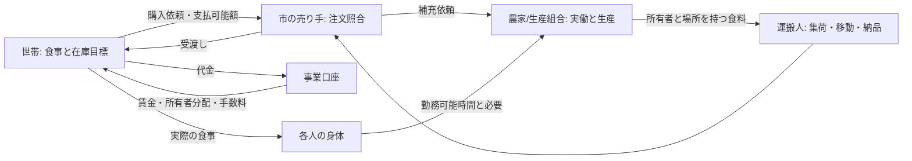

# 市民経済の閉路 — 実装前の設計

状態: 設計案。ゲームコード、コンテンツ形式、既存セーブは未変更。[市民エコシステムの検討](CIVILIAN_ECOSYSTEM_REVIEW.md)の不足を、最初に実装・検証できる契約へ絞る。戦争の拡張より先に、平時の生活と生産が実際の人・物・時間・通貨によって続くことを目標とする。

実装前に確定すべき契約と既存コードとの差は[実装前監査](ECONOMY_IMPLEMENTATION_READINESS.md)に整理した。[E0の現行経済計測](ECONOMY_E0_BASELINE.md)は実施済み。E1では在庫の正本・取引状態・人物の時間占有などを先に固定する。

E1の七項目は[食料の実物流通契約](ECONOMY_E1_CONTRACT.md)に具体化した。旧本編と独立fixtureを世界単位で分け、3日間の物流・売買・食事をE1の受入対象とする。賃金・家計の自律循環と本編90日への統合はE2以降で検証する。

E1から複数財と軍兵站へ進む際の物資正本、容器/アンカー、原子的な移転、受入fixtureは[共通物流設計](COMMON_LOGISTICS_DESIGN.md)に具体化した。E1専用の`FoodLot.place`や現金容器をそのまま軍へ複製しない。

## 「回る」の判定

**資産保存や90日生存だけでは合格にしない。** 初期備蓄と初期資金を使い切る前後に、住民が働き、産物を必要な場所へ運び、他人の所有物を対価と交換し、食べ、次の労働と買物に必要な資金が戻ることを要求する。余剰は保管・休業・他地域への販売など、行き先を持つ。欠員や通行不能なら、代替行動または欠乏という**違う結果**が出る。

最初の境界は食料だけの地域内循環。木材・道具、徴税と公職、遠隔交易は後から加える。初版は固定価格・決定的な定型発注でよい。価格予測や個人ごとの市場最適化は閉路の必要条件ではない。

## 世界の契約と人格の契約

人格v2の認識→動機→判断は、買物・就労・配送を**試みる人の理由**を扱う。世帯の在庫目標、市の定期補充、雇用主の勤務割当は版付き[制度的ルーティン](DATA_DRIVEN_ROUTINES.md)であり、世帯の買物係、売り手、事業の担当者が各々の仕事として起動する。依頼を受けた各人は自分の人格で引受・拒否・延期できる。共通ランナーは仕事の依存関係を追うだけで、売買や労働を成功させない。simは真の位置、時間、所有権、権限、在庫、支払能力を検証し、成功・失敗Eventを確定する。

| 概念 | 誰が持つか | 最小の意味 |
| --- | --- | --- |
| `EconomicRole` / `Employment` | 世界の事実と本人に届いた認識を分離 | 人物ID、雇用主/事業ID、職務、勤務窓、賃金・支払条件。`job`だけで当日の実働を意味しない |
| `InventoryLot` または所在地付き口座 | sim | 財、数量、所有者、現在地、予約量。在庫に人格の信念を混ぜない |
| `Order` | 依頼元とsim | 買主/売主、財、数量、上限価格、受渡場所、期限、原因、状態。市場は照合しても品物を生成しない |
| `DeliveryTask` | ランナーとsim | 担当人物、荷、出発・到着、容量、経路、積載/引渡しEvent。任務中の人は同時に畑で働けない |
| `Settlement` / `Receipt` | sim | 予約、受領、物と通貨の原子的移転、手数料、失敗時の解放。売買と配達の原因をたどれる |
| `MealAttempt` / `WorkShift` | 人格が提案しsimが確定 | 食べた実在庫と本人ID、働いた時間・場所・投入材と成果。日次Activityは結果を要約する |

型名は実装時に調整できるが、**所有者・所在地・予約・実働・原因ID・状態遷移**は契約から外さない。口座を所有と場所の二重台帳にしない。同一在庫の予約・輸送・引渡しを含め、各時点で唯一の所有者と所在地を持たせる。たとえば輸送中は「売主所有、荷車所在地」とし、配達受領時に品物を買主、代金を売主へ同一の取引で移す。買主の代金はそれまで本人の口座で拘束し、支払可能額から除く。取消し・未達なら拘束を解き、在庫の所在と所有を確認する。輸送中の損失は明示的な消費/損失Eventとし、帳簿から無言で消さない。

個人の買物は世帯代表へ委任できるが、代表も実在の人物で、買いに行く時間と場所を要する。市の売り手・運搬人も実在の人物である。市場の照合、端数配分、締切管理は制度処理として自動化してよい。対人約束は任意の追加関係であり、普通の注文や勤務をすべて`PromiseContract`へ変換しない。注文・雇用には履行期待と違反の結果を持たせ、必要なら後から対人約束へ参照で接続する。

## 最小の一日と清算順

1. 日の始めに世帯の食料在庫と生存人数から購入量を算出し、支払可能な数量だけ注文する。事業は市場から届いた注文と在庫目標を見て生産量・勤務枠を決める。本人に届いていない注文を本人が知った扱いにしない。
2. 人物が勤務・買物・配送Taskを引き受け、simが時間枠と場所を予約する。病気、軍務、伝令、拒否などで勤務できなければ、代役か実際の不足を記録する。
3. 勤務終了時に実働と材料から生産を確定し、生産者/事業の所在地付き在庫に加える。仕事を選んだだけでは生産も賃金も発生しない。
4. 生産者が出荷分を予約し、運搬人が実物を積んで時間と道路を使って市場へ届ける。売り手に見えるのは到着した現物と配送された入荷予定であり、予定だけでは販売しない。
5. 売り手が市場の現物と注文を照合し、品物と代金を予約する。同一在庫や同一通貨の二重予約を拒む。買物係の受取り、または担当人物の世帯への配送が終わった時、所有権・代金・明示した手数料を原子的に清算する。未達の注文は期限つきで残すか失敗にする。配達前には食事に使えない。
6. 各人の食事試行で世帯の現物を消費する。欠食・余剰・未配達を記録する。実際の労働に対する賃金、販売収入からの所有者分配、税・扶養の支払いはそれぞれ資金源を持つ。翌日の在庫目標と支払能力はこの結果から更新する。

この順序は一日の概念上の依存であり、全工程を深夜に瞬間処理する指定ではない。勤務と配送が日をまたぐ場合、翌日に予約と進捗を持ち越す。売上前に賃金を払う事業には明示した運転資金が要る。残高が足りなければ未払債務を記録し、架空の現金を発行しない。需要が少なければ生産を休むか備蓄目標までに絞り、その結果として所得が減る可能性も残す。

## 食料のみの検証集落

20人・4世帯の小集落を固定fixtureにする。農家7人、市の売り手1人、運搬人1人、扶養家族など11人。食料需要は一人一日1、価格は2。7人が全日働く日は21食、6人の日は18食なので、`7→7→6`人の勤務を繰り返すと3日で60食を作り、60食の需要と一致する。休む農家を持ち回りにし、農業の生産と食事の間に2食までの調整在庫を置く。これは**定量的な成立可能性の例**であって、実際の労働時間・道路・家計まで自動的に成立する証明ではない。

4世帯は各5人、毎日10通貨ずつ必要で、村全体の食料売上は40通貨/日。7人の農家が働く日は、売り手・運搬人を含む9人へ賃金2ずつ計18を払い、残り22を所有者/組合員へ分配できる。農家6人の日は賃金16、分配可能額24になる。これは事業の他の費用・税・運転資金をゼロとした検算例である。既存の「賃金の80%を世帯へ拠出する」規則を使うなら、個人に残した20%のうち家計の不足分を追加拠出する行動や、所有者分配を世帯へ直接払う規則も必要になる。しかし**各世帯が10通貨を得られるとは限らない**。賃金が偏る世帯、分配権を持たない世帯、税や手数料を取られる世帯は不足する。このため受入fixtureでは、4世帯の構成、初期資金、所有権と分配規則を明記し、世帯別の購買力・欠食・事業残高を毎日検査する。資金の一時的な周回で生存できても、未払が積み上がるなら閉路失敗とする。

農場と市場を短い道路でつなぎ、運搬人の積載量・勤務時間・往復時間が20食/日の輸送に実際に足りるように設定する。4世帯の買物係も市場に行くか、配送枠を得る。輸送能力が足りないときは産地の食料が余り、食卓側で不足する。初期備蓄は日程順序の緩衝だけに使い、後半の達成を備蓄取り崩しで説明しない。

木材・道具を加える次のfixtureでは、道具の摩耗と補充の**必要量**を先に決める。摩耗を追加しないうちは工匠を常勤で生産させず、発注がある日のみ働く。燃料・調理・排泄・睡眠は各々の世界効果と時間を設計してから加え、「食料1を直接消費すれば食べた」という最初のfixtureを虚偽の調理Eventで飾らない。

## 受入条件と対照実験

| 試験 | 合格条件 |
| --- | --- |
| E1基準3日 | 全20人の勤務/配達/買物/食事の結果を原因Eventで追える。食料60の生産・購入/食事と通貨120の移転、欠員/資金不足の反事実を確認 |
| E2以降90日 | 30日以降も実生産・配送・売買・食事が継続し、世帯の未払・在庫・資金が説明できる。恣意的な全世帯飢餓ゼロは要求しない |
| 保存則 | 通貨・食料の総量が初期量＋生産－消費－明示損失と一致。予約中・輸送中も一回だけ数える。所有者と所在地が常に一意 |
| 運搬人不在 | 農場の現物が市場へ瞬間移動せず、初期市場在庫後に配達・食事へ影響が出る。代役がいるならその人物の仕事と時間が残る |
| 買主の資金不足 | 注文が無償清算されず、食料か所得移転の実在がなければ欠食になる。初期資金だけで隠さない |
| 農民の軍務/欠勤 | 実働・生産・賃金が減り、備蓄か欠乏か代役のEventで説明される |
| 同時注文/失敗 | 品物・代金の二重使用がなく、未達/取消しで予約が正しく解放され、誰が何を知るかも配送に従う |
| E1再現 | seed、Command、保存状態、コンテンツ版から3日fixtureの同じEventと台帳へ再現 |
| E2以降の規模と負荷 | 1,000人90日で必要な性能を**実測**し、現行値を新設計の達成値に流用しない |

「商人の職名だけを変える」と結果が変わらない現行の対照に代え、**実際の売り手と運搬人の勤務・不在**を変える。生産→配送→販売→消費の各辺について、担当者・在庫・通貨の一つを抜くと因果的に切れることを検証する。

## 移行順と既存ゲームの扱い

1. **E0: 計測可能な基準。** 現行1,000人90日の食料・装備・金銭、世帯別欠食、職業別実働相当、国別共同口座の推移を記録し、経済が閉じていない箇所を固定する。現行の試験結果を変更しない。
2. **E1: 食料の実物流通。** 所在地付き在庫、予約、注文、農家/運搬人/売り手/買物係のTask、受領時清算を独立した小集落fixtureで通す。旧本編の賃金経路は変更せず、fixtureの3日分は初期資金で買う。経済の自律性を達成したとは判定しない。人格v2全体の移行を待たず、ルール実装を共通Task境界へ接続する。
3. **E2: 労働と所得を含む経済閉路。** 実働、事業ごとの資金、賃金、所有者分配、扶養、未払を導入。国別`work_*`共同口座を一度に消さず、移行表と保存版を作ってから分割する。固定価格のまま90日を再検証し、ここで初めて食料経済の自律性を判定する。
4. **E3: 複数財と既存戦争の接続。** 木材・装備の注文と真の需要、摩耗または限定生産、徴税/公職財源、軍の調達・徴兵による労働欠員を接続。人間が遊ぶ既存90日経路を壊していないか確認する。

各段で受入fixture、保存/再生、不変条件、既存シナリオ回帰を実行する。新経済の停止や不足を隠すため旧共同口座から無断補填しない。人間試遊は引き続きM3の別の未完了条件である。E0の基準計測は実施済み。E1〜E3は今後の作業単位で、この文書作成時点では未実装・未検証。
