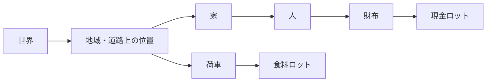

# 物体・包含・所有権の共通モデル

状態: 2026-09-26にL0の物体木・容量・予約・原子的操作を`packages/sim/physical.ts`へ実装し、独立試験で検証した。L1では独立`local_food_v2`の食料・現金・所在地の正本へ接続した。[平時と戦時の共通物流](COMMON_LOGISTICS_DESIGN.md)の`AssetLot + Holder.anchor`案を、入れ子の物体モデルへ改訂した設計である。旧E1/M2の保存形式・動作は未変更。本編経済への移行は後段。

## 一つの物理的な親、別の社会的な関係

硬貨の束は財布の中、財布は人の携行品、人は家の中にいる。人が市場へ出れば、財布と硬貨の現在地は親をたどって決まる。食料は荷車、荷車は街道上、部隊の物資は野営地の倉庫、という関係にも同じ規則を使う。**物理的包含の正本は子の`parentId`だけ**とし、親側の`contents[]`や財ごとの`place`は導出する。

「入っている」「所有している」「預かっている」「世帯/軍に所属する」は異なる。兵士は部隊に所属するが、部隊という組織の中に物理的に入るわけではない。人は所有物にしない。商人の荷を運搬人が預かっても所有者は商人のまま。財布が人の携行品でも中の金の所有者が必ず本人とは限らない。所有者は資産について独立して明示し、保管責任とアクセス権、世帯/軍籍などの複数所属は別の関係に置く。



これは包含図であり、所有図ではない。建物や地域は親の重量容量を必ず持つ必要はない。街道移動中は`Movement`に対応する一時的な通行空間オブジェクトを親にし、到着前に目的地へ配置しない。移動する人や荷車だけを付け替え、その子孫の位置は自動的に変わる。複数人が動く隊列では、それぞれを同じ通行空間へ結びつける。

## 保存する最小データ

```ts
type PhysicalObject = {
  id: string; typeId: string; parentId: string | null;
  quantity: number;             // 通貨・食料など同質ロットは複数、個体は1
  ownerId?: string;             // 所有可能な物だけ。人・道路位置には付けない
  causeEventId: string;
};
type PhysicalType = {
  id: string; tags: string[]; unitMass: number; stackable: boolean;
  container?: {
    acceptsTags: string[];       // この物体へ直接入れてよい子の種類
    maxContentsMass?: number;    // 省略時は重量による制限なし
    maxDirectChildren?: number;  // 必要な種類だけ。敷地などは省略可
    maxQuantityByTag?: Record<string, number>; // 財布の現金20など
  };
  ownable: boolean;
};
type Movement = {
  id: string; routeId: string; fromId: string; toId: string;
  transitObjectId: string; startedAt: number; arrivesAt: number;
  participantIds: string[];
};
```

`ownerId`の実体は人・世帯・事業・国などで、これを所有権の唯一の正本にする。`ownable: true`の物体には有効な所有者を必須とし、`ownable: false`の物体には設定しない。`quantity`は正の安全な整数、個体は常に1。現金は「同じ所有者の通貨N単位」というID付きロットで、一枚ごとのIDは作らない。ロットを割れば新IDと分割Eventを作り、同じ`typeId`・所有者・状態のものだけ合流できる。装備の個体耐久が必要になれば数量1の個体物体で表す。

物体ごとに文化、兵科、価格、損耗、病気などの欄を増やさない。`PhysicalObject`はID・型・物理親・数量・必要な所有関係だけに限定し、人物の身体/人格、軍の編成、商品の品質、施設の生産能力は、それぞれ型付きの別コンポーネントまたは参照する版付きデータに置く。自由な文字列→任意値の属性袋やコンテンツ内スクリプトは使わない。共通化するのは物体の同一性・包含・容量・移動・所有権の基盤であり、全ルールを単一型に押し込むことではない。

荷台容量以外の牽引力、車輪の状態、運送人の積載技能は、物体の共通欄を増やさず[能力インスタンスと能力エージェント](CAPABILITY_AGENTS_DESIGN.md)として結びつける。物体に能力があっても勝手に仕事を開始しない。実在する担当者のTaskと権限が必要である。

## 容量・重さ・許される親

親に直接入れるには、子の型タグが親の`acceptsTags`に合致し、残り容量が足りることが必要。財布は`currency`、携行品枠は`wallet`・`food`・`equipment`、荷台は`cargo`、家は`person`・`furniture`、野営地は`person`・`vehicle`・`store`を受け入れる、といった定義をコンテンツに置く。タグは版付きスキーマで検証し、未知タグや矛盾した型を読込時に拒否する。例外は特定のTaskや制度が明示した権限として扱い、未知の親へ黙って移さない。

重さは`unitMass × quantity + 直下の子の総重量`を再帰集計する。`unitMass`は版付きの非負整数の抽象負荷点でよい。財布の中の現金は財布の重量に加算され、その財布を持つ人と、人を乗せた荷車の負荷にも入る。**同じ物体を二度加算しない。** `maxContentsMass`は中身の総負荷、`maxQuantityByTag`は財布の現金20や袋の食料5などの数量上限であり、物体型ごとに必要な制約だけ宣言する。タグ別数量はその物体の全子孫から集計する。積み入れ時は直接の親から根まで、影響を受ける全祖先の上限を検査する。人物/車両の持ち運び可能量も同じ規則で検査する。現行E1食料5・現金20・荷車21の上限を移す際は、財布自体の重さと現金重量を含めて基準fixtureが成立する係数を決める。

集計は同じ子インデックスを使う純粋関数として定義できる。以下は**設計用の擬似コード**であり、現行コードに存在するAPIではない。

```ts
function totalMass(id: Id): number {
  const object = get(id);
  return typeOf(object).unitMass * object.quantity
    + childrenOf(id).reduce((sum, child) => sum + totalMass(child.id), 0);
}
function contentsMass(id: Id): number {
  return childrenOf(id).reduce((sum, child) => sum + totalMass(child.id), 0);
}
function contentsQuantity(id: Id, tag: Tag): number {
  return childrenOf(id).reduce((sum, child) =>
    sum + (typeOf(child).tags.includes(tag) ? child.quantity : 0)
        + contentsQuantity(child.id, tag), 0);
}
function capacityReport(id: Id) {
  const limits = typeOf(get(id)).container;
  return {
    massUsed: contentsMass(id), massMax: limits?.maxContentsMass,
    directChildrenUsed: childrenOf(id).length,
    directChildrenMax: limits?.maxDirectChildren,
    tagUsed: Object.fromEntries(Object.keys(limits?.maxQuantityByTag ?? {})
      .map(tag => [tag, contentsQuantity(id, tag)])),
    tagMax: limits?.maxQuantityByTag ?? {},
  };
}
```

容器の**空き容量を単純に足しても、外側の運搬能力にはならない**。財布2個に現金が各10入る余地があっても、その人の残り運搬負荷が5なら20を持ち込めない。物体を移す前に、仮の親子関係で移動元と移動先の全祖先について`capacityReport`を再計算し、受入タグ、重量、タグ別数量、直接の子数を検査してから原子的に確定する。同じ人物の袋A→袋Bの移動では人物全体の重量が増えないので、「新しい親へ足す」だけの差分計算では誤判定する。UIに出す空き量は各容器の値と、その物を実際に追加できる量を区別する。

親子関係の検証では、親の存在、親の一意性、世界根への到達、循環なしを確認する。読み込み時に子インデックスを構築し、上の再帰関数は検証済みの木だけに適用する。集計キャッシュを使う場合も正本は`parentId`と型定義であり、移動後は元と先の祖先を無効化して再計算する。保存/再生ではキャッシュを信頼しない。

包含グラフは世界を根とする非循環木で、各物体に親は一つだけ。数量を積む型は子を持てず、容器や人物などの個体型は数量1とする。子を子孫へ入れる操作、親が存在しない状態、人を財布へ入れる状態、容量超過を拒否する。人が死亡しても携行品を消さず、遺体/所持品の扱いを明示したEventで移す。ある場所から別の場所へ物を動かすには、行為者が実際にアクセス可能で、同所性・予約・必要な時間/費用を満たすことをsimが検査する。「親になれる」ことだけで遠隔移動や窃盗を許可しない。

## E1からの具体的な移行

| 現行E1 | 新しい正本 |
| --- | --- |
| `FoodLot.place` | 食料ロット物体の`parentId`。農場/市場/家の食料箱、買物係の袋、荷車のいずれか |
| `CashContainer.amount/place` | 財布・金庫・市場金庫を個体物体とし、中に現金ロット物体を置く。容器の所在地は親から導出 |
| `FoodCart.location/carrierId` | 荷車は個体物体。所在地は親、牽引者はMovement/Taskの参加者から導出 |
| `Person.location/journey` | 同じ人物IDに物理物体と人物コンポーネントを対応させる。所在地は親、旅程はMovementを参照 |
| `wallets`、施設/世帯の在庫表示 | 所有者・親子関係から集計する投影。更新先にしない |

移行変換は元の場所と所有者が確定するE1保存状態だけを受け付け、変換後の食料・現金総量、所有者別残高、全人物IDと因果Event参照を検査する。旧形式をそのまま読めると装わない。E1のシナリオ結果と同一新版の保存/再生を受入条件にする。

## 操作と受入例

`split`/`merge`、`reserve`/`release`、`reparent`、`changeOwner`、`produce`/`consume`、`startMovement`/`arriveMovement`を型付き試行として受ける。市場の売買は食料を売り手の箱から買物係の袋へ、現金を買物係の財布から売り手の金庫へ、所有権と一緒に**同じ原子的操作**で変える。失敗時は資産・親・予約をどれも途中変更せず、理由Eventを残す。包含で決まる位置と、人格が知る位置は別で、本人には届いたEventからの認識だけを渡す。

最小契約試験は次を含める。

| 状態/試行 | 必要な結果 |
| --- | --- |
| 財布に現金10、財布はAの携行品。Aが家→市場を移動 | 現金ロットの`parentId`は財布のまま。市場での所在は親をたどって得られ、現金を複製しない |
| 財布2個に各10の空き、人の残り負荷5 | 容器の空き20を人の運搬可能量と報告しない。合計負荷が5を超える追加を拒否 |
| 同じ人が持つ袋Aから袋Bへ食料1を移す | A/Bそれぞれの上限を検査するが、人の総積載は増えない |
| Aは他人所有の財布を預かる | 財布と中の金の所有者を勝手にAへ変更しない。受渡し権限を別に検査する |
| 容量4の袋へ食料5を入れようとする | 積載を拒否し、食料は元の保管先に残る |
| 財布を自分自身または子孫へ入れる／人を財布へ入れる | 循環と型不一致を拒否。世界状態は不変 |
| 荷車が道路上、車内に食料6。運搬人が欠員 | 荷車と食料は最後の実在位置に残り、目的地へ届かない |
| 兵士4人が野営地の食料6を1食ずつ受ける | 消費4、残量2。元住民と兵士を別個体として数えない |

人物20人・4世帯のE1で同じ食料60/通貨120と因果結果を再現した後に軍の小fixtureへ進む。移行前後の内部IDやworldHashは一致を要求せず、保存再開・同一版の再実行は一致させる。実行性能とデバッグ表示は、入れ子の深さ制限/集計キャッシュの必要性を実測してから決め、未計測を達成済みとしない。
