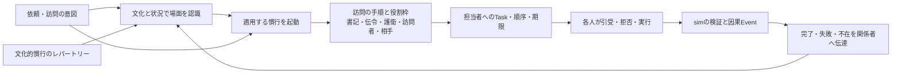

# 社会的慣行を行動の方法として扱う設計

状態: 設計案。ゲームコードは未変更。現行の [認知・行動インターフェースv2](AGENT_INTERFACES_v2.md) と [仮接続調査](INTERFACE_DRY_RUN.md) を補う。契約の型・慣行の優先規則は実装前に対照例で確定する。

多数の場面・職業へ拡張するため、慣行は原則としてプランナーが編集する版付き[ルーティンデータ](DATA_DRIVEN_ROUTINES.md)で定義する。ここに示す`SocialPracticePort`はそのデータを利用する意味上の境界であり、訪問ごとの専用コードを増やす方針ではない。

## 問題

「君主が家臣を訪ねる」は単一の移動行動ではない。訪問という**社会的場面**を認識した時点で、書記への連絡、家臣への予告、護衛の手配、同行、到着時の取次ぎなどが通常の手順として予期される。賊に襲われる確率と損失を毎回計算して護衛を思いつく必要はない。この手順は文化・地位・役職・組織に共有される**慣行（SocialPractice）**であり、個人の合理的予測とは別の行動源である。

文化を「出来事の解釈枠」と「動機の重み」だけにすると、慣行による行動展開が抜ける。文化には、場面の分類、そこで当然視される役割と作法、通常の仕事の組み立て方も含める。一つの社会に複数の慣行があり、人物ごとに知識と従い方が異なる。慣行は自然法則ではないため、破る、簡略化する、知らない、相手文化と衝突することも表せる。

## 境界



慣行は **認識と実行の双方に関係する共有知識**である。認識ブロックは「これは君主の公式訪問だ」と場面を分類できる。動機づけは「護衛の職務」「礼を欠けば失礼」などを受け取れる。判断ブロックは訪問の意図を選べる。慣行の展開は、その意図を実際に行うための既定の方法を、担当者の仕事へ落とす。これらを一つの実装がまとめて計算してもよいが、出力される仕事と世界効果は型と因果で検査する。

最小の概念契約は次のとおり。これは実装クラスの固定や汎用DSLの要求ではない。

```ts
type PracticeActivation = {
  practiceId: Id;
  practiceVersion: string;
  situationRef: Id;       // 本人が捉えた場面
  evidenceRefs: Id[];      // 届いた刺激・既存の知識
};

type PracticeInvocation = {
  actorId: PersonId;
  intentionRef: Id;       // 例: 家臣を公式訪問する
  activation: PracticeActivation;
  knownContext: SituatedContext;
};

type PracticePlan = {
  parentIntentionRef: Id;
  practiceRef: { id: Id; version: string };
  roleSlots: RoleRequirement[];  // 君主、書記、伝令、護衛、訪問相手
  tasks: TypedTaskSpec[];        // 準備、通知、集合、同行、取次ぎ等
  order: TaskDependency[];
  failureOptions: TypedFallback[]; // 待つ、代役を求める、単独で行く、断念
};

interface SocialPracticePort {
  applicable(situation: SituationFrame, repertoire: CulturalRepertoire): PracticeActivation[];
  instantiate(input: PracticeInvocation): PracticePlan;
}
```

`SocialPracticePort` は**慣行という責務の境界**で、内部は規則、固定テンプレート、別の方法の組合せなど何でもよい。人間やNN/LLMによる実装も後から可能だが、それらを別の社会的役割として図に割り振らない。`CulturalRepertoire` は人物・組織が知る版付き慣行の集合を指し、`CulturalFrame` と同じ文化的状態に属する。現行の3文化から始めてもよく、新しい巨大な文化DSLを初日から作る必要はない。

## 訪問の因果例

1. 君主の「家臣を訪問する」という意図から、本人の文化・役職・相手との関係に合う「公式訪問」の慣行が起動する。護衛を連れることは既定の手順であり、毎回賊の確率を予測して選び直さない。
2. 慣行のPlanは、書記へ予告文の作成、伝令へ配送、護衛役へ同行、訪問相手へ在宅の依頼を、それぞれ人物IDを持つTaskとして提案する。誰を割り当てられるかは既知の候補と制度上の権限で決め、最終的な在否・資格・時間はsimが検証する。
3. 各人は通常の職務なら慣例に従って引き受ける場合が多いが、負傷・別任務・不忠・文化差などで遅延や拒否があり得る。Taskの割当と本人の実行は別Eventである。伝令や護衛は瞬間移動しない。
4. 必要な準備が整ってから訪問団が出発する。道中の賊という実際の危険は世界側が処理する。護衛が欠けたときだけ、代役・延期・単独訪問・中止を再判断する。単独訪問は可能だが、危険や礼節上の評価に影響し得る。
5. 到着、取次ぎ、面談、帰路はそれぞれEventで追う。訪問相手や遠方の君主には、結果が届いた時だけ認識を更新する。

この構造では「君主が護衛を連れた」は、君主自身の予測スコアだけではなく、文化的慣行の版、護衛への仕事、護衛本人の実行、移動と到着のEventで説明できる。

## 設計上の注意

- **慣行と約束は別物。** 慣行は社会に共有される既定の方法・期待であり、特定の二者間で成立した債務ではない。護衛が任務を引き受けたらTaskが成立し、明示的な報酬保証を交わした時だけSocialCommitmentが別に生じる。
- **慣行と強制力も別物。** 「通常は護衛を連れる」は行動を必ず禁止/許可する法律ではない。役職上の命令権、本人の承諾、実際の同行可能性、世界の効果はsimで別に判定する。
- **文化と制度は重なる。** 宮廷の手順は文化的期待であると同時に、書記・護衛の職務規則にもなる。テンプレートを人物ごとに複製せず、共有する定義と各人の知識・従い方を分ける。
- **複数慣行が衝突する。** 公式訪問、秘密訪問、戦時の緊急移動、喪中の作法などは同時に当てはまり得る。初期実装は場面の明示的な選択と少数の優先規則でよいが、どの慣行を採ったか・省いたかは記録する。
- **習慣は計算節約にもなる。** 通常経路は決まった手順を展開し、欠員や例外でだけ再判断する。ただし慣行の適用・不適用の根拠と、実際に人が動いたかは残す。

## 現行コードとの違いと検証例

現行 `REQUEST_AUDIENCE(mode: "visit")` は君主と書記の`journey`を直接設定する（`packages/sim/diplomacy.ts:78–103`）。護衛役、護衛へのTask、集合、拒否・欠員による代役がない。`summon`は書記と伝令を通るが、配送選択はsimが直接行う。既存の`Audience`、`Message`、`Event`は手順を追う土台として使える一方、慣行の起動・役割枠・個人別Taskの履歴は追加設計が必要である。

対照例: 同じ「家臣を訪ねる」意図で、(a)護衛が揃う、(b)護衛が他任務中、(c)君主が秘密訪問を選ぶ、(d)相手文化が護衛付き訪問を威圧と解釈する、を比較する。世界の危険を変えずに文化・地位・状況だけで準備と相手の受け止め方が変わること、TaskとEventを全員のIDで追えること、資産・人口・保存再開が保たれることを確認する。**現時点では設計例であり、テスト未実施。**
