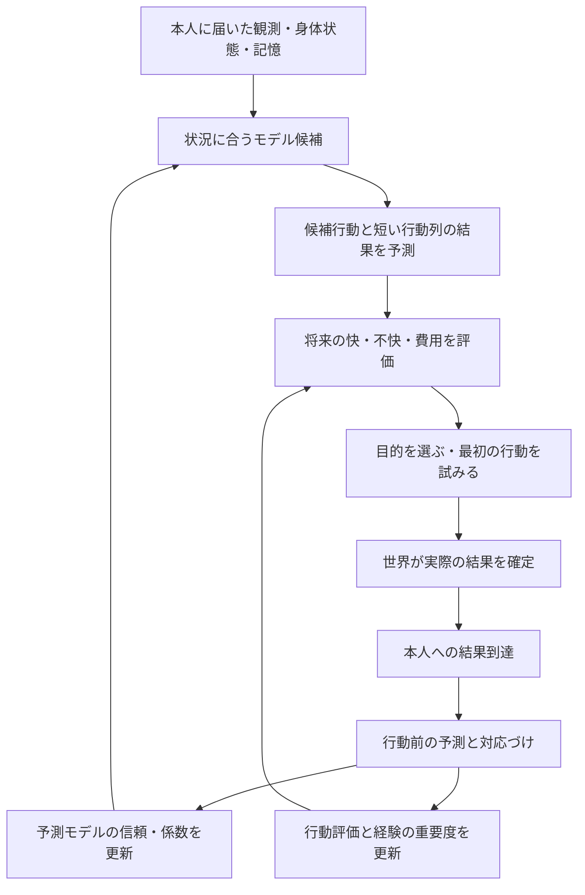

# 状況別の予測モデルと快・不快による行動選択

更新: 2026-10-03。ユーザー合意に基づく設計。段階Aを[v13](PREDICTION_LEDGER_V13_RESULT.md)で実装した。[v17](EXPERIENCE_LEARNING_V17_RESULT.md)でBの体力モデルとCの短い採集目的を初実装した。[v18](FOOD_JOURNEYS_V18_RESULT.md)で農作業と市場の目的を保持し、[v19](FOOD_PLANNING_V19_RESULT.md)で食品の期限・需要・睡眠・帰路から限定した行程を比較する。B/Cの全行動への統合とDは未完了。[身体・環境の設計](NEEDS_AND_ACTION_SELECTION_PLAN.md)を具体化する。[v12の実測](ANTICIPATORY_NEEDS_V12_RESULT.md)は旧実装の比較基準とし、本書の方式が90日成立した証拠にはしない。

## 目的と境界

睡眠の新しい身体法則は[睡眠・眠気・活動疲労の身体モデル](SLEEP_AND_FATIGUE_BODY_MODEL.md)に置く。現行の `sleepDebt + 時間` と固定8時間の回復を、入眠待ち・実睡眠履歴・時間帯・疲労から先の眠気を見積もる小モデルへ置き換える設計。現在の身体信号と本人に届いた履歴・結果で学び、世界の内部の睡眠圧や未来の回復の正解は渡さない。新規則は未実装で、旧v19の回復率・単位の経験をそのまま転用しない。

本人が小さな予測モデルを複数持ち、状況と実際の結果から使うモデルを選び直す。候補行動と短い行動列の結果を内部で予測し、将来の快・不快、労力、時間、備蓄と約束から選ぶ。強い不快になる前に対処できるようにする。

世界は身体・植物・加工・移動・権利・取引の結果を確定する。本人は届いた観察と身体信号で学ぶ。世界の未来、遠隔の資源量、他人の需要、実験者が付けた「状況が変化した」というラベルを人格へ渡さない。rule人格内部の方式であり、`PersonalityModel` の全実装に同じ評価式を強制しない。

初期のモデル群と初期知識は設計者が用意する。その選択・局所的な係数・評価を経験で更新する段階から始める。新しい概念・モデル構造を自動発見する能力、生物の脳の再現、経済の持続性を達成したとは扱わない。技能獲得・職選択は[食品経済の計画](FOOD_ECONOMY_SKILLS_PLAN.md)の後続段階に残す。雇用・木こり・薪の停止は継続する。

## 参考にする構造

- [MOSAIC原論文](https://wolpertlab.neuroscience.columbia.edu/sites/wolpertlab.neuroscience.columbia.edu/files/content/papers/HarWolKaw01.pdf)は、予測器と制御器の組を複数持ち、状況と予測誤差から各組の寄与と学習を調整する運動制御モデル。本書はモデル選択の構造を参考にする。生活の快・不快や職選択まで同論文の検証対象とはしない。
- [PC-ALM公式解説](https://pub.sakana.ai/pc-alm/)は、層ごとの局所的な予測誤差から深いネットワークを訓練する方式。時間をまたぐ行動学習は後続課題であり、本書でその訓練方式を導入するとは決めない。
- ユーザーの [latent-state-adaptation](https://github.com/demerzel09/latent-state-adaptation#readme) は、予測との不一致、原因の区別、仮説検証、一時状態と持続的な統合を設計している。ここでは一過性の例外と持続的な変化を区別し、検証前の仮説を既存記憶へ即座に上書きしない構造を参考にする。同リポジトリの内部状態操作を移植する計画ではない。

以下の更新式・容量・行動評価は、このシミュレーター向けの提案であり、これらの研究で有効性が実証された組合せではない。

## 理論・設計・現行コードの対応

判断処理はTypeScriptの独自実装で、外部OSSの意思決定エンジンは導入していない。MOSAICを生活行動へ応用する構造上の参考とし、原論文の運動制御・NN・確率的な学習方式を再現したとは扱わない。PC-ALMの訓練や `latent-state-adaptation` のコードも移植していない。

| 考え方 | 現行の実装 | 設計に残る範囲 |
| --- | --- | --- |
| 状況別の予測とモデル選択 | [体力モデル](../../packages/ai/action-learning.ts)は行動・荷重・屋内外・寒さ・睡眠不足で条件を分ける。初期と経験の事前予測を同じ実結果で比較し、経験2件・誤差比較2件以上で経験の平均絶対誤差が小さければ採用する | 本書のGaussian誤差からの重み、複数モデルの寄与による学習、仮説の検証・統合 |
| 経験による数値更新 | [予防判断](../../packages/ai/anticipatory-needs.ts)と体力モデルは観測の平均・ばらつきを逐次更新。v19は寒さ0/上限、睡眠不足0で制限された結果を率の証拠にしない | 変化への追従、忘却、予測区間の校正、すべての観測の同条件対応 |
| 将来の身体と食品から候補比較 | [食品行程](../../packages/ai/food-planning.ts)は見える植物5候補と家・市場・記憶した探索先から最大8候補を作り、取得・帰路・体力・寒さの余裕・睡眠不足・次の需要・期限で比較する。採集量も身体の見込みに合わせて減らす | 汎用の行動列探索、食品以外も含む統一評価、実行中の人格による中断 |
| 行動を選ぶルール | [判断本体](../../packages/ai/anticipatory-needs.ts)の優先順位と閾値は初期rule。食品候補の費用重み・8時間の睡眠見込み・1〜3食の採集目安も初期設定 | 快不快から行動の価値・優先順位・目的を学ぶ方式 |
| 誤差と不快を区別する | 正確に消耗を予測するモデルは保持し、その予測から荷物を減らす・回復する。本人に届いた実行区間だけを更新する | 複合行程の成果配分と長期価値学習 |

したがって、本書の後続節には実装済みと提案が混在する。現行の正確な更新条件は[v17の報告](EXPERIENCE_LEARNING_V17_RESULT.md)、行程比較の範囲と90日の実測は[v19の報告](FOOD_PLANNING_V19_RESULT.md)を併読する。予測モデルの学習が成立することと、生活・経済が持続することも分けて測る。

## 全体の流れ

### 区別する三つの学習対象

| 対象 | 学ぶ内容 | 主な更新材料 |
| --- | --- | --- |
| 状況とモデルの選択 | 現在の状況を説明できるモデルはどれか | 行動前の状況、行動後の予測誤差、過去の適用履歴 |
| 結果の予測 | この条件・行動で時間や身体がどう変わるか | 対応する実測、量ごとの誤差、結果のばらつき |
| 行動の評価 | この身体・目的でその行動がどれだけ役立つか | 本人が感じた快・不快の経過、費用、実在の成果 |

強い不快を正確に予測したモデルは、予測器として信頼を増す。その予測から危険な行動を避ける。予測が正確だったという理由で、その行動の価値を上げない。快・不快の強さと予測誤差の大きさは別の量として保存する。

## 小さなモデルの構成

一つのモデルは、適用条件、入力、予測する量、予測期間、初期知識の出所、学んだ係数、ばらつき、経験数を持つ。同じ量・同じ期間を予測する代替モデル間で競合させる。移動時間モデルと寒さモデルは役割が違うため、一つの勝者を決めず組み合わせる。

行動の小さなモジュールは、この予測器と候補行動を作る制御器を組にする。制御器は「観察した熟した植物へ移動して採集」「寒さが増える前に利用可能な場所へ移動」といった状況・目的から候補を提案する。その提案を対応する予測器で評価し、人物が最終的に選ぶ。初期の制御器は既存の行動から候補を作る条件表とし、選択履歴と行動評価を学ぶ。予測器の係数学習と制御器の評価更新を別に保存する。

| 領域 | 初期に用意するモデル・条件 | 予測する結果 |
| --- | --- | --- |
| 移動 | 経路・距離と荷重からの初期見積もり、既知経路の経験モデル | 到着までの時間、体力消費、途中の身体変化 |
| 寒さ | 既知の場所の屋内外・保温、観測した気温と時刻の履歴 | 一定時間後の寒さ、途中の最大値、体力の変化 |
| 睡眠 | 屋内・屋外、本人の開始時の睡眠不足、観察した環境 | 実際に寝た時間での回復と残る不足 |
| 採集 | 観察した植物と成熟・量、本人の作業経験 | 成否・収量・所要時間・疲労・得られる可食量 |

v12の場所・時間集計を材料にするが、結果が上下限で止まった観測も扱う。睡眠不足が0になった後の時間を低い回復能力の証拠にせず、寒さ0での停滞を「暖かい場所で寒さが減らない」という学習にしない。上限・下限で観測が制限された区間は、そのままの変化率の更新から除外するか、限界付き観測として記録する。

### 状況の選択と切り替え

1. 観測可能な条件と利用権から適用可能なモデルを絞る。未知の条件は未知のまま残す。
2. 状況履歴から行動前の重みを出す。初期は条件表と同じ状況での採用履歴で十分とする。
3. 結果到達後、同じ実行行動を予測した各候補の誤差を比較し、行動後の重みを更新する。
4. 次の同様の状況で、行動前の選択へ反映する。係数更新の量も各モデルの寄与で調整する。

初期の比較式は `重み ∝ 状況からの重み × exp(-標準化誤差² / 2)` とし、観測ノイズの下限と数値の下限を設定する。量の単位が異なる場合は、量ごとの観測精度・尺度で誤差を標準化する。未経験モデルの不確かさだけが大きいことを、常に勝つ理由にはしない。異なる不確かさを比較する尤度は正規化項を含める。この重みは初期の選択用の値であり、校正済みの真実の確率とは扱わない。

一回の外れは「例外か変化か未確定」として残す。初期は複数の独立した完了経験で同じ向きの誤差が続いた場合に、代替モデルの重みを継続的に増やす。判断回数や同じEventの再配送を経験回数として数えない。継続回数・誤差閾値・切替の余裕はモデル版に保存し、小fixtureで決める。

切り替えるのはまず説明に使うモデルであり、行動目的を毎回変えることではない。行動の切替は、危険の増大、実行不能、期待した資源の不在、または切替費用を上回る改善が見込める場合に再検討する。

## 予測と実結果の対応づけ

行動前に予測を確定して保存する。結果を見てから予測を書き直さない。

| 記録 | 必須の内容 |
| --- | --- |
| 予測 | 人物・予測ID・判断時刻、入力の観測IDと主観状態版、候補モデルIDと版・重み、条件、行動案、対象の量・単位、予測値・期間・不確かさ |
| 実行への接続 | 選択した案と予測ID、試行ID、受理後のProcess ID、開始地点・対象・開始時刻 |
| 結果 | 発生時刻と到達時刻、観測ID、実測値、完了・中断・拒否・対象変更・未観測の区別 |
| 更新 | 対応した予測IDとモデル版、更新前後の係数・重み・誤差尺度、更新した理由または除外理由 |

同じ対象・期間・実行条件について到達した結果だけを比較する。予測が1時間後なら同じ対象時点の観測と比較し、配送遅延がある場合も到達時刻を予測期間へ混ぜない。移動を中断した場合、経過時間を完了所要時間として学習しない。受理されなかった試行は、実行可否の経験として使い、物理的な所要時間0として扱わない。

未選択の案は比較用の仮説で、正解ラベルを持たない。同じ実行行動について別の予測モデルも事前に予測していた場合は、その実結果で比較できる。未観測は0にせず、期限を過ぎた予測は未観測として閉じる。重複更新を予測ID・結果IDで防ぐ。

予測中にモデルが更新されても、誤差は保存した旧版の予測から求める。係数を更新する際は更新先の現行モデルと観測の適合を再確認し、どの版へ反映したか残す。

### 数値の更新

平均の初期更新は `見込み ← 見込み + α × 寄与 × (実測 - 現行の見込み)`。事前予測に対する誤差は別に監査用として残す。更新時点で見込みが変わっていた場合に古い誤差をそのまま重ねて足さない。αは記録した固定値から始め、実測の対照で決める。v12の全経験の平均との比較を残す。

典型的な絶対誤差や二乗誤差も更新する。次の一回のばらつきと、平均の推定誤差を分ける。経験数が増えただけで、次の移動・寒さの変動まで0に近づくと解釈しない。安全の余裕には未経験度、次の結果のばらつき、モデル間の不一致を含める。予測区間の実際の包含率は対照で測り、初期の余裕を安全保証とは呼ばない。

## 快・不快と行動の評価

最初は既存の寒さ・空腹・睡眠不足・体力と、その改善を代理指標にする。身体の各量、感じた改善、経過時間を分けて記録する。独立した感情モデルや厳密な栄養は別の拡張とする。

- 現在の不快の強さと、行動中の累積不快、回復量を区別する。悪い状態を往復させて回復だけを報酬として稼ぐ選択を防ぐため、悪化と継続の費用も同じ経過で評価する。
- 候補評価は、予測される累積不快と回復、体力・時間・移動費、可食在庫、約束の履行を別項目で残す。初期の重みは本人の設定であり、世界が結果に合わせて調整しない。
- 時間当たりの結果と全経過の結果を区別し、1時間の待機と8時間の睡眠を単一の回復量だけで比較しない。候補は共通の評価期間で、行動後の既知の待機も含めて比較する。
- 長い行動列の評価は実行した区間の履歴へ対応づける。まず直接の身体変化を予測し、その予測から行動列を評価する。直接経験した行動の評価と、計画全体の評価を同じ報酬として重複加算しない。
- 強い快・不快や大きな意外性は経験を残す理由とする。一度の強い経験を多数の独立経験に置き換えず、予測誤差そのものを不快や世界の危険度とはみなさない。

初期は短い行動単位と完了した目的の実結果を更新する。実行していない後半の行動に実報酬を割り当てず、複数の作業や遅れた成果の原因帰属が曖昧な場合は未確定にする。時間をまたぐ一般的な価値学習は、この直接の対応づけが成立した後の比較候補とする。

## 短い行動列と実行中の判断

初期の計画は、到着したら採集する、帰宅したら保存・加工する、利用可能な場所へ移動して眠る、という既存行動の組合せ。各段階で予測した位置・時刻・荷物・身体を次のモデルの入力へ渡す。想像上の観測を新しい事実や経験として記憶しない。

初期上限は行動列3段階、候補8案とし、長い周期の栽培計画は別の目的記憶へ残す。評価期間は6時間を基準に、候補の完了・対処所要時間を含む共通期間へ延ばし、最大24時間とする。上限外の結果は未評価として明記する。予測が不足する場合も、既知の初期知識と不確かさから判断できるようにする。

最初の一行動だけを世界へ試行する。実結果・新しい観察を受け、残りの計画を再評価する。離散的な採集・睡眠・移動の命令をモデルの重みで数値平均しない。予測・評価を比較して一つの実行可能な案を選ぶ。

行為途中の判断には、人物に結果・身体信号を届ける接続と、当該Processの中断可否が必要。中断できない行為を人格が停止したことにはしない。世界は中断済み区間の時間・消耗・材料の結果を確定し、本人は残る目的を再検討する。

## 記憶・保存・再現

詳細経験、集計した予測モデル、検証待ちの仮説、実行中の目的、未決の予測を分ける。詳細経験はv12の24件を開始点とし、モデル群は初期の定義済み有限集合で始める。予測待ちは人物ごとに16件を上限とし、超過時は古い未観測の予測を除外理由付きで閉じる。容量と忘却は設定・モデル版に保存する。閉じた予測と更新は再生用履歴へ残す。

候補の順序・同点時の選択・更新順を固定し、乱数を導入する場合はseedと状態を保存する。未決予測、モデル版、目的、仮説、重複処理の管理状態もセーブ対象。本人の信念更新は主観履歴に残し、物理Eventと区別する。

v12の記録は初期条件・応答・世界規則を維持する。新しい人格方式には新しい規則／人格版とfixtureを設ける。保存応答を使う世界の再実行と、同じ判断入力で新しい人格計算を再実行する検証を分け、双方の一致を確認する。記録容量を測り、モデル全文を毎回無制限に複製せず、初期スナップショットと差分・参照で追える形式を検討する。

## v12からの実装順と完了条件

| 段階 | 実装する内容 | 次へ進む条件 |
| --- | --- | --- |
| A 予測と結果の対応 | 移動の事前予測、試行・Process・到達結果の接続、誤差履歴。まず既存選択を維持して計測する | 完了・中断・拒否・遅延・重複・保存再開で正しく対応し、旧記録の再実行が一致 |
| B 小モデルの競合 | 同じ移動結果を初期見積もりと経験モデルで予測。寒さ・睡眠へ拡張し、信頼と係数を更新 | 同じ現在状態でも経験で予測・選択重みが変わる。一過性の外れと持続変化で挙動に差が出る |
| C 行動評価と短い連鎖 | 快・不快の経過と費用から候補を評価し、3段階まで連鎖。継続・再検討と可能な中断を接続 | 不快を正確に予測するモデルを保持して予防でき、温暖・遠い家では屋外滞在も選べる |
| D 食品経済との統合 | 在庫と加工・採集・販売を同じ判断へ接続し、90日と不足・市場対照を記録 | 保存則・情報境界・再実行が成立し、食事と市場の成否を個別に説明できる |

モデル構造を無制限に生成する仕組み、遅い統合の専用処理、一般的な強化学習はA〜Dの前提にしない。将来の技能による所要時間変化は同じ予測入力へ、職選択は本人が知った作業・価格・能力の候補へ接続する。

## 受入対照と測定

| 対照 | 確認すること |
| --- | --- |
| 同じ現在状態・異なる経験 | 経験差だけで先の見込みと根拠、必要なら行動が変わる |
| 帰宅経路の短長・荷重の違い | 到着前の危険と対処時間を含めて判断する。到着時刻の誤差が次の見込みに反映される |
| 一度の遅延と継続する迂回 | 一度の外れで既存モデルを消さず、反復する変化には追従する |
| 強い不快を正確に予測 | モデルの信頼は増し、危険な行動の評価は低くなる |
| 温暖／寒冷、近い／遠い家 | 固定時刻の帰宅へ収束せず、屋外が有利な条件も表現できる |
| 睡眠完了／中断、回復の下限到達 | 寝た時間だけを学び、中断を完了にしない。回復0到達後を誤って低能力と学習しない |
| 予防した／未選択の待機 | 実行結果だけを更新し、無被害を未選択行動の安全証拠にしない |
| 行動列の後半が未実行 | 未実行段階へ観測や報酬を作らず、実行区間と計画評価を分ける |
| 食品の枯渇・腐敗・所有・資金不足 | 予測上の成功で物資や通貨を生成せず、実失敗から再判断する |
| 同じ届いた情報・異なる隠れた世界 | 情報が到達するまでは同じ判断・更新になる |
| 保存・再開・重複配送 | 予測の対応、記憶、選択、世界のEventが一致し、同じ結果で二度学ばない |

予測量ごとの平均絶対誤差、偏り、予測区間の包含率、モデルの切替回数と変化への追従時間、目的の往復、予防の開始時点、最大・累積不快、移動・待機費、失敗、記録サイズを測る。更新なし／v12の平均更新／モデル選択のみ／係数更新を含む方式、現在の不快への反応のみ／予測ありの対照を、同じfixtureと初期条件で比較する。

閾値の調整用fixtureと受入用fixtureを分け、寒冷・温暖、距離、荷重、ノイズの複数条件で確認する。食品の産地・食事・原料と加工品の売買・在庫・現金保存は独立に報告する。全員の毎日食事や帰宅の見た目だけで受入とせず、売買が停止した結果も残す。

## 次の着手点

**段階Aはv13で実装済み。Bの体力モデル比較はv17、Cの食品行程比較はv19で初実装した。全行動への統合とDは後続。** 以下は段階Aの着手当時の方針として残す。 `packages/ai/anticipatory-needs.ts` の `trip` と移動経験を入口に、主観側の予測ID・実行ID・旧版の見込み・結果接続・除外理由を追加する。身体・食品の世界法則を変更する前に、この対応と保存再開を小fixtureで確かめる。その後、同じ予測対象を持つ二つの移動モデルを段階Bで比較する。

実装済みの分割は `packages/ai/prediction-ledger.ts`（事前予測・結果照合・重複防止）と `packages/ai/tracked-needs.ts`（v12人格への接続）。後続の分割候補は`packages/ai/local-prediction-models.ts`（適用条件・予測・信頼・係数更新）、`packages/ai/action-forecast.ts`（候補・短い連鎖・評価）。後続候補は新設予定で、現時点の実在ファイルではない。既存人格はこれらを呼び出す入口とし、世界の保存・記録には必要な主観状態と識別子だけを接続する。

## 現在の行動からの具体化

2026-10-02の[v16監査](V16_BEHAVIOR_AUDIT_AND_LEARNING_PLAN.md)で、自宅での穀物積み戻し138組、Fの移動体力不足6件、食事からの経過時間として使う時計の意味の不一致を確認した。Aの対応記録を体力・回復・入手・販売へ広げ、BとCの小モデルと候補比較へ接続する。先に食事の実時計と利用目的を持つ積み込みを整える。穀物だけの規則を一般的な学習と呼ばず、物品の性質・荷重・身体・場所と実際の成果から見込みを更新する。監査文書の数値は現行記録の実測、改善案は未実装。

## v17の実装への接続

[実測と境界](EXPERIENCE_LEARNING_V17_RESULT.md)。実際の食事時刻、目的を持つ積み込み、身体・在庫・成果の対応記録、初期と経験の体力変化率の同区間誤差比較を追加した。移動の条件キーは物品名を含めず、経験の違いで積む量を変える対照を検査する。採集の移動から作業まで目的を保持する。市場と再訪の待機時間は初期ruleであり、販売・生育・期限の全学習ではない。モデル構造の獲得、任意の行程の最適化、快不快に基づく全行動の価値学習は残る。
