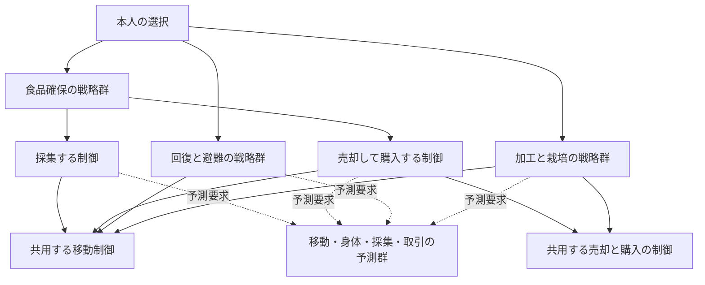

# HMOSAICを参考にした階層モデルへの分割案

更新: 2026-10-04。区分: 現行v24のコード調査と未採用の設計案。調査対象はcommit `8c9d7de`。本書は判断コードの変更、学習方式の採用、生活改善の実証を意味しない。

移動・売買・探索などの基本要素を入力を変えて共用し、予測モデルと行動制御モデルを独立した実装として構成できるかを検討する。現行コードには分割の材料がある。ただし、全体の優先順位、予測・利得・候補生成の混在、行程をまたぐ学習は、関数を移すだけでは解決しない。外側の人格契約を保ち、その内側に階層と型付きの接続を設ける案を示す。

## 要求と今回の範囲

ユーザーの要求は、現在の状況に適するモデルの選択、行動結果の予測、本人にとっての利得の評価を、構成モデルの修正と上下のフィードバックを持つ階層として扱うことである。初期のモデル内部はルールでよい。新しい状況への対応は、既存要素の係数・適用の重み・使い方・組合せの変更から考える。

予測と制御は別のモデルID、入力契約、状態、更新履歴を持つ。移動などの「基本要素」は能力のまとまりであり、予測器と制御器を一つのクラスに固定する名称ではない。同じ制御案を複数の予測器で評価し、同じ予測器を複数の戦略から使える。接続の互換性と学習対象を明示して関連付ける。

今回文書化するのは、v24の分割対応、共用と入出力の案、初期ruleの位置、実装前に確認する成立条件である。交渉、技能・転職、雇用等を今回実装する計画ではない。現在の実装と結果は[STATUS](../STATUS.md)、物理・所有・死亡の条件は[DECISIONS](../DECISIONS.md)を参照する。

## 研究から借りる構造と独自の提案

[HMOSAIC原論文](https://www.sciencedirect.com/science/article/abs/pii/S0531513103001900)では、各層に予測器と制御器の組があり、上位の制御器が下位の選択の事前重みを出し、下位の事後重みが上位へ戻る。上位の予測器は次の下位の事後重みを予測する。予測の適合度が制御への寄与と学習を調整する。この上下の接続を参考にする。

[MOSAIC-MR原論文の要旨](https://pubmed.ncbi.nlm.nih.gov/22168558/)は、状態変化の予測、報酬の予測、強化学習による制御を分け、その結び付きを固定しない構成を扱う。予測と利得・戦略を分けて共用する参考とする。

以下の生活行程、離散行動、型、利得、学習の割当ては、このシミュレーター向けの提案である。原論文のアルゴリズムの再現ではなく、HMOSAICが生活の生存最適化や任意の接続構造の自動発見を保証するとは扱わない。[従来の小モデル計画](../baseline/MODULAR_PREDICTION_AND_ACTION_PLAN.md)は予測の対応づけを継承する資料とし、今回の階層設計と区別する。

## 現行v24で実際に通る経路

判断の中心は [learning-needs](../../packages/ai/learning-needs.ts) → [tracked-needs](../../packages/ai/tracked-needs.ts) → [anticipatory-needs](../../packages/ai/anticipatory-needs.ts) → [effort-choice](../../packages/ai/effort-choice.ts) の `effortDecision` である。前段で実結果・睡眠・植物・身体の履歴を受け取り、選択後に予測IDと試行を結び付ける。`anticipatoryNeedsVillageModel.decide` は `effortBody` があると後半の旧判断へ進まず委譲する。

v24では `foodAcquisition` が有効で、[food-acquisition](../../packages/ai/food-acquisition.ts) の `acquisitionCandidates` と `acquisitionChoice` が食品行程を生成・選択・継続する。ただし食事、回復、荷下ろし、避難、市場の加工・農作業等の早いreturnが外側に残る。`!foodAcquisition` の採集・売却分岐や、`effortBody` より後の旧判断を、v24の実行経路と一括して移植してはいけない。

`action-learning` の体力変化、`effort-choice` の疲労、`sleep-forecast` 内の疲労近似は別の見込みである。移動時間の近似も複数箇所にある。統合時には対象量・単位・役割を区別し、似た数値という理由で同じ学習状態へ併合しない。

## 基本要素と現行コードの対応

「抽出」は現行の計算・対応づけを取り出せること、「分離」は混在した処理を分けること、「新設」は必要な契約・処理が現行v24にないことを示す。いずれもモジュール化の実装済みを意味しない。

| 基本要素 | 現行の材料 | 予測モデルへ分けるもの | 制御モデルへ分けるもの | 対応の判断 |
|---|---|---|---|---|
| 移動 | `travelEstimate`、[prediction-ledger](../../packages/ai/prediction-ledger.ts)、`trackedNeedsVillageModel`、各所の `travel` 提案 | 出発・目的地・荷重・本人の経路経験から時間と不確かさ | 上位から渡された目的地へ移動、継続・中断・到着後の再確認を提案 | 抽出可能。目的地の選択は上位に残し、経路・物理移動はsimが実行 |
| 活動・休息の身体変化 | `effortRate`、`observeEffort`、[action-learning](../../packages/ai/action-learning.ts) | 行動・荷重・身体条件に応じた疲労と活動余力の変化 | 休息、荷下ろし、活動の中断を提案 | 抽出＋再設計。栄養・疲労・活動余力の結合した経過予測は不足 |
| 寒さと避難 | `forecastCold`、`anticipatory-needs` の `learn`、避難return | 本人が知る屋内外・気温・時間帯から寒さの経過 | 利用可能と本人が考える場所への避難・待機 | 予測は抽出可能。初期閾値と全体の優先順位は分離 |
| 睡眠 | [sleep-forecast](../../packages/ai/sleep-forecast.ts) の `forecastSleep`、`observeSleep`、`canPlanSleep` | 入眠待ち、実睡眠、眠気・不足と回復の見込み | 眠る・延期・継続の案 | 抽出＋分離。睡眠内部の疲労近似の扱いと栄養消耗の接続が必要 |
| 売却 | `observeEffort` の `trade`、`acquisitionChoice` の提示・待機・撤回 | 場所・現物・数量・価格・待機期間ごとの成立と遅れの見込み | 提示、期限付き待機、撤回、再試行 | 分離可能。現行の成功／失敗集計は粗く、相手別等の予測はない |
| 購入 | `marketBelief`、市場の購入分岐、`observeAcquisition` | 到着時の提示・価格・期限・成立の見込み | 現地で確認した提示の選択と購入試行 | 分離可能。遠方の記憶は購入を直接許可しない |
| 探索 | [foraging-memory](../../packages/ai/foraging-memory.ts)、`acquisitionCandidates` の探索候補 | 調査で得られそうな観察・食品の見込み | 目的を受け、知っている調査先と移動・観察の手順を提案 | 食品探索は分離可能。未知地点の獲得、一般的な情報利得は新設 |
| 採集 | 可視植物の候補、`gather_plant`、取得結果 | 成否・量・時間・負担・可食量 | 対象と数量を選び、到着後に競合と成熟を再確認 | 分離可能。現行の数量・時間の近似と経験学習の範囲を明記 |
| 所持品の取扱い | `unload`、`load_grain`、`take_home`、`store_home`、`store_grain` | 荷重・容量・所在の変化 | 指定物の取得・保管・荷下ろし | 制御は抽出可能。所有・所在・実容量の確定はsim |
| 食事と吸収 | `eat`、食品行程の取得・食事・吸収時刻 | 摂食から本人の栄養感覚・活動余力がどう変わるか | 本人が持つ可食物の摂食案 | 食事制御は抽出可能。現行の時刻近似だけでは身体の経過予測にならず新設が必要 |
| 加工 | 市場の `bake_bread`・原料購入・パン提示 | 加工時間、原料・食品・荷重の変化 | 原料取得・加工・余剰提示の案 | 分離可能。Sの初期戦略と基本加工を分ける |
| 栽培 | [food-journeys](../../packages/ai/food-journeys.ts) の `cultivationChoice`、`cropPlan`、農作業return | 作業時間と負担、本人が知る生育・収量の見込み | 対象区画の確認、耕作・種取得・播種・収穫 | 短い制御は抽出可能。長期栽培の統一予測・利得は新設 |
| 交渉 | v24の行為語彙は価格付き提示・購入・撤回 | 相手の反応、譲歩、合意までの時間等 | 提案・対案・受諾・拒否等 | v24には対案・対話過程がなく未実装。[旧系列の `bargain` 応答](../../packages/ai/index.ts)を交渉モデルと読み替えない |

売買では[世界の試行受付](../../packages/sim/autonomous-world.ts)が現物、代金、所有、容量、販売者の所在を検証して移転する。予測器・制御器はそれを代行しない。交渉を後に加えるには、相手へ届く通信・返答・合意と世界で許される行為も別途必要である。

## 現行のifをどこへ置くか

分類はA＝実行・接続の境界、B＝初期の局所制御、C＝予測、D＝利得・選択、E＝経験・意図の更新とする。一つの分岐に複数の責任があれば分離する。特に「現行条件では危険と見積もる」と「世界が実行を拒否する」をAへまとめない。

| v24の処理 | 分割先の案 | 移す際の扱い |
|---|---|---|
| `activeAction`、実際の睡眠中の新規作業抑止 | A: 実行状態アダプター、B: 継続制御 | 同時に開始できる行為と中断可否を守る。継続そのものは比較候補にする |
| 期限、寒さ・疲労・眠気による中断 | B: 中断戦略、C: 経過予測、E: 意図の遷移 | 主観的閾値は初期戦略。中断可能な時点は世界の境界 |
| 空腹なら食べる、地面・家の食品を取る | B: 摂食・取得、上位: 食品確保 | ロットと数量を引数化。早いreturnの順位は全体へ移さない |
| 荷重・疲労から `unload` | B: 荷下ろし、上位: 回復／運搬 | 荷下ろしとその後の必要物の取得を同じ行程で評価 |
| 屋内で `canPlanSleep`、疲労0.55で休息 | B: 睡眠・休息、C: 身体予測 | 局所案として残せる。栄養悪化・食品取得の遅れも上位へ返す |
| 栄養需要0.9かつ体力1未満で待機、`finish` の体力不足で案を置換 | C: 作業余力、B: 待機・回復、D: 全体比較 | 現行の「選択後の置換」は再設計。待機・回復も先に予測し、選択を履歴に残す |
| 寒さ・眠気から帰宅、帰宅前の荷下ろし | B: 避難行程、C: 移動・寒さ・睡眠 | 帰宅は上位の一戦略。本人が知る別の避難先も同じ契約で提案可能にする |
| 市場で購入・提示・期限付き待機・撤回 | B: 売却／購入、E: 提示状態と意図 | 同じ要素を食品取得と加工の両戦略から利用する |
| Sのパン加工・原料購入・余剰提示 | 上位: 原料調達／加工／販売の戦略 | 技能、保管量、保持量を入力・初期方策の引数へ。職業別の分岐を汎用選択器へ置かない |
| 農地再訪、`cropPlan`、耕作・播種・収穫 | 上位: 栽培戦略、B: 基本作業 | 短期食品取得との目的衝突と長期の未評価部分を明示 |
| 夜の帰宅・家での待機、最後の待機return | B: 日常の避難・待機戦略 | 初期の生活戦略として候補化。全候補の結果と比較 |
| `acquisitionCandidates` 内の `add` | 候補展開、C: 行程予測、D: 利得・リスク | 現在は時刻・身体・除外・便益・費用が混在し、関数全体を一モデルにしない |
| `acquisitionChoice` の `source/market/sale/buy` | B: 複合戦略の進行、E: 意図更新 | 売却と購入を基本制御へ委譲し、状態遷移を保存する |
| `feasible && value > 0` から最高値を選択 | D: 選択モデル | 再設計対象。待機を含めて比較し、全候補が負という理由だけで無評価の待機へ落とさない |
| `observeEffort`、`observeAcquisition`、各ledger | E: 対応づけと各モデルの更新 | 対応関係を継承し、身体・取引・全行程の更新を区別 |
| `foodAcquisition` 等の版切替 | A: 人格構成の版・旧版アダプター | 戦略の優劣として学習しない。旧版の再現用に残す |

局所制御の `if` は初期実装として利用できる。全体のreturn順を木の子の順序に置き換えるだけでは、状況に応じたモデル選択にはならない。比較へ参加できる案、予測、適合度、評価を返す必要がある。旧優先順位をそのまま包む方式は再現の比較基準としてのみ扱う。

## 階層と共用する接続

意味上の階層は「本人の選択 → 食品確保／回復／生産 → 複合戦略 → 基本制御」とする案である。予測と利得は、階層の各制御から要求できる独立したモデルとして登録する。下図の線は利用関係であり、すべてを同時に実行する指示ではない。



親子の管理は木にできるが、共通モデルへの参照とデータ接続を含む全体はグラフになる。実装定義、人物ごとの学習状態、今回の呼出しを別のIDで管理する。基本モデルは親の目的の名称へ依存せず、目的地・数量・価格・調査対象等の入力を受ける。食品を運ぶ移動と種を運ぶ移動は同じ予測実装を使えるが、荷重等の条件を消して同じ数値にするわけではない。

同じ人物・モデルの学習状態を複数の親から参照する。人物間で初期実装を共用しても、個人の経験・意図・信用は混ぜない。呼出し結果の再利用は、入力、行程段階、期間、状態版が一致する場合に限る。共有した出力の消費先の数だけ学習しない。

## 入出力と接続の案

入力を引数化する範囲は、最初に次のように絞る案である。基本要素は必要な投影だけを受け、親の食品・栽培・職業別の状態を直接読み取らない。

| ポート | 入力の例 | 出力の例 |
|---|---|---|
| 移動制御 | 本人が知る位置、上位の目的地・期限、進行中の移動、届いた実結果 | 移動・継続・中断・到着確認の案 |
| 移動予測 | 出発・目的地・開始時刻・荷重、本人の経路経験、移動案 | 到着時刻とその不確かさ。身体の予測は別モデルへ接続 |
| 売却制御 | 本人が扱えるロット、上位が指定した数量・価格・待機期限、提示状態と届いた取引結果 | 提示・待機・撤回の案 |
| 取引予測 | 到着の予測、現物・提示の主観的な認識、数量・価格・待機期間、対応する経験 | 条件付きの成否・時刻・代金・物品の変化 |
| 探索制御 | 確認したい対象、既知の調査先、観察範囲、期限・負担の予算 | 調査先と移動・観察要求。現行では食品が対象 |
| 探索予測 | 調査案、過去の観察と古さ、観察範囲、到着時刻の予測 | 得られそうな観察・資源と不確かさ。利得評価へ別途接続 |
| 身体予測 | 本人の身体信号・摂食と睡眠の履歴、行動・荷重・環境・摂食の予測された経過 | 栄養感覚・疲労・眠気・寒さ・活動余力の経過 |

各ポートは対象量、単位、期間、必要な入力、出力の意味を宣言する。以下は契約の型例であり、採用するAPIではない。`C` は必要な主観情報の投影、`D` は名前付きの上流入力、`P` は行動または下位目標を含む型付きの案である。

```ts
type ModelRef = {
  modelId: string;
  definitionVersion: string;
  stateRevision: number;
};
type Frame = {
  actorId: string;
  frameId: string;
  beliefRevision: number;
  observedAtMinute: number;
  compositionVersion: string;
};
type Scope = {
  scenarioId: string;
  candidateId: string;
  stageId: string;
  fromMinute: number;
  toMinute: number;
};
type SignalRef = {
  evaluationId: string;
  model: ModelRef;
  port: string;
};
type Estimate<T> =
  | { kind: "estimated"; value: T; uncertaintyNote: string }
  | { kind: "unknown"; reason: string };
type Forecast<T> = {
  frame: Frame;
  scope: Scope;
  ref: SignalRef;
  estimate: Estimate<T>;
  inputRefs: readonly SignalRef[];
  evidenceIds: readonly string[];
};
type ModelInput<C, R, D> = {
  frame: Frame;
  scope: Scope;
  context: Readonly<C>;
  request: Readonly<R>;
  inputs: Readonly<D>;
};
interface ForwardModel<C, A, D, O, S> {
  predict(input: ModelInput<C, A, D>, state: Readonly<S>): Forecast<O>;
}
type Proposal<P> = {
  id: string;
  payload: P;
  inputRefs: readonly SignalRef[];
  assumptions: readonly string[];
};
interface ControlModel<C, G, D, P, S> {
  propose(input: ModelInput<C, G, D>, state: Readonly<S>): readonly Proposal<P>[];
}
interface Learner<S, F> {
  update(state: Readonly<S>, feedback: F): {
    nextState: S;
    evidenceIds: readonly string[];
    reason: string;
  };
}
```

型例は不確かさの数値形式、分岐した予測、モデル登録・実行器を省略している。`Readonly` は浅い型指定なので、運用上は入出力・試算用状態を不変に扱う実行器も必要である。予測モデル、制御モデル、利得モデルには別の登録と学習器を割り当て、全モデルに架空の学習を強制しない。

例えば市場行程の統合入力 `D` は `{ arrival: Forecast<Arrival>, transaction: Forecast<TradeBranches>, body: Forecast<BodyTrajectory> }` とする。複数の出力を名前で受け取り、条件を保持した本人の将来の経過を返す。親からの適合度の事前重みと下位から返す事後重みは、対象モデル群IDと時点付きの別ポートにする。

接続は次の条件で区別する。

| 接続 | 契約 |
|---|---|
| 同じ役割の代替予測を並列比較 | 同じ要求・行動・条件・対象量・期間を渡す。行動前の適合度は過去の経験と現在の情報から出す |
| 前段の結果を次段へ渡す | 予測した到着時刻・荷重・現金等を次段の開始状態へ明示的に投影する。`stageId` と期間の連続性を検査 |
| 複数の予測を統合する | 人物・認識版・候補・条件分岐をそろえ、期間の対応を検査。別の役割のモデルを一つの勝者にしない |
| 代替制御を比較する | 子の案を対応する予測へ渡し、共通の評価契約で比べる。移動と睡眠の命令を重み付き平均しない |
| 上下のフィードバック | 要求→子の計算→親の統合を段階化。再検討は版付きの次の反復とし、同じ反復の相互待ちを禁止 |

`Scope` のID一致だけでは意味の整合は保証できない。出力ポートの対象・単位と、状態投影・条件分岐の契約を実行時にも検査する。現在観測と将来予測は別の型の入力とし、予測を観測ポートへ接続しない。時間は例では分を使い、既存の時間単位との変換はアダプターへ置く。`unknown` は0や成功確率0へ読み替えない。

一反復の計算は循環のない依存関係に展開し、上流から順に実行する。親からの要求と、子を受けた親の統合は別の計算段階とする。同じモデルへ戻る情報は次の段階・反復・判断へ渡し、同じ段階の自分の出力を入力の前提にしない。モデル定義への再帰的な参照があっても、深さと呼出し数の予算で止まり、未評価を返す構成が必要である。これが計算として成立する条件であり、学習の収束や最適な行動を証明する条件とは別である。

売却成功・売却失敗・購入失敗では、現金・荷重・食品・次の行為が異なるため、平均状態一つで次段を計算しない。行程予測は条件分岐を保つ。購入の成立は売却結果・到着時刻等を条件に予測し、独立という根拠なく二つの確率を掛けない。分岐数の上限に達した場合は未評価の部分を残し、不確かさを消さない。

## 適合度と利得と戦略の変更

適合度は、同じ実行を予測したモデル群の中で、その状況をどれだけ説明できるかを扱う。初期の条件と重み、対応する誤差、更新後の寄与を保存する。[従来案の誤差による重み更新](../baseline/MODULAR_PREDICTION_AND_ACTION_PLAN.md)は候補になるが、誤差尺度・ばらつき・観測ノイズの校正が必要で、現在のコードに全面実装されているとは扱わない。

上位の制御モデルは、目的・現在の状態・下位の適合度の履歴から、子への要求、数量、順序、継続・変更を提案する。上位の予測モデルは複合した将来の経過を予測し、HMOSAICとの対応として下位の寄与が次にどう変わるかも予測対象にする案である。この寄与の遷移モデルは現行コードになく、新設対象である。

利得モデルは、予測した本人の経過と必要・価値観を受け、生存への影響、栄養・不快の経過、時間・労力、残る食品・現金等を別項目で返す。生存を最優先に扱う要求は保持するが、そのリスクの主観的予測と他項目との比較方法はまだ実装仕様にしていない。非公開の栄養残量や未来の世界から死亡の正解を得ない。観察不足があれば推定不能や不確かさを返す。

食品、売上、購入した栄養は一連の成果なので重複して報酬にしない。下位の局所評価を親で単純に合計せず、同じ評価期間の将来状態と経過を評価する。待機、休息、睡眠、継続、中断にも予測を用意する。現行の便益・費用式は `LegacyFoodValue` 等の比較用実装として切り出せるが、新方式の利得の正解に固定しない。

学習で変える対象は、予測の係数・不確かさ、状況別の適合度、制御の数量・順序・子の選び方、本人の経験に対応した行程評価である。学習器が明確な更新を持つ箇所と、初期ruleのままの箇所を登録情報で区別する。最初から任意のモデルや接続を自動生成することは成立条件にしないが、係数だけを更新して戦略の選択・構成が永久に固定された方式を到達点にもしない。

## 実行と結果を戻す運用

1. 本人へ届いた結果を対応する保存済み予測・試行へ結び付け、各モデルを更新する。観測していない反実仮想には実報酬を与えない。
2. 更新後の本人の認識・モデル状態を判断の開始版として固定する。上位から目的・評価期間・計算予算を渡す。
3. 制御が案を出し、依存順に予測・統合・評価する。試算で実記憶・現物・確定済み意図を変更しない。
4. 適合度の事前重みと各案の予測・利得を記録して選択する。根拠のない候補除外や、未評価の待機への置換を隠さない。
5. 採用した意図の遷移だけを確定し、最初の行為試行を既存の `ActorResponse` へ変換する。試行の受付と実結果はsimが確定する。
6. 結果が届いた後、保存時点の予測へ誤差を戻す。更新先が新版なら適合を再確認し、元の予測を書き換えない。

疲労の観測は対応する身体予測へ、取引の成否は取引予測へ返す。上位には完了した行程の経過・達成度と下位の適合度を戻す。全行程の失敗を全構成モデルへ同じ負の学習として渡さない。原因を観測できない場合は未確定とする。同じ実行を事前予測した代替予測器も比較できるが、未実行の別戦略を実測したことにはならない。

共有モデルの重複更新は人物・モデル・実経験IDで管理し、一つの実経験に複数の観測量がある場合も更新項目を明示する。予測ID、Process、対象、期間、完了・中断・拒否の対応は既存ledgerの条件を継承する。モデル版、未決予測、意図、接続の版、更新済み経験、乱数状態を保存対象にする。

## B1の判断をこの構成へ対応づける例

現行v24のhour32で、B1の穀物3単位案は吸収まで14時間、成立見込み0.25、評価−5.13となり、記憶した採集先の確認が選ばれた。これは[記録に基づく既存分析](../NEXT_SESSION.md)であり、新構成で売却が選ばれるという結果ではない。

案としては、食品確保の上位制御が、採集先確認、自己食品取得、穀物売却後の購入を提案する。穀物案は「取得→荷重付き移動→売却→購入→食事」を下位へ要求する。移動予測は他の案と共用し、数量・荷重・目的地を変える。売却と購入は別の予測・制御にし、失敗時も身体・所持品の経過を予測する。食事後の吸収と栄養消耗を身体予測へ接続する。

同じ判断で待機・休息・睡眠・荷下ろしも評価する。最終比較から現在の「正の食品候補がなければ待機」という抜け道を除き、本人にとっての将来の生存と負担を比較対象にする。行動後には、どの見込みが外れたかと、予測どおりでも役立たなかったかを分けて修正する。新たな売却優先のifを追加する設計ではない。

## 段階的な実装案と成立の検証

現行の [PersonalityModel](../../packages/ai/personality.ts) は内部の方式を指定しないため、外側の `ActorInput → ActorResponse` を維持して別の人格構成として試せる。現物・身体・情報配送・世界の法則をモデルの都合で補正しない。

| 段階 | 作業案 | 次へ進む条件 |
|---|---|---|
| 0 今回 | コードの責任分割と接続・学習の設計を文書化 | 現行処理、取り出せる部分、新設・再設計、未決が区別できる。本書までで本体は変更しない |
| 1 接続の試作 | 移動予測と移動制御を別登録し、食品取得と栽培の二つの親から利用。複数予測の統合を試算 | 型・単位・時間・状態版が合う接続だけが成立し、違う親や入力で共用できる。試算で実記憶が変わらない |
| 2 初期戦略の移植 | 食事、回復、避難、食品行程、加工・栽培の局所ruleを提案する制御へ分ける | 旧版の対応表から移植漏れを説明できる。共通要素の重複実装と、未評価の選択後置換がない |
| 3 階層の選択と更新 | 共通期間の身体・利得予測と上下の寄与・経験更新を接続 | 同じ局所ruleでも経験で予測・子の寄与・戦略の量や選び方が変わる。各更新を原因まで追える |
| 4 生活で比較 | 別人格／ruleset／fixtureで保存入力の再計算、保存再開、未経験の組合せ、実走を測る | 因果・保存則・再現と、食品取得・生存・他者への影響を別に評価。良い実走一件だけで一般化を認定しない |

初期の少数対照は接続の欠陥を見つけるために使う。適応の評価では、移動・取引・疲労・食品の複数条件を同時に変え、学習時に使わなかった組合せへ既存モデルを適用する。条件ごとに新しいifを追加してから選択が変わったことを適応の成功としない。

最低限確認するのは、親の追加に共通移動モデルの変更を要しないこと、予測器と制御器を独立して差し替えられること、共有結果の複数消費で学習が増殖しないこと、時刻・単位・条件分岐の不一致を検出すること、実行と結果配送の遅延・重複・拒否・中断を区別すること、予算上限と保存再開で同じ判断を再現できることである。

## 実装前に詰める点

| 未決の点 | 必要な具体化 |
|---|---|
| 身体・栄養の主観的な経過予測 | 本人が知る感覚・摂食履歴から何を推定できるか。予測不能の扱いと学習対象。世界の内部係数・残量を参照しない |
| 生存を優先する利得・選択 | 生存リスクの表現、比較期間、期間外の備蓄や長期成果、未知のリスクの扱い。現行の固定式は採用根拠にしない |
| 制御と上位の学習 | 完了した経験から数量・順序・子の寄与をどう更新するか。予測の信頼と本人の利得を混同しない具体的な更新則 |
| 適用条件とモデル内の修正 | 固定条件の切り方をどこまで継承するか。観測できる新しい条件に応じた係数・重みの修正と例外の扱い |
| 探索 | 食品獲得の見込みと、観察によって選択を改善する価値の区別。現在の食品探索だけを汎用探索と扱わない |
| 計算量と再編成の範囲 | 案・分岐・深さ・反復の予算、低い寄与のモデルを再試行する余地、接続変更の版管理。自動変更する接続の範囲は未決 |

記載した条件なら、階層と共用を持つ計算・運用の構成を定義できる。ただしこれは接続上の成立見込みである。予測の精度、経験からの戦略変更、生存を優先した生活の成立は、それぞれ別の未達として検証する。
