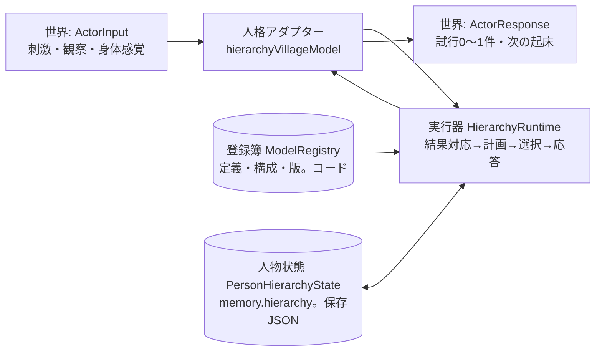

# 階層モデルの運用契約（登録・行程・委譲・観測・保存・予算）

更新: 2026-10-06。区分: 実装前の運用契約。対象は[実装前レビュー](HMOSAIC_IMPLEMENTATION_READINESS_REVIEW.md)のR04・R05・R06・R10・R11で、[レビューの実装順序](HMOSAIC_IMPLEMENTATION_READINESS_REVIEW.md#実装へ移る順序と残る判断)の1「運用の最小契約」に当たる。調査基準: commit `79217e0`、本体v24。本書は仕様の採用判断であり、本体コード・fixture・同梱記録・身体法則は変更していない。新構成の実行・学習・生活改善は未実施である。

[分割案](HMOSAIC_MODULE_DESIGN.md)と[利得・経験更新案](HMOSAIC_VALUE_AND_FEEDBACK_DESIGN.md)の方針を維持する。基本モデルは複数の親から引数で共用する。順モデルの予測誤差、逆モデル（制御）の目標未達と修正、上下の事前・事後重みは別のポートで返す。子の誤差は保存したモデルと観測入力で分析する。経験によるモデル内の構成変更は、登録した要素と接続操作の範囲で学習対象にできる形を残す。本書はこれらの計算法ではなく、その計算が一意に実行・対応・保存・打切りできる運用の契約を定める。計算法の主案は[形式仕様](HMOSAIC_FORMAL_SPEC.md)に分けた。

## 採用・未決・仮の読み方

- **採用**: 次の接続試作（レビュー順序2。移動・時間・身体感覚を二つの親から共用）がこの通りに実装する仕様。変更するときは本書を先に更新する。
- **未決**: 試作の計測で決めるか、R01〜R03・R07〜R09・R12で定める事項。本契約はその余地を残す形にし、計算法を先取りしない。
- **仮**: 数値・名称で、試作の計測後に変更してよいもの。機構の採用とは区別する。

本書の型例は契約の形をstrict型検査で確認したもので、採用するAPIそのものではない。型が合うことは、意味の整合や学習の成立を示さない。

## 全体像と識別子



外側は現行の[PersonalityModel](../../packages/ai/personality.ts)の `ActorInput → ActorResponse` を維持する。登録簿はコードで定義し、人物状態はJSONで保存する。実行器は登録簿と人物状態だけから判断を再計算できなければならない。

| 識別子 | 意味 | 寿命 | 置き場所 |
|---|---|---|---|
| `modelId` + `definitionVersion` | 予測・制御・合成・評価・分析・学習器の定義 | 版ごとに不変 | 登録簿。状態は版を参照する |
| `compositionVersion` | 親子の接続とポート結線の定義 | 版ごとに不変 | 登録簿。fixtureが指定し、人物状態と記録rulesetに記録 |
| `stateRevision` | 人物×モデルの学習状態の改訂番号 | 更新ごとに+1 | 人物状態 |
| `goalId` / `goalRevision` | 本人の目的と、その評価基準の版 | 採用から追跡終了まで | 人物状態 |
| `planId` / `planRevision` | 目的の下の行程グラフとその版 | 再計画で+1 | 人物状態 |
| `delegationId` | 親から子制御への委譲 | 要求から完了・撤回まで | 人物状態 |
| `intentId` | 一つの段階の実行意図（世界への1試行に対応） | 提案から終端まで | 人物状態。試行の `experienceId`／`predictionId` へ転記 |
| `trackingId` | 遅延する結果の追跡台帳 | 開始から解決・期限まで | 人物状態 |
| `choiceId` | 選択時点の候補・分布・採用の記録 | 保持予算まで | 人物状態 |
| `evaluationId` | 一回の判断内の計算結果 | 判断内のみ | 保存しない。追跡・選択記録が参照だけ持つ |

時間は内部で絶対分（整数）を使う。世界の判断時刻 `at`（時間）は `at * 60` へ変換し、身体の15分刻みと睡眠の `minute` と同じ軸に置く。応答の `wait.at` は分を時間へ切り上げ、現在より後の整数にする。これは[分割案の型例](HMOSAIC_MODULE_DESIGN.md#入出力と接続の案)が分を使っていた点を採用したもので、換算はアダプターにだけ置く。

## R10-1 登録簿の契約

登録簿は人物に依存しないコードの表で、**定義**と**構成**を持つ。人物ごとの経験・意図・信用は登録簿に入れない。

### モデル定義

| 項目 | 内容 | 検査 |
|---|---|---|
| `modelId`, `definitionVersion`, `kind` | 種別は `forward`（順モデル）／`control`（逆モデル）／`composer`（合成）／`evaluator`／`analyzer`／`learner`／`fallback` | 同じIDの版は不変。版を上げずに挙動を変えない |
| `inputs`, `outputs` | ポートごとに対象量、単位、観測か予測か、本人が観測できる根拠（直接／推定／不能）、共用できる条件項目 | 単位・観測予測の不一致を結線時に拒否 |
| `contextProjection` | 子へ渡す主観情報の投影名。親の全記憶や職業別状態を渡さない | 未登録の投影は `missing-projection` |
| `stateSchema` | 学習状態のスキーマIDと版。固定ruleなら `none` | 保存時・読込時に検証 |
| `learner` | 対応する学習器IDと版。更新を持たないなら `fixed-rule` | 学習器がある定義だけが `stateRevision` を進める |
| `comparisonGroups` | 同じ役割の代替群ID。計算法はR02で未決 | 群内の出力ポート・単位・期間が一致 |
| `cost` | 提案・予測・分析の予算単位 | 実行器が消費を合算 |

身体の感覚量（疲労・栄養需要・眠気・寒さ・活動余力）を出力するポートは `composer` からの結線だけに許す。これで「子ごとに身体を進めてから親でも進める」二重消耗を静的に防ぐ（R04）。

### 構成定義

構成は `root`（本人の選択）、`fallback`（予算切れ・失敗時の制御）、`edges`（親→子の役割付き結線）、使用する定義と版の一覧を持つ。役割は `delegate`（制御の委譲）、`forecast`（予測の要求）、`compose`（合成への入力）、`evaluate`、`analyze`、`feedback`（更新先）に分ける。同じ子を複数の親が結線でき、子の定義に親の名称は現れない。

読込時に検査するのは、参照する定義と版の存在、結線先ポートの存在と単位・観測予測の一致、同一段階内の循環がないこと（反復は後述の有限ループだけ）、`fallback` が予測を要求しない制御であること、`registryVersion` が人物状態の記録と一致すること。不一致は暗黙に移行せず、明示的な読込エラーにする。

### 試作で登録する定義（仮）

| 定義 | 種別 | 入力の例 | 出力の例 | 現行の材料 |
|---|---|---|---|---|
| `travel-forward@1` | forward | 出発地、目的地、荷重、開始分 | 所要分の推定（経験・事前・外挿の区別付き） | `travelTimes` と `travelEstimate`、[prediction-ledger](../../packages/ai/prediction-ledger.ts)の対応規則 |
| `body-forward@1` | forward | 開始時の感覚、活動種別、荷重、所要分、屋内外、開始分 | 疲労・活動余力・栄養需要・眠気・寒さ・消化中の推定 | `effortRate`、[action-learning](../../packages/ai/action-learning.ts)の体力変化、`forecastSleep`、`forecastCold` を別ポート・別状態として移す |
| `travel-control@1` | control | 現在地、目的地要求、期限、進行中の移動、届いた結果 | 移動開始・継続・中断・到着確認の案 | 各所の `travel` 提案と `interrupt_action` |
| `compose@1` | composer | 行程グラフ、開始状態、子の予測 | 区間列・分岐・契約違反・未評価 | 新設 |
| `recovery-parent@1`, `food-parent@1` | control | 本人の主観状態、目的 | 子への委譲、数量・順序 | 試作の仮の親。評価は仮で、生存比較ではない |
| `fallback-local@1` | fallback | 現在の行動、空腹と手持ち食品 | 継続／食事／1時間待機の案 | 新設。学習しない |

`body-forward@1` の疲労（感じる疲労／時間）と活動余力（体力／時間）は現行で別の見込みなので、出力ポートも状態も分けたまま移す。似た数値という理由で併合しない。

## R04 入出力の型、行程グラフ、将来状態の合成

### 量・単位・観測と予測

- 単位は列挙で宣言する（分、時間、質量、貨幣、食数、個数、確率、0〜1の疲労・栄養需要・眠気、寒さ、活動余力）。結線時に単位が異なれば `unit-mismatch`。
- 現在観測 `Observed<T>` と将来予測 `Predicted<T>` は別の型で、観測ポートへ予測を結線すれば `timing-mismatch`。
- 推定は `point`（点）、`interval`（範囲）、`branches`（条件分岐）、`unknown`（理由付き）の四形で、`point` でも裏付け（経験／事前／外挿、標本数、条件キー）を持つ。文字列の注記だけの不確かさは廃止する。
- `unknown` を0・確率0・失敗へ変換しない。分岐の確率も推定であり、独立の根拠なく掛けない。

### 試作の具体ポート

| ポート | 量と単位 | 観測の根拠 | 共用できる条件 |
|---|---|---|---|
| `travel-forward.duration` | 所要分 | 直接。移動完了の結果刺激の `occurredAt − startedAt`（1時間刻み） | 出発地、目的地、荷重区分 |
| `body-forward.fatigue01` | 行為後の疲労 | 直接。行為前後の自己観察 `experience.before/after` | 活動種別、荷重区分、屋内外、栄養需要区分 |
| `body-forward.energy` | 行為後の活動余力 | 直接。同上 | 同上 |
| `body-forward.nutritionNeed01` | 行為後の栄養需要 | 直接。同上。初期は事前のみで、経験が無い条件は `unknown` | 活動種別、消化中かどうか |
| `body-forward.digesting` | 消化中かどうか | 推定。判断時の `effortBody.digesting` の遷移 | 食事からの経過分 |
| `travel-control.proposal` | 試行案 | — | 目的地、期限 |

売却・購入・採集・探索の予測・制御は本契約の型で登録できるが、ポートの内容は試作後に追加する。現行の `marketBelief` や成功／失敗集計を、そのまま確率予測器として登録しない。

### 行程グラフ

行程は型付きの有向グラフ `PlanGraph` で表し、ノードは三種に限る。

| ノード | 意味 | 宣言するもの |
|---|---|---|
| `delegate` | 子制御への委譲 | 子のID、要求（目的地・数量・期限など）、使用資源の請求、段階予算 |
| `attempt` | 本人が直接出す世界への1試行 | 試行の種類と引数、使用資源の請求、段階予算 |
| `observe` | 観察して再計画する境界 | 上限分、待つ刺激の種類 |

辺は `completed`／`failed`／`rejected`／`interrupted`／`timeout`、または分岐IDを条件に持つ。反復は `loops` に段階列と `maxIterations` を宣言した有限ループだけ許し、未宣言の循環は `cycle-without-loop` で拒否する。「2時間まで買い手を待つ」は `observe` と `timeout` 辺と有限ループで書く。

資源の請求 `ResourceClaim` は、本人が知る範囲のロット・現金・容量・身体占有について `consume`／`hold`／`produce` を宣言する。計画の検証では、入口から終端までの各経路で同じロットを二度 `consume` しない（`duplicate-resource`）、現金が負にならない（`negative-cash`）、物理行為が同時に二つ占有しない（`body-conflict`）ことを調べる。経路の列挙は予算 `branchesPerPlan` で止め、超えた経路は未評価として残す。これは本人の主観上の検査で、現物・権限・容量の最終検証は従来どおり世界が行う。

### 将来状態の合成

`compose@1` は行程グラフと開始状態 `ProjectedState`（時刻、所在、ロット、現金、身体推定、占有）から区間列 `Segment[]` を作る。各区間は段階ID、分岐経路、開始と所要の推定、前後の状態、身体予測の参照、子の効果予測の参照を持つ。契約は次のとおり。

1. **時間経過の所有者は合成だけ。** 子の制御・順モデルは所要分と資源の変化を返し、身体を進めない。合成は区間ごとに一度だけ `body-forward` を呼び、その結果を次区間の開始状態へ投影する。
2. **確率的な到着と未到達の枝を確定区間へ押し込めない。** 区間の開始は推定（点・範囲・分岐）で、未到達の枝は `unreached-branch` の `unknown` を保つ。
3. **並列に計算できることと同時に実行できることを分ける。** 移動時間と身体の予測は並列に計算できるが、区間の活動は一つで、`occupied` が `physical-action` の間に別の物理行為を置けば `body-conflict`。
4. **分岐は状態を分けたまま持つ。** 売却成立・不成立・購入不成立で現金・荷重・食品・次の行為が異なるため、平均状態一つで次段を計算しない。分岐の上限に達したら未評価を残す。
5. **契約違反は値で返す。** 合成は `violations` と `unevaluated` を結果に含め、例外にしない。実行器は違反を含む候補を選択から外し、その理由を選択記録に残す。

### 二つの親からの共用

同じ人物・同じ子モデルの学習状態は一つで、親ごとに複製しない。委譲は親ごとに別の `delegationId` を持つ。一回の判断内で同じ `modelId`、`definitionVersion`、`stateRevision`、要求、入力参照が一致する呼出しは結果を再利用し、不一致なら再計算する。この再利用キャッシュは判断内だけで、保存しない。学習は（モデル、実経験の試行Event）の組で一度だけ行い、共有した出力を読んだ親の数だけ更新しない。

## R05 目的・行程・意図・委譲の状態機械

四つの記録を分ける。**目的** `Goal` は本人の目的と保存した評価基準の参照、**行程** `PlanGraph` は目的の下の版付きグラフ、**委譲** `Delegation` は親から子制御への要求、**意図** `Intent` は世界への1試行に対応する段階の実行状態である。共有する子の学習状態（`models`）と、呼出しごとの進行状態（`delegations`・`intents`）は別の場所に置く。

### 状態と遷移

| 記録 | 状態 | 遷移の契機 |
|---|---|---|
| 目的 | `adopted → executing ⇄ suspended → completed / abandoned / expired / superseded` | 採用、段階の開始、中断（寒さ・疲労・眠気・荷重）、再開、完了条件の観測、本人の放棄、期限、外部指示や親の切替による置換 |
| 行程 | 版 `planRevision` を持ち、再計画で+1 | 観察、中断後の再開、数量・順序の変更、委譲の失敗。旧版は保持し、理由と原因Eventを記録 |
| 委譲 | `requested → active → completed / failed / withdrawn / expired` | 子の案の採用、子の完了報告、親の撤回、段階予算の期限 |
| 意図 | `proposed → adopted → submitted → started → progressing → completed / failed / rejected / interrupted / superseded / withdrawn` | 提案、選択、`ActorResponse` への変換、世界の `process_started`、毎時の継続、世界の完了・失敗・拒否・中断の結果、外部指示の置換、本人の撤回 |

意図の `adopted` から `submitted` は同じ判断内で起き、`attempt.experienceId` と移動なら `predictionId` に `intentId` を転記する。世界の結果刺激はこれらのIDで戻るため、配送の変更を要しない。`started` は `process_started` の結果で確定し、原子的な試行（食事・取得・購入）は `started` を経ずに完了・拒否へ進む。

各状態で許す変更を限定する。`adopted` 以降の意図の引数は変えない（変えるなら新しい意図）。`executing` の目的の行程を変えるときは新しい版を作り、旧版の意図は `withdrawn`（本人の撤回）か `superseded`（外部指示）にする。`suspended` の目的は新しい段階を出さず、再開時に新版の行程を作る。目的の `goalRevision` は評価基準（必要・価値観・期限）が変わったときだけ上げ、行程版の変更では上げない。

### どの実結果をどこへ返すか

| 事例 | 局所効果（子の順モデル） | 目的の利得（親の台帳） | 制御の更新対象 |
|---|---|---|---|
| 寒さで移動を中断し、避難後に同じ目的で購入した | 実行した区間だけ、行為前後の観察で更新。中断した移動は経過分と中断として対応 | 旧版の利得予測は未確定（`unresolved`、理由 `superseded-by-revision`）。新版の予測を、新版の開始分から追跡終了までの観測経過と照合 | 中断の選択は回復側の選択記録、購入までの選択は新版の選択記録。旧版の未達を新版の失敗にしない |
| 同じ目的で数量を変えた | 同上 | 新版の予測と照合。旧版の取引予測の項目は `censored`（理由 `not-attempted`） | 新版の選択記録 |
| 親を切り替えた（食品確保→回復） | 開始済みの子の局所予測は世界の結果で通常に閉じる | 食品確保の目的は `suspended` か `abandoned`。その構成予測は未確定 | 切替自体は本人の選択記録として残す |
| 外部指示で行為が置換された | 世界が送る `superseded` で提案した意図を閉じる。指示された行為は本人の選択ではないので更新しない | 未確定 | 更新しない。選択記録の `source` は `external-command` |

中断した区間の身体負担は、実行した区間の局所効果として計上する。目的の利得は、旧版の窓では未確定、新版の窓では新版の開始分からの観測経過で評価する。これにより、期限を変えた後の成否へ局所の取引予測を直接照合しない。

### 選択記録と方策の版

選択が起きる時点ごとに `ChoiceRecord` を保存する。候補ID、評価できたか、予測と利得の参照、分布（確率選択を使う場合）、採用、`source`（方策／予備／外部指示）、`policyRevision`、参照した各モデルの `stateRevision`、乱数の消費回数、予算切れの有無を持つ。これはR03の最終選択・更新式を定める前提の記録であり、分布や更新の計算法は未決である。

遅延して届いた目的の利得は、対応する選択記録の `policyRevision` が現在の版と一致する場合だけ制御の学習器へ渡す。版が進んでいれば利得予測の解決を `unresolved`（理由 `stale-policy`）として記録し、適用しない。方策差を扱う方式（重要度補正等）は未決で、この限定規則をそれまでの採用とする。

## R06 観測の対応、吸収、死亡、打切り

### 本人が観測できるもの

| 量 | 観測 | 根拠となる刺激・文脈 | 備考 |
|---|---|---|---|
| 到着時刻、移動の失敗・経路変更・中断 | 直接 | `result` の `travel`（phase, startedAt, elapsedHours） | 1時間刻み |
| 行為前後の活動余力・疲労・栄養需要・眠気・荷重・現金・食数 | 直接 | `result` の `experience.before/after` | 開始と終端の二点。途中経過は毎時の文脈 |
| 売却の成立と代金 | 直接 | `result` の `trade`（offerId, soldAt, revenue） | 遅延0〜1時間 |
| 提示の有効・無効 | 直接 | `result` の `offerChange` | 無効理由付き |
| 購入の成立 | 直接 | `buy_surplus` の成功結果 | 取得したロットIDは結果に無く、所持ロットの差分で推定 |
| 食事 | 直接 | `eat` の成功結果 | 食べたロットは世界が選ぶ。所持差分で推定 |
| 吸収 | 推定 | 判断時の `effortBody.digesting` が真→偽へ遷移した最初の判断分、`nutritionNeed` の変化 | 1時間刻み。間に別の食事があれば `ambiguous`（識別できない） |
| 栄養残量、各食事の吸収量 | 不能 | — | 世界の帳簿を本人の観察の代わりに使わない |
| 他者の在庫、買い手の存在、未来の供給 | 不能 | 市場での可視提示・可視人物だけ | 存在を取得可能性へ読み替えない |
| 世界の拒否、外部指示の置換 | 直接 | `attempt_rejected` の結果、`superseded` | 別の終了理由 |
| 自分の死亡 | 不能 | — | 外部監査だけが知る |

### 追跡台帳

目的ごとに `TrackingRecord` を開く。実行状態（意図・委譲）が閉じても追跡は残り、吸収のような遅延結果を待つ。項目 `TrackingItem` はポート、保存したモデルと版・改訂、段階、予測、上流から渡した予測入力の参照、観測できた実入力、観測結果、状態（`open`／`observed`／`estimated`／`ambiguous`／`unobserved`／`censored`／`late`）と打切り理由、対応に使うID（意図、試行Event、Process、開始分）、診断用スナップショットの有無を持つ。

対応規則は既存ledgerの条件を継承する。結果刺激は `experience.predictionId`（＝`intentId`）、開始分、行為種別、`elapsedHours === occurredAt − startedAt`、`started` で確定した `processId`／`attemptEventId`、行為前観察の一致で意図と対応させる。`occurredAt ≤ at`、`receivedAt ≤ at`、`receivedAt ≥ occurredAt` を満たさない刺激は無視する。一回の判断では、届いた証拠を全て処理してから期限切れを処理する。期限切れ後に届いた対応する結果は `late` として記録し、学習状態を更新しない。

観測できる実入力（例: 実際の移動分）と予測入力（例: 予測した移動分）を項目に別々に保存する。これが[分析器](HMOSAIC_VALUE_AND_FEEDBACK_DESIGN.md#子の計測と誤差の寄与を分析する仕組み)の「子自身の条件付き残差」と「入力の違いの波及」の分解に必要な材料で、分析の計算法と非線形な利得への影響はR07で未決である。

### 終了理由

| 理由 | 意味 | 教師にするか |
|---|---|---|
| `observed-complete` | 完了条件を本人が観測した | 対応する項目を更新する |
| `deadline` | 追跡期限に達した | 未観測の項目は `unobserved`。失敗へ変換しない |
| `self-interrupted` | 本人が中断・放棄した | 実行した区間だけ局所更新。目的の利得は未確定 |
| `world-rejected` | 世界が試行を拒否した | 拒否理由を記録。成立率の負例にしない |
| `superseded` | 外部指示や新版の行程で置換された | 更新しない |
| `capacity` | 保持予算で閉じた | `censored` として数え、更新しない |

欠測を失敗にせず、期限切れ前後の同じ結果を二回使わない。終了理由を一つにまとめず、監査で区別できるように保存する。

### 死亡の扱い

採用: **死亡前に本人が観測できた信号から学ぶ方式**。世界の[死亡処理](../../packages/sim/autonomous-world.ts)は本人の実行状態・inbox・未配送結果を消し、以後その人物を起こさない。したがって死亡の実利得は本人の `decide` 経路へ届かず、本人の状態は死亡時点で凍結される。開いた目的・追跡は `open` のまま保存され、人物状態の検証は死亡者についてこれを許す。死亡の校正・原因は外部監査（記録と死亡Event）だけが扱い、本人が死亡経験から学んだとは主張しない。

未決: 終端の学習専用処理を新設する方式。採用するなら、死後の行動を生成しない境界、許される終端情報（最後に観測できた感覚・活動余力までとし、世界の内部量を渡さない）、更新できるモデルの範囲、世代間・別実験への共有の禁止を別途定める。現契約の人物ごとの経験の維持から自動的には導けない。

## R10-2 保存JSON、版、再実行、乱数

### 人物状態の格納

新しい人格状態は `VillageMemory.hierarchy?: PersonHierarchyState` に置く。旧人格の `anticipation` と混ぜず、新ruleset（仮に `autonomous-village-hierarchy-v25`）ではfixtureの `hierarchyModel: { compositionVersion }` を立て、`hierarchy` を持ち `anticipation` を持たない。旧rulesetの記録は `hierarchy` を持たず、[記録再生](../../packages/sim/village-recording.ts)の `rulesetId` 判定に新フラグを追加するだけで、既存の判定順と同梱記録は変えない。`checkVillageWorld` は `!!fixture.hierarchyModel === !!memory.hierarchy` を検査し、存在すれば `checkHierarchyState` を呼ぶ。

人物状態の内容は、`version`、`compositionVersion`、`registryVersion`、`models`（モデルID→定義版・改訂・状態JSON）、`goals`、`plans`、`intents`、`delegations`、`tracking`、`choices`、`snapshots`、`rng`、`failures`、`nextId`。配列はIDで決定的に並べ、Recordのキーは登録順にする。JSON文字列の一致で再生を検査する現行方式に合わせる。

### 保存できる値の制限

- 有限数、文字列、真偽、null、配列、通常のオブジェクトだけ。Map・Set・クラス・関数・循環参照・`undefined` を状態に置かない。
- `NaN`／`Infinity` は保存前の検査で `contract-violation` にする。[共有JSON](../../packages/sim/shared-village-json.ts)がnullへ変換する前に検出し、未知は `unknown` の型で表す。
- モデル定義は登録簿の版への参照で保存し、コードを保存しない。`registryVersion` が一致しない保存状態は読込エラーにし、暗黙に移行しない。

### 診断用スナップショット

追跡項目は `(modelId, stateRevision)` を参照する。モデル状態を更新する前に、その改訂を参照する開いた追跡項目があり、保存済みのスナップショットが無ければ、更新前の状態を `snapshots` へ複写する（更新時複写）。参照する追跡が全て閉じたら削除する。保持予算を超えたら最も古い参照済みスナップショットを削除し、参照していた項目に `snapshot: "unavailable"` を付ける。分析器はその項目について未評価を返し、現在の状態で代用しない。

### 乱数

人物ごとに `rng: { algorithm: "xorshift32", state, draws }` を持つ。初期状態は世界の `seed` と人物IDから人物状態の初期化時に決定的に作り、世界側は人物の記憶を初期化する一行でこれを渡す。乱数を消費するのは選択の段階だけで、候補の評価順・合成・分析・再計算は消費しない。候補の順序はIDの整列で決める。各選択記録に消費回数を書き、判断再計算で一致を検査する。確率選択・探索を採用していない段階では消費回数は0である。

### 再実行・再開・再計算の検証

| 検証 | 内容 | 現行の方法との関係 |
|---|---|---|
| 記録再生 | 保存した応答で世界を再実行し、状態とEventのhashを照合 | 既存の `replayVillageRecording`。新状態は `subjectiveBefore` のJSON比較に含まれる |
| 判断再計算 | 保存した入力（刺激・文脈・事前状態）から実行器を再実行し、応答・事後状態・乱数消費・予算使用を照合 | 新設。再生の成功を再計算の証明にしない |
| 保存再開 | 未完了の行程・未更新の観察・更新前のモデル・開いた追跡がある時点で保存し、再開後の判断・更新・乱数・世界結果が連続実行と一致 | 既存の `saveVillageWorld`／`loadVillageWorld` に `checkHierarchyState` を追加 |
| 旧版の保持 | v24・v23・v22の記録とfixtureを変更せず、再生が成立 | 既存の対照を維持 |

## R11 計算予算と失敗時の応答

### 予算の単位と消費

予算は壁時計を使わず、決定的な処理単位の個数で宣言する。判断ごとに `DecisionBudget` を受け取り、使用量 `BudgetUsage` を返す。

| 項目 | 仮の値 | 消費する処理 |
|---|---|---|
| `proposals` | 32 | 制御が返す案の総数 |
| `forecasts` | 96 | 順モデルの呼出し（キャッシュ再利用は数えない） |
| `branchesPerPlan` | 8 | 一つの行程の分岐経路 |
| `compositionDepth` | 4 | 委譲の深さ |
| `iterations` | 2 | 上下の再検討の反復 |
| `analyses` | 16 | 分析器の照合 |
| `learningUpdates` | 32 | 学習器の更新 |
| `openGoals` | 1 | 同時に `executing`／`suspended` の目的 |
| `openTracking` | 6 | 開いた追跡台帳 |
| `retainedTracking` / `retainedChoices` / `retainedSnapshots` / `retainedFailures` | 24 / 48 / 8 / 8 | 閉じた記録の保持 |

巡回順は、構成の段階順、段階内は（親、段階ID、子モデルID）の整列、候補は候補IDの整列とする。同じ入力・状態・予算から同じ打切り結果になることを再計算で検査する。

### 予算切れの意味

- 評価できなかった候補・枝・項目は `unevaluated: "budget"` として残し、確率・価値を0にしない。
- 選択は評価できた候補の中で行い、評価できた候補が無ければ予備の経路へ進む。
- 開いた追跡が `openTracking` を超えるときは最も古い追跡を `capacity` で閉じ、記録する。開いた目的の追跡を数だけで消さないよう、`openTracking` は `openGoals` に吸収待ちの追跡数を足した値以上にする。
- 既存の24件・16件・8件の履歴上限は、閉じた記録の保持にだけ対応し、開いた追跡や参照中のスナップショットには適用しない。

### 確定の単位と失敗時の応答

判断は四つの段階で進める。**A 結果対応**（刺激の対応、追跡の更新、学習器の更新、期限切れの処理）、**B 計画**（目的の維持、提案、予測、合成、評価）、**C 選択**（選択記録、乱数）、**D 応答**（意図の採用、試行への変換、起床時刻）。

| 段階 | 失敗時の扱い |
|---|---|
| A | 届いた証拠を失わないため、対応できない刺激は分類（`late`／不一致）として記録し、例外は契約違反として伝播させる。Aが完了した状態を確定単位とする |
| B・C・D | 作業用の複製で計算し、予算切れ・契約違反・例外では複製を破棄する。確定したAの状態に失敗記録 `DecisionFailure`（段階、分類、詳細）を追加し、予備の経路で応答する |

失敗の分類は `budget-exhausted`、`model-mismatch`、`contract-violation`、`insufficient-observation`、`world-rejected`、`exception` を分け、どれも教師信号を作らない。予備の経路は構成の `fallback` 制御（`fallback-local@1`）で、現在の行動の継続、空腹で手持ち食品があれば食事、それ以外は1時間待機を案にする。これは生存比較ではなく、選択記録に `source: "fallback"` と理由を残し、制御の学習に使わない。応答は現行世界の検査（試行は最大1件、起床は現在より後の整数時刻）を満たす。

## 現行コードとの対応

| 現行 | 本契約での扱い |
|---|---|
| [prediction-ledger](../../packages/ai/prediction-ledger.ts)の対応規則、`travelTimes` | `travel-forward@1` の材料。対応条件（ID・開始・Process・試行Event）は追跡台帳へ継承 |
| [action-learning](../../packages/ai/action-learning.ts)の行為前後の観察と体力変化、[effort-choice](../../packages/ai/effort-choice.ts)の疲労率 | `body-forward@1` の別ポート・別状態。飽和の除外条件は継承し、忘却・条件分割はR08で未決 |
| [food-acquisition](../../packages/ai/food-acquisition.ts)の `outcomes` と `end` | 取得で終了する履歴として旧rulesetに残す。親の利得の台帳には使わない |
| 世界の結果配送（`result`、`experience`、`travel`、`trade`、`offerChange`） | 変更しない。`intentId` を既存の `experienceId`／`predictionId` へ転記して対応 |
| 世界の死亡処理 | 変更しない。本人は死亡を観測しない |
| `VillageMemory`、fixture、`checkVillageWorld`、記録の `rulesetId`、人物記憶の初期化 | `hierarchy` 欄、`hierarchyModel` フラグ、`checkHierarchyState`、新rulesetの判定、乱数初期値の受け渡しを実装時に追加する。世界法則・物品・身体・死亡条件は変えない |

未決の世界側変更: `eat`／`buy_surplus` の結果刺激にロットIDを含めること。現在は所持ロットの差分で推定するため、同時刻に複数のロット変化があると `ambiguous` になる。配送項目の追加は法則の変更ではないが、旧rulesetの記録に影響しない形で導入する必要がある。

## 型例

契約の形をまとめた型例である。strict型検査で整合を確認するためのもので、採用するAPIではない。`Frame` と `Scope` は[分割案の型例](HMOSAIC_MODULE_DESIGN.md#入出力と接続の案)にあったが、固定区間の `Scope` は本書の `Segment` に置き換える。

```ts
// 時間は絶対分。世界の判断時刻 hour は hour * 60 へ変換する。
type Minute = number;
type Id = string;

// ---- 登録簿 ----
type ModelKind = "forward" | "control" | "composer" | "evaluator" | "analyzer" | "learner" | "fallback";
type Unit = "minute" | "hour" | "mass" | "coin" | "meal" | "count" | "probability"
  | "fatigue01" | "nutritionNeed01" | "sleepiness01" | "cold" | "energy";
type ObservationSource =
  | { kind: "context"; field: string }
  | { kind: "result"; field: string }
  | { kind: "inventory-diff" }
  | { kind: "sensation-transition"; field: string }
  | { kind: "none" };
type PortDeclaration = {
  port: string; quantity: string; unit: Unit;
  timing: "observed" | "predicted";
  observation: ObservationSource; observable: "direct" | "estimated" | "none";
  shareable: readonly string[];
};
type ModelDefinition = {
  modelId: Id; definitionVersion: string; kind: ModelKind;
  inputs: readonly PortDeclaration[]; outputs: readonly PortDeclaration[];
  contextProjection: readonly string[];
  stateSchema: { schemaId: string; version: number } | { schemaId: "none" };
  learner: { learnerId: Id; version: string } | { learnerId: "fixed-rule" };
  comparisonGroups: readonly Id[];
  cost: { propose?: number; predict?: number; analyze?: number };
};
type CompositionEdge = {
  parent: Id; child: Id;
  role: "delegate" | "forecast" | "compose" | "evaluate" | "analyze" | "feedback";
  bindings: readonly { from: string; to: string }[];
};
type CompositionDefinition = {
  compositionVersion: string; registryVersion: string;
  root: Id; fallback: Id; edges: readonly CompositionEdge[];
  definitions: readonly { modelId: Id; definitionVersion: string }[];
};

// ---- 量・推定・観測 ----
type Support = { basis: "experience" | "prior" | "extrapolation"; samples: number; conditionKey: string };
type UnknownReason = "no-experience" | "out-of-range" | "missing-input" | "budget" | "unreached-branch" | "not-registered";
type Estimate<T> =
  | { kind: "point"; value: T; support: Support }
  | { kind: "interval"; low: T; high: T; support: Support }
  | { kind: "branches"; branches: readonly Branch<T>[]; support: Support }
  | { kind: "unknown"; reason: UnknownReason };
type Branch<T> = { branchId: Id; condition: string; probability: Estimate<number>; value: T };
type SignalRef = { evaluationId: Id; modelId: Id; definitionVersion: string; stateRevision: number; port: string };
type Observed<T> = { timing: "observed"; atMinute: Minute; value: T; evidenceIds: readonly Id[] };
type Predicted<T> = { timing: "predicted"; estimate: Estimate<T>; ref: SignalRef };

// ---- 行程と合成 ----
type LotRef = { lotId: Id; kind: string; quantity: number; mass: number; edible: boolean; expiresMinute?: Minute };
type BodyEstimate = {
  fatigue01: Estimate<number>; nutritionNeed01: Estimate<number>; sleepiness01: Estimate<number>;
  cold: Estimate<number>; energy: Estimate<number>; digesting: Estimate<boolean>;
};
type ProjectedState = {
  atMinute: Estimate<Minute>; siteId: Id | { transitFrom: Id; to: Id };
  lots: readonly LotRef[]; cash: number; body: BodyEstimate;
  occupied: "free" | "physical-action" | "asleep";
};
type ResourceClaim = { kind: "lot" | "cash" | "capacity" | "body"; id?: Id; quantity?: number; mode: "consume" | "hold" | "produce" };
type StepBudget = { maxMinutes: number; deadlineMinute?: Minute };
type PlanNode =
  | { kind: "delegate"; stepId: Id; child: Id; request: Readonly<Record<string, unknown>>; claims: readonly ResourceClaim[]; budget: StepBudget }
  | { kind: "attempt"; stepId: Id; attemptKind: string; args: Readonly<Record<string, unknown>>; claims: readonly ResourceClaim[]; budget: StepBudget }
  | { kind: "observe"; stepId: Id; until: { maxMinutes: number; stimuli: readonly string[] } };
type PlanEdge = { from: Id; to: Id; on: "completed" | "failed" | "rejected" | "interrupted" | "timeout" | { branchId: Id } };
type PlanLoop = { stepIds: readonly Id[]; maxIterations: number };
type PlanGraph = {
  planId: Id; goalId: Id; planRevision: number; entry: Id;
  nodes: readonly PlanNode[]; edges: readonly PlanEdge[]; loops: readonly PlanLoop[];
  revisionCause?: { kind: "observation" | "interruption" | "external-command" | "delegation-failed" | "quantity-change"; evidenceIds: readonly Id[]; atMinute: Minute };
};
type Segment = {
  stepId: Id; branchPath: readonly Id[]; start: Estimate<Minute>; duration: Estimate<number>;
  before: ProjectedState; after: ProjectedState; bodyRef: SignalRef; effectRefs: readonly SignalRef[];
};
type ViolationCode = "duplicate-resource" | "negative-cash" | "body-conflict" | "double-time-advance"
  | "unit-mismatch" | "timing-mismatch" | "unknown-port" | "cycle-without-loop" | "missing-projection" | "stale-state-revision";
type ContractViolation = { code: ViolationCode; where: { modelId?: Id; port?: string; stepId?: Id }; detail: string };
type TrajectoryForecast = {
  planRef: { planId: Id; planRevision: number }; segments: readonly Segment[];
  violations: readonly ContractViolation[]; unevaluated: readonly { stepId: Id; reason: UnknownReason }[];
};

// ---- 目的・委譲・意図・選択 ----
type ValueBasisRef = { goalId: Id; goalRevision: number; preferenceRevision: number; evaluatorVersion: string; discountVersion: string; policyRevision: number };
type StatusCause = { kind: "observation" | "interruption" | "external-command" | "deadline" | "budget" | "parent-switch" | "self"; evidenceIds: readonly Id[]; atMinute: Minute };
type GoalStatus = "adopted" | "executing" | "suspended" | "completed" | "abandoned" | "expired" | "superseded";
type Goal = {
  goalId: Id; goalRevision: number; parentModel: Id; purpose: string; basis: ValueBasisRef;
  adoptedAtMinute: Minute; deadlineMinute: Minute; completion: { port: string; condition: string };
  status: GoalStatus; statusCause?: StatusCause; currentPlan?: { planId: Id; planRevision: number }; trackingId: Id;
};
type DelegationStatus = "requested" | "active" | "completed" | "failed" | "withdrawn" | "expired";
type Delegation = {
  delegationId: Id; goalId: Id; planRevision: number; stepId: Id; parent: Id; child: Id;
  request: Readonly<Record<string, unknown>>; budget: StepBudget; status: DelegationStatus;
  intentIds: readonly Id[]; priorWeights?: Readonly<Record<Id, number>>;
};
type IntentStatus = "proposed" | "adopted" | "submitted" | "started" | "progressing"
  | "completed" | "failed" | "rejected" | "interrupted" | "superseded" | "withdrawn";
type Intent = {
  intentId: Id; goalId: Id; planId: Id; planRevision: number; stepId: Id; delegationId?: Id;
  attemptKind: string; args: Readonly<Record<string, unknown>>; status: IntentStatus;
  adoptedAtMinute: Minute; startedAtMinute?: Minute; attemptEventId?: Id; processId?: Id;
  before?: Readonly<Record<string, number | string | boolean>>; predictionRefs: readonly SignalRef[];
};
type ChoiceCandidate = { candidateId: Id; evaluated: boolean; forecastRef?: SignalRef; gain?: Estimate<number>; violations?: readonly ViolationCode[] };
type ChoiceRecord = {
  choiceId: Id; atMinute: Minute; goalId?: Id; stepId?: Id; policyRevision: number;
  stateRevisions: Readonly<Record<Id, number>>; candidates: readonly ChoiceCandidate[];
  distribution?: readonly { candidateId: Id; probability: number }[]; chosen: Id;
  source: "policy" | "fallback" | "external-command"; rngDraws: number; budgetExhausted: boolean;
};

// ---- 追跡台帳 ----
type Scalar = number | boolean | string;
type TrackingItemStatus = "open" | "observed" | "estimated" | "ambiguous" | "unobserved" | "censored" | "late";
type CensorReason = "not-attempted" | "superseded-by-revision" | "parent-switch" | "capacity";
type TrackingItem = {
  port: string; modelId: Id; definitionVersion: string; stateRevision: number; stepId: Id; planRevision: number;
  predicted: Estimate<Scalar>; predictedInputRefs: readonly SignalRef[];
  observedInput?: Observed<Scalar>; observed?: Observed<Scalar>; status: TrackingItemStatus;
  matching: { intentId?: Id; attemptEventId?: Id; processId?: Id; startedAtMinute?: Minute };
  censoredBy?: CensorReason; snapshot: "live" | "stored" | "unavailable";
};
type TrackingClose = "observed-complete" | "deadline" | "self-interrupted" | "world-rejected" | "superseded" | "capacity";
type GainResolution =
  | { kind: "observed"; observed: number; error: number; atMinute: Minute; evidenceIds: readonly Id[] }
  | { kind: "unresolved"; reason: "superseded-by-revision" | "not-attempted" | "missing-observation" | "stale-policy" | "self-interrupted" };
type GainPrediction = { planRevision: number; fromMinute: Minute; predicted: Estimate<number>; basis: ValueBasisRef; resolution?: GainResolution };
type TrackingRecord = {
  trackingId: Id; goalId: Id; openedAtMinute: Minute; expiresAtMinute: Minute;
  items: readonly TrackingItem[]; gains: readonly GainPrediction[];
  close?: { reason: TrackingClose; atMinute: Minute; evidenceIds: readonly Id[] };
};

// ---- 保存する人物状態 ----
type JsonValue = null | boolean | number | string | readonly JsonValue[] | { readonly [key: string]: JsonValue };
type ModelState = { definitionVersion: string; stateRevision: number; state: JsonValue };
type Snapshot = { modelId: Id; stateRevision: number; state: JsonValue; referencedBy: readonly Id[] };
type PersonRng = { algorithm: "xorshift32"; state: number; draws: number };
type FailureCode = "budget-exhausted" | "model-mismatch" | "contract-violation" | "insufficient-observation" | "world-rejected" | "exception";
type DecisionFailure = { atMinute: Minute; phase: "feedback" | "plan" | "select" | "respond"; code: FailureCode; detail: string };
type PersonHierarchyState = {
  version: 1; compositionVersion: string; registryVersion: string;
  models: Readonly<Record<Id, ModelState>>;
  goals: readonly Goal[]; plans: readonly PlanGraph[]; intents: readonly Intent[]; delegations: readonly Delegation[];
  tracking: readonly TrackingRecord[]; choices: readonly ChoiceRecord[]; snapshots: readonly Snapshot[];
  rng: PersonRng; failures: readonly DecisionFailure[]; nextId: number;
};

// ---- 予算と実行器 ----
type DecisionBudget = {
  proposals: number; forecasts: number; branchesPerPlan: number; compositionDepth: number; iterations: number;
  analyses: number; learningUpdates: number; openGoals: number; openTracking: number;
  retainedTracking: number; retainedChoices: number; retainedSnapshots: number; retainedFailures: number;
};
type BudgetUsage = Readonly<Record<keyof DecisionBudget, number>>;
type RuntimeInput<Stimulus, Context> = { actorId: Id; atMinute: Minute; stimuli: readonly Stimulus[]; context: Readonly<Context>; budget: DecisionBudget };
type RuntimeResponse = {
  attempt?: { kind: string; args: Readonly<Record<string, unknown>>; intentId: Id };
  wakeAtMinute: Minute; choice: ChoiceRecord;
};
interface HierarchyRuntime<Stimulus, Context> {
  decide(input: RuntimeInput<Stimulus, Context>, state: Readonly<PersonHierarchyState>): {
    response: RuntimeResponse; nextState: PersonHierarchyState; usage: BudgetUsage; failures: readonly DecisionFailure[];
  };
}
```

## 接続試作で確認する対照

順序2の試作（移動・時間・身体感覚を回復と食品確保の二つの親から共用）で、本契約について次を確認する。計算法が未決の項目は仮の実装で動かし、仮であることを記録する。

1. **登録と結線（R10-1・R04）。** 単位違い、観測ポートへの予測の結線、未登録の投影、合成以外からの身体ポート結線、未宣言の循環が読込エラーになる。親を一つ追加しても `travel-forward@1`・`body-forward@1` の定義を変えない。
2. **行程の検査（R04）。** 同じロットを二つの段階で消費する行程、現金が負になる行程、移動と睡眠を同じ区間に置く行程が、それぞれ別の違反コードで候補から外れ、理由が選択記録に残る。
3. **合成（R04）。** 二つの親が同じ移動予測を要求したとき、同じ判断内では一度だけ計算され、学習は実経験ごとに一度。売却不成立のような分岐が別の後続状態を持ち、未到達の枝が `unknown` のまま残る。身体は区間ごとに一度だけ進む。
4. **状態機械（R05）。** 寒さによる移動の中断→避難→同じ目的の再開で、旧版の未達を新版の失敗として配送しない。親の切替で開始済みの子の局所予測が世界の結果で通常に閉じる。外部指示の置換で `superseded` となり、制御を更新しない。
5. **観測と追跡（R06）。** 取得後に食べなかった、吸収待ちで中断した、追跡期限後に結果が届いた、保存時に未確定の親がある、の各場合で、項目の状態と終了理由を保存・再開できる。間に別の食事があれば吸収を `ambiguous` にする。
6. **保存と再現（R10-2）。** 未完了の行程・開いた追跡・更新前のスナップショットがある時点で保存再開し、判断・更新・乱数消費・世界結果が連続実行と一致する。判断再計算で応答と事後状態が一致する。v24・v23・v22の記録再生が変わらない。
7. **予算（R11）。** 提案・予測・分岐・深さ・分析を上限で止め、未評価が0にならない。予算切れで予備の経路が応答し、失敗記録と `source: "fallback"` が残る。同じ入力・予算から同じ打切り結果になる。

この試作の仮の目的評価を、生存比較（R01）や寄与による選択（R02・R03）の実装とは扱わない。

## 採用した仕様と未決事項

| 項目 | 採用 | 未決 |
|---|---|---|
| 登録簿 | コードの定義・構成表、版の不変、読込時の結線検査、投影の限定、学習器の有無の区別 | 比較群内の適合度の計算（R02）、構成定義の学習による変更手順（R09） |
| 量と推定 | 単位の列挙、観測と予測の型分離、点・範囲・分岐・未知の四形と裏付け | 分布・信頼区間の具体形式、情報価値の計算（R08） |
| 行程グラフ | 三種のノード、条件辺、有限ループ、資源請求と三つの検査、未評価の保持 | 行程を生成する制御の方策と学習（R08・R09） |
| 合成 | 合成だけが時間を進める、分岐の保持、違反を値で返す、判断内キャッシュ | 親の相互作用モデル、構成の誤差の学習（R07） |
| 状態機械 | 目的・行程版・委譲・意図の分離と遷移、結果の配送先の表、選択記録、`stale-policy` の限定規則 | 最終選択の分布と更新式（R03）、方策差の扱い |
| 観測 | 観測可能性の表、ledgerの対応規則の継承、追跡台帳、終了理由、遅延結果の `late` | 吸収のロット同一性（世界側の配送項目）、確率出力の損失（R07） |
| 死亡 | 死亡前の観測から学ぶ方式。死亡の校正は外部監査 | 終端の学習専用処理 |
| 保存 | `memory.hierarchy`、新rulesetとフラグ、JSON制限、スナップショットの更新時複写、人物ごとの乱数、三つの検証、旧記録から新状態への移行は行わない | 判断記録ごとに全状態を保存する現行方式での記録サイズ。保持予算の値で調整する |
| 予算 | 単位の個数、巡回順、未評価の保持、四段階と確定単位、失敗の分類、予備の経路 | 仮の値、予備の経路の比較用予測を使うかどうか |

本書で採用した仕様は接続・運用の成立条件であり、予測の精度、経験からの戦略変更、生存を優先した生活の成立は、それぞれ別の未達として検証する。
