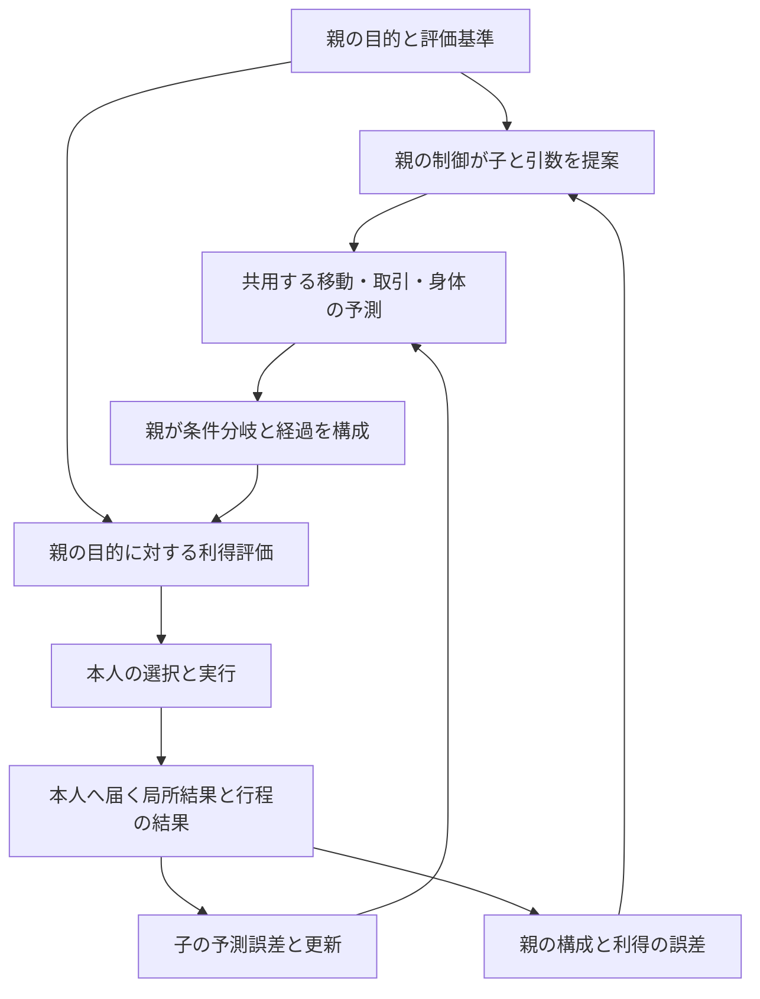

# 階層モデルによる未経験行程の利得予測と経験更新

更新: 2026-10-04。区分: 未採用の設計案。[モジュール分割案](HMOSAIC_MODULE_DESIGN.md)の利得・学習を具体化する補足。調査時の本体はv24、commit `97fbc93`。本書の計算・更新案は本体へ実装しておらず、生活改善や学習の収束を実証していない。

設計の中心は、適用できる基本モデルの予測を共用し、親がその結果を目的に照らして評価することである。行程全体を未経験でも、移動・取引・身体などの経験を使って利得を予測できる。行動後には、保存した利得予測と実結果の差を計算し、子の効果の予測、親の組合せ、価値の予測、制御の変更へ区別して戻す。未経験を全て同じ「未知」にまとめず、どこを既存経験で説明でき、どの接続・効果が未確認なのかを保持する。

従来の探索案は、未経験の案を試す機会の説明が中心だった。本書は、試行前に既知部分から評価する経路と、実行後に各層を更新する経路を追加する。数値の利得・生存比較と適用条件の表現は、引き続き採用前の検討対象である。

## MOSAIC系の研究で異なる誤差

| 研究 | 誤差と構成 | 本書へ取り入れる範囲 |
|---|---|---|
| [MOSAIC原型、2001年](https://www.researchgate.net/publication/220500102_MOSAIC_Model_for_Sensorimotor_Learning_and_Control) | 順モデルの状態予測の誤差で寄与を推定し、対応する逆モデルの制御・学習を調整。逆モデルの勾配学習ではフィードバック補正指令を教師信号に使う | 予測の信頼と制御の修正を結合する。状態の予測誤差を利得の誤差と同じ量にはしない |
| [HMOSAIC、2003年](https://www.sciencedirect.com/science/article/abs/pii/S0531513103001900) | 上位の制御が下位の事前重みを出し、下位の事後重みが上位へ戻る。上位の予測器は下位の次の事後重みを予測 | 上下の目的・選択と実結果のフィードバックを持つ階層。生活行程の物品・身体・利得の合成は本プロジェクトの追加設計 |
| [MMRL、2002年](https://www.researchgate.net/publication/11352258_Multiple_Model-Based_Reinforcement_Learning) | 即時報酬の予測と実報酬の誤差で報酬モデルを更新。別にTD誤差で将来価値を更新し、順モデルの寄与で学習を調整 | 利得の予測誤差と、将来価値・制御を学ぶ信号を区別する。離散時間のTD式は式(18)、報酬予測の更新は3.1節 |
| [MOSAIC-MR、2012年](https://www.researchgate.net/publication/51877459_MOSAIC_for_Multiple-Reward_Environments) | 発表版の要旨では、状態・報酬の予測器を分け、TD誤差を使って制御器を選択・学習し、対応する予測器を事前に固定しない | 効果の予測と本人の価値・制御の独立、共用する結び付きを参考にする。公開本文は2008年付の草稿なので、発表版の具体式と同一とは扱わない |

MMRLの離散時間の量を、符号を「実結果−予測」にそろえて書くと次のようになる。`r` は即時報酬、`V` はその後も含む期待累積報酬、`γ` は割引係数である。

```text
報酬の予測誤差:  e_reward = r_observed - r_predicted
価値のTD誤差:    delta = r_observed + gamma * V(next_state) - V(current_state)
```

TD誤差は即時報酬の予測誤差だけではない。後の状態が持つ価値も含め、価値の見込みが整合するかを学ぶ信号である。また、予測誤差が小さいことは利得が高いことを意味しない。枯渇する待機を正確に予測しても、その待機が本人に有利になるわけではない。

## BPとの関係とこの設計の利点

BPを誤差逆伝播の意味で扱う。BPは微分可能な計算のパラメータへ勾配を求める計算法で、HMOSAICは予測・制御を構成し、状況に応じて寄与を選び、経験を各層へ戻すアーキテクチャである。原型MOSAICにも勾配による学習があり、モジュール内部をNNとBPで実装することもできる。両者は排他的な方式ではない。

このプロジェクトで重視する利点は、経験を再利用する単位、入出力の意味、目的と制御、誤差を戻す先を明示できることである。共通の移動を食品確保と栽培から使い、未経験の組合せでも既知の効果を評価できる。行程の失敗が起きたとき、全モデルへ同じ失敗点を返さず、観察された局所効果と親の判断を分けて更新できる。

これはBPを使う構成にも取り入れられる利点であり、BPに原理的に不可能だという主張ではない。また、親子の線だけで未知の効果や失敗原因が判明するわけではない。接続の状態・条件・期間・単位と、対応する観測が必要である。

## 子の効果を親の目的へ接続する計算

子の共用モデルは「本人にとって何点か」を用途ごとに固定して返さず、次の状態と経過の予測を返す。例えば売却予測は、数量・価格・待機期限に応じた現金、所有物、所要時間、未成立分岐を返す。売却の意味は、食品を買う親と、生産資金を得る親では異なるためである。

親の予測器は子の結果を次の子の入力へ投影し、本人の将来の経過を構成する。HMOSAICの下位の寄与遷移予測は別ポートとして保持する。親の利得評価は、目的とその判断で固定した評価基準を用いて、構成した経過を評価する。

```text
child_forecast = F_child(subjective_start, requested_action, applicable_context)
trajectory_distribution = Compose(child_forecasts, conditional_links, parent_context)
predicted_gain = E[ U(saved_preferences, saved_goal, trajectory_distribution) ]
```

`Compose` は到着時刻・荷重・現金・食品等を接続する処理で、世界の真実を実行する処理ではない。`U` は本人の評価契約であり、生存、栄養・不快、時間・負担、期間末の備蓄等を区別する。生存比較の仕様が未決の間はその項目を数値で確定せず、試作上の仮の評価基準と生活の評価を分ける。



### 部分的に適用できる場合

未経験の行程について、子ごとに適用できる経験・条件を確認する。既知の目的地への移動と、その荷重での身体変化が予測でき、取引相手の反応だけが未確認なら、移動と身体の予測は利用し、取引の分岐に不確かさを残せる。完成行程の学習済みIDがないことを理由に、全てを未知として棄却しない。

条件の一部が似ているというだけで、予測の全出力を信頼しない。モデルは、各出力の条件・経験による裏付け、入力が経験の範囲内か、外挿か、未評価かを返す。数量・荷重・相手・時刻等のどの条件を共用できるかは、モデルが宣言する契約にする。状況の似た単語を比較するだけの適合度にしない。

完全な点推定ができる場合は期待利得を、範囲の根拠がある場合は利得の範囲と分岐を、根拠がない部分には未評価を返す。未評価を0や確率0へ変換しない。未知があることと、本人に不利という証拠があることを区別する。

親は子の利得を単純に合計しない。売上・購入した食品・吸収をそれぞれ独立した成果として加算すると重複する。状態の移転として接続し、同じ評価期間の本人の経過を評価する。並行する身体消耗等も、一つの経過へ統合して二重に数えない。

子のモデルが個別に適用できても、組合せの相互作用が既知とは限らない。到着が遅れて食品提示が消える、売却相手と食品供給が連動する等の条件は、接続か親の条件付き予測で扱う。独立の根拠なく成功確率を掛けない。必要に応じて親に相互作用を予測するモデルを置くが、観測できない相互作用を学習済みとしない。

## 実利得と予測利得を同じ基準で照合する

判断時に、モデルの版、親子の接続、予測した各段階と本人の経過、目標・評価基準・期間を保存する。実行後は、本人へ届いた観察から同じ期間の経過を作り、保存した評価基準で評価する。

```text
observed_gain = U(saved_preferences, saved_goal, observed_trajectory)
gain_error = observed_gain - saved_predicted_gain
```

判断後に必要・価値観・目標が変わった場合、その変更による再評価と、元の予測の誤差を分ける。後から更新したモデルで古い予測を書き換えない。利得の一部が観測できないなら、その部分の誤差は未確定とする。まだ行程途中なら、対応する区間・段階だけを照合し、吸収前の実結果を全行程の最終利得と比較しない。

累積利得の完了観測には `G_observed - G_predicted` を使える。完了前に価値を学ぶ候補として、実際に経過した区間の利得と次の状態の価値を使うTD更新を検討する。行程の長さが変わるため、分単位の割引基準を宣言する。[時間の抽象化を扱うoptionsの研究](https://www.sciencedirect.com/science/article/pii/S0004370299000521)を参考にするが、既知の完成行程一覧への固定は要求しない。

TD式を適用するには、区間の報酬が累積利得へ一貫して分解でき、価値の入力に必要な履歴が含まれることが条件になる。例えば期間内の最大疲労を評価するなら、その時点までの最大値も状態へ含める。生存を優先する項目別の比較を、根拠なく一つの加算可能な点数へ変換しない。適合する数値の報酬契約を作れない段階では、完了した同じ期間の利得の照合を使い、TD更新を接続しない。

```text
R_interval = 実際に経過した区間の、時間割引を適用した観測利得
delta_parent = R_interval + discount(elapsed_minutes) * V(next_belief, goal)
                           - V(start_belief, goal)
```

次の状態の `V` は推定であり、実報酬ではない。評価基準と方策の版が合う場合だけ接続する。打切り・途中中断を、完了した目標の教師データへ変換しない。観測不能や期限による打切りと、本人が知った目標達成・失敗を区別する。

## 各層へ返す信号と原因の対応

| 信号 | 対応する更新先 | 同じ信号にしないもの |
|---|---|---|
| 局所効果の予測誤差 | 対応する子の順モデルと、その出力を比較する適合度 | 最終目標を達成したかどうか |
| 観測利得と保存した予測利得の差 | 対応する報酬・行程価値の予測器。親の構成の照合にも利用 | 観測していない別行程の報酬、全ての子への一律の失敗点 |
| 親の構成・相互作用の誤差 | 観測した子の結果を条件に、親がどう経過・利得へ接続するかを学ぶモデル | 子の既知の効果が外れたことによる誤差の全額転嫁 |
| 目標の未達と修正案 | 対応する逆モデル・上位制御 | 正しい予測をした順モデルへの負の適合度 |
| 価値のTD誤差、行為の利得と基準価値との差 | 価値予測器、実際に選択した委譲・引数の制御 | 一度も選ばなかった案を成功・失敗として学ぶこと |
| 下位の事後重みと上位の事前・遷移予測の差 | 上位の寄与の予測と下位の事前重みを出す制御の学習接続 | 異なる役割の移動・取引・身体を一つの適合度の勝者へまとめること |

親の構成を学ぶときは、本人が観測した子の入力・結果を学習入力にし、本人が観測した親の結果を教師にする案である。行動前には子の予測を入力として使う。これにより、子の予測誤差を含む行程全体の差と、観測した子の結果を親が結び付ける誤差を区別できる。行動後の観測を使った構成の照合は診断・学習であり、行動前の予測が当たっていたという採点には使わない。

子の結果を観測できなければ、親の最終利得の差だけから失敗原因を特定できない。原因は未確定として保持し、追加の観察や条件を変えた試行の対象にする。親子関係は原因を調べる経路を提供するが、因果を識別する証拠の代わりにはならない。

各更新には、人物、親の意図・委譲ID、子の実行ID、モデルと学習接続の版、出力ポート、期間、実経験IDを持たせる。予測の依存関係と、経験をどのモデルへ戻すかは別の登録として管理する。共有する子を二つの親が利用しても、同じ局所経験による子の更新は一度。実際に実行された親子の経路で目標を照合できるが、本人の実報酬が二倍になったとは扱わない。別候補の親が同じ子の予測を読んだだけなら、その親の制御を実行した経験にはしない。

## 入出力へ追加する契約

[分割案の型付き入出力](HMOSAIC_MODULE_DESIGN.md#入出力と接続の案)を利用し、以下を追加する案である。

| 接続 | 必要な入力・出力 |
|---|---|
| 子の効果の予測 | 現在観測と予測された開始状態を区別した入力、行為の引数、条件付きの状態変化・時刻、適用範囲と裏付け、不確かさ |
| 親の構成 | 名前付きの子の出力、前後・並行の関係、分岐の条件、現物・時間の接続、既知・外挿・未評価の接続箇所 |
| 親の利得の予測・評価 | 目的、価値観と評価器の版、共通期間、構成した経過、利得の項目、推定できる範囲と未評価部分 |
| 利得のフィードバック | 保存した評価基準・予測の参照、対応する観測の期間と項目、予測と実結果、誤差または未確定の理由 |
| 制御のフィードバック | 実際に採用した子・数量・順序・中断の選択、最終的な選択確率、目標・利得・基準価値、対応する実経験 |

型例は同じ数値の評価基準で比較できるフィードバックの区分に限り、数値の利得の仕様を採用するものではない。項目別の利得・比較には別の型が必要である。`Frame`、`Scope`、`SignalRef` は分割案の型を参照する。

```ts
type ValueBasis = {
  goalId: string;
  goalRevision: number;
  preferenceRevision: number;
  evaluatorVersion: string;
  discountVersion: string;
  policyRevision: number;
};
type GainFeedback = {
  frame: Frame;
  scope: Scope;
  basis: ValueBasis;
  predictionRef: SignalRef;
  evidenceIds: readonly string[];
} & (
  | { kind: "observed-residual"; predicted: number; observed: number; error: number }
  | { kind: "bootstrapped-td"; observedIntervalReward: number;
      nextValueRef: SignalRef; nextValue: number; discount: number;
      previousValue: number; delta: number }
  | { kind: "unresolved"; missingObservations: readonly string[] }
);
```

`observed-residual` は同じ評価基準・期間・観測可能な項目で比較できた場合だけ作る。`bootstrapped-td` は将来の推定を含む更新信号で、完了した実利得の観測へ接続しない。型だけでは対応関係を保証できないため、実行器がID・版・期間・項目・重複を検査する。探索の情報価値は、未実行の反実仮想と同じく予測として保持し、得た食品・現金と同列の実報酬に書き換えない。

## 実装可能な更新則の候補と移行

局所ruleを初期モデルとして残し、その外側に予測・制御のパラメータ状態と更新器を設ける。未知の行程ごとにifを追加するのではなく、宣言した入力特徴と接続に対応する経験で更新する案である。

1. 局所の連続量の予測は、まず宣言した条件の平均・一次回帰を候補にする。例えば出力 `y`、入力特徴 `phi`、予測 `y_hat = theta * phi` に対して `theta_next = theta + eta * responsibility * phi * (y_observed - y_hat)` とする。時間・荷重等の特徴と出力の単位を固定する。取引の確率には別の確率モデルと観測窓を用い、拒否・未成立・未観測・中断を混ぜない。
2. 親は最初に型付きの子の結果を構成して利得を計算する。全体を経験していない段階でもこの合成予測を使える。親の学習履歴が空というだけで候補の価値を0へ落とさない。追加の親の予測器を学ぶ場合は、観測した子の結果と親の結果が対応したデータで学ぶ。相互作用の教師が不足する部分は未評価のまま保持する。
3. 価値の予測には、宣言した入力特徴について `v_next = v + eta * responsibility * delta * phi` のTD更新が候補になる。これは本人の評価基準を変更する式ではない。目標と制御方式の版、観測された区間と将来推定を記録する。
4. 制御の初期試作では、子・引数の局所選択に確率分布を定義し、実際に採用した委譲の利得が基準価値を上回ったかで、その選択の重みを更新する案を使える。有限の局所選択を組み合わせるので、全行程の学習済み一覧を必須にしない。下記の式はその制御が行う最終選択の確率に対する候補で、外側の固定ifが後から勝者を置換する場合には適用しない。

```text
pi(j) = softmax(w)[j]                  # 今回の許された局所選択について
A = observed_return - saved_baseline  # 同じ目的・期間の観測利得と基準価値
w_next[j] = w[j] + eta * responsibility * A * (1[chosen == j] - pi(j))
```

ここで `responsibility` は、登録した予測と制御の学習接続が示す適用の寄与であり、失敗原因へ任意に割り振る割合ではない。初期試作は一つの制御の最終的な確率選択でこの対応を確認する。複数の制御からの候補生成・合成・選別を行う段階では、実際の選択分布と各学習接続を定義し直す必要がある。選別前の提案確率を実行された行為の確率として学習しない。

仮の数値例では、同じ評価基準で予測利得8、観測利得3なら予測誤差は−5という照合になる。一方、保存した基準価値が1なら、制御の更新に使う `A` は3−1で+2になる。予測を下方へ修正することと、基準より利得が高かった選択の重みを増やすことは両立する。−5をそのまま全ての子の学習へ配ることではない。誤差の符号だけでは次の行為の正解も決まらず、代替の予測・制御の修正・試行機会が必要である。

現在の [food-acquisition](../../packages/ai/food-acquisition.ts) は固定式で `benefit/cost/value` を計算し、結果履歴へ到達時刻・成否等を保存するが、保存した全行程の利得と同じ基準の実利得を照合するledgerはない。[effort-choice](../../packages/ai/effort-choice.ts) と [action-learning](../../packages/ai/action-learning.ts) の身体の予測誤差・対応づけは、子の学習へ移す材料になる。これを親の利得の学習が実装済みという根拠にしない。

接続試作では、別人格の内部で、基本モデルの効果予測、親の構成、評価基準の保存、利得フィードバックを独立に作る。その後、局所予測と親の価値・制御の更新を接続する。現在の世界・物品・死亡条件を変えず、別rulesetで旧版を比較基準に残す。

## B1への適用例と成立を確認する条件

B1の「穀物を運び、売却し、食品を買って吸収する」行程全体が未経験でも、荷重付きの移動、取引、身体の基本モデルが該当条件を説明できれば、その予測を組み合わせられる。未確認の売却・購入には成功と未成立の分岐を置く。親は現金から食品取得への接続、吸収までの時間、待機・採集等の代替を含めて本人への利得を評価する。この予測は試行前にも使える。

実行結果で移動時間と疲労は予測どおり、売却は成立したが食品を買えなかった場合、移動や売却の効果の予測を一律に低く評価しない。購入の予測、売却から購入への接続、親の数量・順序・期限を対応する観察で見直す。全行程の予測が正しくても、食品確保の目標に役立たない行程なら、親は代替や構成の変更を選ぶ。逆に利得が高くても局所予測が外れれば、その子の予測は更新する。

この例は新方式の実走結果ではない。次の条件を満たすことが、設計を実装へ進める前提になる。

- 親が未経験の組合せを要求しても、適用できる既存の子から予測を構成できる。未評価の効果や接続と、既知部分の寄与を追える。
- 新しい親や目的を追加するために、共通の移動・取引予測へ親別のifを追加しない。親が目的に応じて同じ効果を評価する。
- 同じ実経験について、局所予測と親の利得の誤差を区別できる。親の接続だけが誤っている場合に、正しい子へ同じ失敗を配送しない。
- 利得の誤差が0でも、予測された低い利得を本人に有利と扱わない。観測していない後続利得を実績にせず、共有経験の更新が増殖しない。
- 制御の状態更新が後の子・引数・順序へ反映される。未経験の組合せへの適用と、生存・食品取得の改善を別に評価する。

これらは接続と更新の成立条件である。一般化、生存の評価、学習の安定性、計算予算、接続の再編成の範囲は、未採用のまま別に確認する。親子の構成を設けるだけで、全ての未知行動の利得が正確に得られるとは扱わない。
