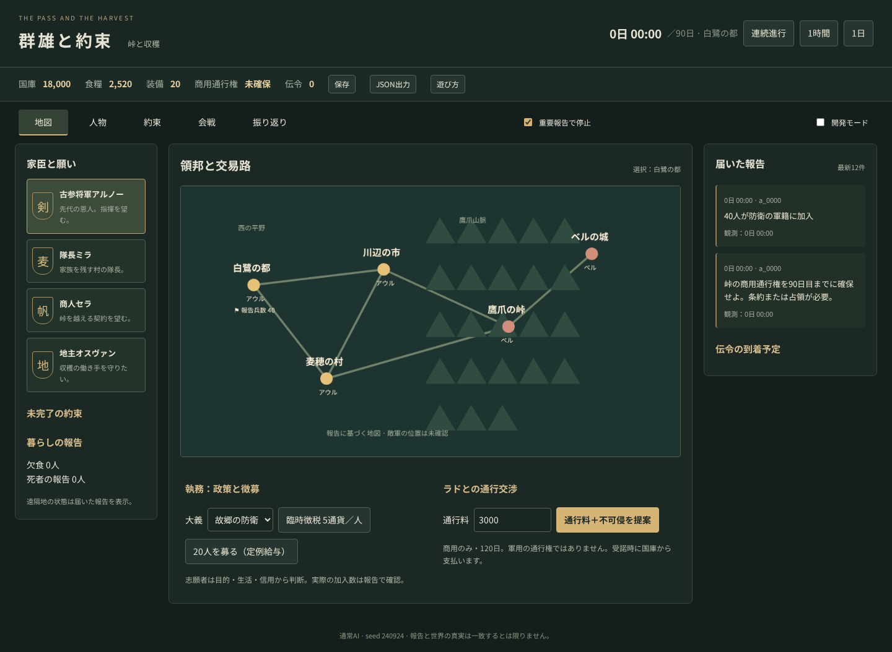

# 群雄と約束 — 峠と収穫

1,000人の住民と兵士を同一人物として扱う、90日間のローカル戦略ゲームです。家族・文化・信用で返答が変わる家臣を率い、峠の商用通行権を条約または占領で獲得します。LLM接続なしで遊べます。



[全員の行動を確認する開発画面](artifacts/debug-screen.png)

## 起動

Node.js 22以上とnpmが必要です。リポジトリを取得して、プロジェクトのディレクトリで実行します。

```sh
npm ci
npm run dev
```

表示された `http://127.0.0.1:5173` を開き、「統治を始める」。外部APIキーやサーバー契約は不要です。

VS Codeでは「実行とデバッグ」（F5）から、ブラウザ版、90日シナリオ、E0/E1の各ケース、検証・ベンチマークを選べます。[launch.json](.vscode/launch.json)の各設定には実行するシェルコマンドを`command`として直接記載しています。コマンドはこの作業環境の `~/.local/node` を参照します。Nodeを別の場所に入れた環境では、そのパスを変更してください。

E1の空間デバッグは `http://127.0.0.1:5173/?e1=debug`、またはF5の「経済 E1: 空間デバッグ画面」で開きます。町・4軒の家・農場・市場、20人の移動と食料・現金の所在地を時刻スライダーで再生できます。人物、荷車、現金容器、食料をホバー/クリックすると所有者・積載量/上限・体力と移動費用が見られます。[画面例](artifacts/e1-spatial-debug.png)。この画面は独立したE1実験であり、90日ゲームの世界とはまだ接続していません。

A3の固定20人経済は `npm run autonomy:a3:income -- baseline --days 90` で日別計測できます。3日間の空間デバッグは `http://127.0.0.1:5173/?e1=a3-income`、資金不足の対照は `npm run autonomy:a3:income -- buyer-no-money` です。画面で人物をクリックすると、仕事、空腹・体力、賃金と協同事業の分配、運搬人による荷車整備のEventを追えます。固定配置の90日運用は確認していますが、食事・休息の本人判断、会計記録の伝達、地図と人員を変えた自律性の受入は未達です。[監査と判定条件](docs/SOCIAL_SIM_AUTONOMY_AUDIT.md)を参照してください。

この作業環境のLinux版Nodeを使う場合は、先に `export PATH="$HOME/.local/node/bin:$PATH"` を実行してください。ほかの環境でNodeがすでに利用できる場合、この設定は不要です。

## 操作

- **地図**：拠点を選択。政策の大義、臨時徴税、志願兵の募集、通行交渉を行います。
- **人物**：アルノー、ミラなどの願いを面談で聞きます。「宮廷に呼ぶ」は書記が招待状を作り、伝令が届け、相手が承諾して到着すると成立します。「訪ねる」は君主と書記が出向きます。将軍交代は前任者の信用を損ないます。
- **約束**：相手・総額・期限・条件・保証金を指定。実際の支払いが本人へ伝わって初めて信用が変化します。ミラの家族扶助は遠征への協力にも影響します。
- **会戦**：部隊ごとに指揮官・目的地・補給・攻撃/撤退を指示。命令は伝令到着後に解釈され、拒否される場合があります。国庫の食糧は首都から運ぶ必要があります。
- **時間**：1時間、1日、連続進行/一時停止。重要報告で停止する設定があります。
- **振り返り**：届いた証言とその原因Eventをたどります。敵軍は推定、遠隔部隊は報告時点の情報です。
- **保存**：IndexedDBに保存。「JSON出力」で持ち出せます。起動画面からJSONを読み込めます。
- **開発モード**：画面上部のチェックを入れて「開発」を開くと、敵味方を含む全1,000人を検索できます。人物ごとの日次活動、個別Eventと原因ID、担当した伝令、面談の進行を確認できます。通常の君主画面には未確認情報を表示しません。

初回は地図で「3,000通貨＋不可侵」を提案し、数日進めて外交の伝達を確認できます。軍事経路では志願兵を募り、部隊に食糧を送り、目的地「鷹爪の峠」への攻撃を指示します。徴兵は生産を減らし、戦死者は家族を持つ実在の住民です。

勝利条件は90日目の君主生存・首都保有・商用通行権です。何もしなければ通行権を得られず敗北します。

## 実装と検証

M0〜M2の機構受入とM3の自動シナリオは検証済みです。M3の正式受入に必要な3〜5人の人間試遊は未実施です。企画書全細目の完成版ではなく、共同市場などの簡略化があります。[状態と未実装範囲](docs/STATUS.md)、[判断記録](docs/DECISIONS.md)を参照してください。

| 段階 | 現在の状態 |
|---|---|
| M0：再現可能なコア | 100人30日、seed・Command再現、中間保存からの再開を検証済み |
| M1：生活・約束・徴兵 | 1,000人30日、資産保存、政策への個別反応、約束と信用、徴兵・復員を検証済み |
| M2：戦争と通信 | 200人の会戦追跡、地形・補給・配置・命令時刻による戦果差を検証済み |
| M3：90日シナリオ | 軍事・外交による勝利と無策による敗北を確認。人間試遊待ち |

2026-09-26の検証結果：単体・シナリオ **56/56成功**、ブラウザ **6/6成功**。型検査・本番ビルド・コンテンツ検査も成功しました。ブラウザ検証には保存・再開、90日進行、JSON読込、会戦表示、幅390pxの画面と新旧E1の空間デバッグを含みます。既存ゲームの[検証記録](artifacts/validation.json)と旧[E1画面例](artifacts/e1-spatial-debug.png)を保存しています。新版の性能測定は未実施です。

未実装の主な範囲は、個別市場、融資の元本実行、捕虜交換、自由布陣・医療、政治運動です。LLM実接続・出生継承・3D化・公開デプロイは今回の対象外です。


```sh
npm run typecheck
npm test
npm run build
npm run content:validate
npm run fixtures
npm run sim -- --scenario pass_and_harvest --seed 240924 --days 90
npm run sim -- --scenario pass_and_harvest --seed 240924 --days 90 --path military --record
npm run bench -- --profile world-1000 --days 100 --warmup-days 10
```

ブラウザ検証は `npx playwright install chromium` の後、`npm run test:browser`。本番ビルドをローカルで起動して検証します。`world-30000` はM6未対応としてエラーになります。1,000人の計測を大規模性能達成とは扱いません。

## サンプルと構成

- [外交成立・ミラへの約束が未履行の3日目セーブ](artifacts/sample-day3.json)
- [軍事経路4日目のセーブ](artifacts/sample-war-day4.json)
- [外交経路ログ](artifacts/diplomacy-run.json) / [軍事経路ログ](artifacts/military-run.json) / [無策の敗北ログ](artifacts/idle-run.json)
- [会戦対照実験](artifacts/combat-fixtures.json) / [性能測定](artifacts/benchmark.json)

`packages/sim` はDOM/UI/ネットワーク非依存、`contracts` は入力契約、`content` は固定設定、`ai` はObservationを受け取る通常AIとMock、`apps/web` はReact/Canvas/Workerです。世界状態の更新は検証されたCommandとシミュレーション内処理のみで行います。

設計原本は [DESIGN.md](docs/DESIGN.md)、出発点は [concept-original.md](docs/concept-original.md)。次の受入作業は [PLAYTEST.md](docs/PLAYTEST.md) です。Noto Sans JPはFontsource経由でローカル配信しています（SIL Open Font License、依存パッケージ内LICENSE参照）。

動機・行動・社会的約束の共通化に関する[設計調査](docs/RESEARCH_MOTIVATION_ACTION.md)を踏まえ、A〜Cで共有する[人格の認知・行動インターフェースv2](docs/AGENT_INTERFACES_v2.md)を検討しています。文化と本人が知る状況による認識、動機づけ、判断から、[データ駆動のルーティン](docs/DATA_DRIVEN_ROUTINES.md)による複数人の仕事と実行までを設計しています。ルール・NN・LLM・人間は各ブロックの実装方法です。これは設計段階で、現行のゲームコードへの移行は未着手です。

次の設計・実装の優先は[市民経済の閉路](docs/ECONOMY_LOOP_DESIGN.md)です。E0の現行経済計測に続き、E1の独立20人集落で食料流通を実装しました。[共通物流](docs/COMMON_LOGISTICS_DESIGN.md)、[物体・包含モデル](docs/PHYSICAL_OBJECT_MODEL.md)、[能力エージェント](docs/CAPABILITY_AGENTS_DESIGN.md)に沿い、L0の物体操作/二台馬車対照と、L1の物体木を正本とする3日経済`local_food_v2`を実装しました。[L1の契約と結果](docs/E1_OBJECT_CAPABILITY_READINESS.md)を参照してください。旧E1は回帰用に残し、90日ゲームの国別共同市場はまだ新経済へ移していません。

[実装前監査](docs/ECONOMY_IMPLEMENTATION_READINESS.md)に、E1前に確定する在庫・取引・時間・伝達・経済Task・旧処理との切替、E2前に数表で検証する家計と事業の資金循環をまとめました。[E0の現行経済90日計測](docs/ECONOMY_E0_BASELINE.md)は実施済みで、日別・世帯別の詳細と要約を保存しています。

[E1の食料流通契約](docs/ECONOMY_E1_CONTRACT.md)では、20人の集落について人員、2kmの道路、勤務と配送の時刻、食料ロット・購入注文・資産清算を具体化しました。独立fixtureは3日間動作し、60食を生産・配送・購入・消費します。`npm run economy:e1 -- baseline`で日別集計を表示できます。`carrier-absent`、`buyer-no-money`、`farmer-absent`を引数にすると反事実を確認できます。`--output <path>`で人物別Taskと因果Eventを含む世界状態をJSON保存できます。E1の共通ルーティンランナーと人格v2、本編接続、賃金循環は未実装です。

物体木版は`npm run economy:e1:v2 -- baseline`で実行し、`http://127.0.0.1:5173/?e1=v2`で人物と物体をクリックして物理親・所有者・重量/容量・予約・行動Eventを確認できます。CLIには旧版と同じ3つの反事実名と`--output <path>`を渡せます。VS Codeの「経済 L1: 物体木の基準3日」「経済 L1: 物体木デバッグ画面」からも起動できます。新版のセーブは`schemaVersion:3`で、旧E1セーブは新版ローダーで明示的に拒否します。

新版では[仕事・体力・車両状態](docs/WORK_ENERGY_DESIGN.md)も追えます。運搬人Cは21食の荷積みで5体力、帰路で20体力、荷下ろしで5体力を消費し、荷車の状態も走行で減ります。人物を選ぶと仕事の体力Event、荷車を選ぶと摩耗後の状態が見られます。家での夜間休息だけ体力を回復します。

現行の費用は出発・作業時に一括処理します。雨・渋滞・襲撃などを道中で扱うための[時間と負荷で進む行動の設計](docs/ACTION_PROCESS_DESIGN.md)を追加しました。人・家畜、または水流で回る水車の出力を、積荷や道路の負荷に応じて進捗へ変換し、荷車の摩耗は実走距離から導く方針です。共通実行器は未実装です。

現在は移動やTaskの予定を保存していますが、仕事の開始・完了は中央の時刻処理が主導します。[行動中の状態と本人主導の進行](docs/ACTOR_EXECUTION_DESIGN.md)に現行との違いを記録しました。将来は各人が届いた仕事・身体の必要・近くの出来事を受けて次の行動を選び、simはその結果だけを検証・確定する構成に移します。

次の開発は[自律的な箱庭の開発順](docs/AUTONOMOUS_SANDBOX_ROADMAP.md)に沿います。固定20人の所得・保守90日対照は実行できました。生活行動と会計情報を本人の認識・行動へつなぎ、地理や人員を変えてから、故障と不作を試します。軍事の新機能、人間関係、木々や動物の生態系はこの検証より後です。

[実装前の漏れ監査](docs/AUTONOMOUS_SANDBOX_GAP_AUDIT.md)では、本人へ届く情報、同時に同じ道具を使おうとした場合の調停、仕事の依頼、通貨の持ち帰り、保守の資源を受入条件へ追加しました。「安定」はまず固定収量下の90日運用を意味し、自然資源まで含む永続性や生存率の結論は後段で検証します。

これらを扱う[自律行動の外側のインターフェース](docs/AUTONOMY_INTERFACE_CONTRACT.md)を設計しました。本人へ届く刺激、本人の判断と待機、simによる試行と利用権、進行中行動と結果を共通の境界とし、人格v2の意味分割を維持します。共通人格v2の全機能と20人全員への接続はまだ設計段階です。

**A1小fixture:** ブラウザの`/?a1=debug`、またはVS Code「自律 A1: 作業場デバッグ画面」で、二人と共有道具の6分間を再生できます。人物・道具を選ぶと利用権、体力、仕事の進捗、因果Eventを確認できます。`npm run autonomy:a1`（VS Code「自律 A1: 二人と一つの道具」）は同じ結果のテキスト表示です。A1のコードは[autonomy-a1.ts](packages/sim/autonomy-a1.ts)。A1自体は独立した小世界で、90日安定の検証ではありません。

**A2の買物・販売・農業・運搬:** `npm run autonomy:a2`で20人経済の3日間の人物別判断と注文・補充・収穫・配送・売買を表示します。`npm run dev`で起動し`http://127.0.0.1:5173/?e1=a2`を開くか、VS Code「自律 A2: 20人経済の空間デバッグ画面」を使ってください。B0〜B3・S・F0〜F7・Cをクリックすると、次の判断、本人が知る依頼とTask、因果Event、所在地・積荷・所有者を確認できます。[共通の人格入出力型](packages/ai/personality.ts)を使用し、旧物体木版`/?e1=v2`を比較用に残しています。食事・休息はまだ中央の処理です。所得と保守は別モード`/?e1=a3-income`にのみ接続しています。

## 次の作業

1. A2で食事・休息と家での荷下ろしを本人主導へ移し、生活行動を含む20人の自律性を検証する。
2. A1で検証した分刻みの行動進捗・中断をE1に移し、A3で得た所得と荷車保守の90日結果を地理・人員・会計情報の伝達を変えた対照で検証する。
3. A4で荷車故障と不作を注入し、各人が知った結果に基づく再判断と資産・時間への影響を対照する。既存90日ゲームの回帰は続ける。
4. [人間試遊の記録票](docs/PLAYTEST.md)を使い、3〜5人に30〜60分遊んでもらう。試遊結果と[STATUS.md](docs/STATUS.md)の未実装事項を見直し、M3の正式受入後にM4を検討する。
