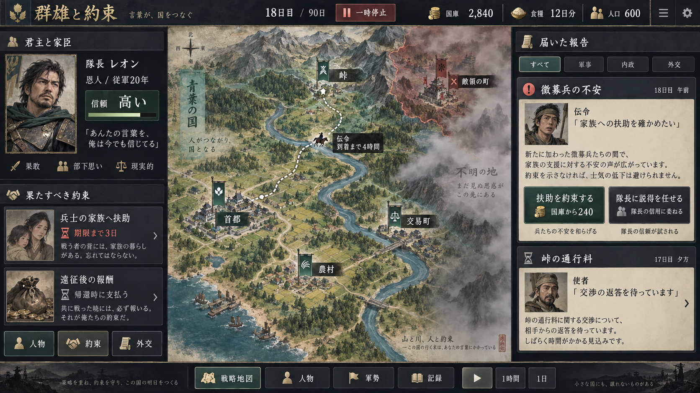

# Medieval Simulator

**群雄と約束（仮題）** — 欲望、文化、約束、人間関係で動く小国家を率いるストラテジーゲーム。

プレイヤーは一人の君主として、徴税、登用、交渉、遠征などを決断します。家臣・住民・兵士はそれぞれの利害や価値観で行動し、約束や信用、兵站、命令の伝達が国家運営と会戦の結果につながります。

長期的に有利な判断にも、人間関係の損失や政治的な譲歩が伴います。個人の欲望と国家の利益の間で揺れながら、必要な局面で協力と準備を成立させる体験を目指します。

## 画面イメージ

国家運営画面のコンセプトです。実装済みの画面ではありません。

## 現在の状態

企画・設計段階です。現在のリポジトリには構想と仕様案を収録しており、ゲーム本体や開発環境は未実装です。起動・ビルド・テスト用のコマンドはまだありません。

## 主な構想

- 国家運営と会戦を、人物の履歴や人間関係を通じてつなぐ。
- 住民・兵士一人ひとりに、身分、文化、仕事、性格、経験を持たせる。
- 徴税や徴兵への反応を、目的、報酬の約束、慣習、信用によって変化させる。
- 大義への支持から、改革・反乱・新勢力が生まれる仕組みを目指す。
- 少数の人物に柔軟な計画立案を導入し、後続段階で限定的なLLM利用を検討する。

最初の試作は自国600人・敵国400人の小規模な世界から始め、90日間のシナリオを想定しています。最終的な規模の目標は一国最大10,000人、軍籍を持つ者最大1,000人です。これらは設計上の目標であり、性能検証は未実施です。

## ドキュメント

- [ゲームコンセプト原文記録](docs/concept-original.md)：構想の出発点となった発言の記録。
- [企画・システム設計・実装引継書 v0.1](docs/project_proposal_v0.1.md)：ゲームシステム、技術構成案、実装段階、受入条件。

設計書では「合意した核」「実装用の仮決定」「後続機能」を区別しています。具体的な数値や技術構成は、実装・検証に応じて見直す前提です。

## 実装方針

最初の実装対象は、ローカルPCで動く2Dブラウザアプリです。TypeScript、React + Vite、Canvas 2D、Web Worker、Vitest、IndexedDBを初期構成として想定しています。

まずは設計書のM0〜M3を対象に、基盤とシミュレーションの機構検証から遊べる試作までを段階的に実装します。社会の拡張、LLM接続、大規模化は後続段階で扱います。
