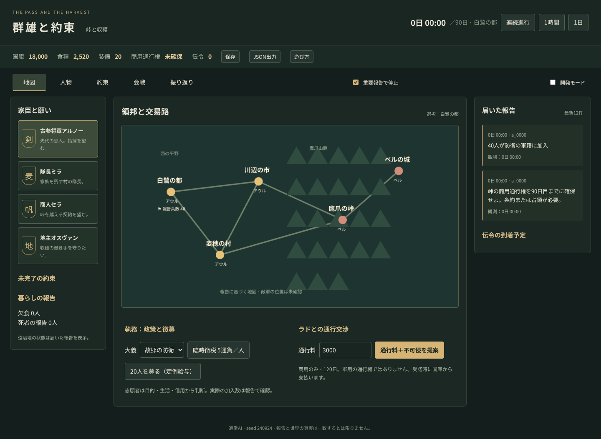

# 群雄と約束 — 峠と収穫

1,000人の住民と兵士を同一人物として扱う、90日間のローカル戦略ゲームです。家族・文化・信用で返答が変わる家臣を率い、峠の商用通行権を条約または占領で獲得します。LLM接続なしで遊べます。



[全員の行動を確認する開発画面](artifacts/debug-screen.png)

## 起動

Node.js 22以上とnpmが必要です。リポジトリを取得して、プロジェクトのディレクトリで実行します。

```sh
npm ci
npm run dev
```

表示された `http://127.0.0.1:5173` を開き、「統治を始める」。外部APIキーやサーバー契約は不要です。

VS Codeでは「実行とデバッグ」（F5）から、ゲーム、個人経済、自律A1〜A3、経済E0〜L1、検証、性能のグループ別に起動設定を選べます。個人経済では各実験の画面とCLI計測を並べ、生活市場の90日計測も選べます。[launch.json](.vscode/launch.json)の各設定には実行するシェルコマンドを`command`として直接記載しています。コマンドはこの作業環境の `~/.local/node` を参照します。Nodeを別の場所に入れた環境では、そのパスを変更してください。

E1の空間デバッグは `http://127.0.0.1:5173/?e1=debug`、またはF5の「経済 E1: 空間デバッグ画面」で開きます。町・4軒の家・農場・市場、20人の移動と食料・現金の所在地を時刻スライダーで再生できます。人物、荷車、現金容器、食料をホバー/クリックすると所有者・積載量/上限・体力と移動費用が見られます。[画面例](artifacts/e1-spatial-debug.png)。この画面は独立したE1実験であり、90日ゲームの世界とはまだ接続していません。

A3の固定20人経済は `npm run autonomy:a3:income -- baseline --days 90` で日別計測できます。3日間の空間デバッグは `http://127.0.0.1:5173/?e1=a3-income`、資金不足の対照は `npm run autonomy:a3:income -- buyer-no-money` です。画面で人物をクリックすると、仕事、空腹・体力、賃金と協同事業の分配、運搬人による荷車整備のEventを追えます。農作業の賃金証拠は実際に荷車へ積まれた食料とともに市場へ届き、売り手は届いた証拠だけで支払・分配を判断します。固定配置の90日運用は確認していますが、食事・休息の本人判断、市場以外の職務情報の伝達、地図と人員を変えた自律性の受入は未達です。[監査と判定条件](docs/archive/SOCIAL_SIM_AUTONOMY_AUDIT.md)を参照してください。

個人所有の新しい二つの独立実験も起動できます。`npm run autonomy:life -- 30` は世帯・農場・市場のない3人の採集生活、`npm run autonomy:market -- 7` はS所有の市場でFの収穫をCが運び、Sが自分の資金で単価を提示し、Cが購入金を預かり、Fが作業前に受諾して採った分だけ現地で支払い、Sが売る取引です。Sは4通貨を手元に留保する判断をし、ベリーは収穫日を含む3日間保管できます。ブラウザの `/?individual=life` と `/?individual=market`、またはF5の「自律: 制度なし採集生活の空間デバッグ画面」「自律: S個人市場の空間デバッグ画面」で1〜7日の日末状態と全員の行動・所有権・因果Eventを確認できます。CLIの引数を90にすると90日計測になります。[仕組みと測定結果](docs/baseline/INDIVIDUAL_ECONOMY_IMPLEMENTATION.md)、[複数食品・森と農場・技能・なわばりの拡張順](docs/baseline/FOOD_ECOLOGY_AND_MARKET_PLAN.md)に制約を記録しました。個人市場は買主の所得源がないため90日安定に失敗しており、本編やA3へは未接続です。

食事と個人備蓄を接続した次の独立実験は `npm run autonomy:living -- 30`、画面は `http://127.0.0.1:5173/?individual=living` です。B1/B2の家と本人所有の備蓄箱、空腹、買物の移動、薪の採集・納品・所得、実際の食事を追えます。Sは薪を燃やした日に売場を開き、現物を受け取った場合だけBへ通貨を払います。90日ではB1/B2が薪所得10/8を得ても空腹が85/86まで累積し、安定していません。[生活市場の測定と未実装範囲](docs/baseline/LIVING_MARKET_EXPERIMENT.md)を参照してください。

次の自律世界に向けた数表の検算は `npm run autonomy:feasibility`、またはF5の「自律: 90日生活の算術実行可能性」で実行できます。5人の食料・薪・通貨・時間の90日分の**実行可能性**を計算します。人物の判断や実際の物理移動は含まず、条件と限界は[90日の数表](docs/baseline/AUTONOMOUS_90_DAY_FEASIBILITY.md)に記録しています。

5人の自律生活世界は `npm run autonomy:village -- 90`、日別結果は `npm run autonomy:village -- 90 --daily` で実行できます。本人の起床・通知・現地観察・試行から仕事、現物取引、食事、薪使用が進み、基準fixtureで90日続きます。F5の「自律: 5人の90日生活」からも起動できます。初期条件・測定値・対照の範囲は[実行結果](docs/baseline/AUTONOMOUS_VILLAGE_RESULT.md)を参照してください。

人物の履歴と再実行記録は `npm run autonomy:village -- 90 --record /tmp/village.json.gz` で保存できます。[同梱の90日記録](fixtures/recordings/autonomous-village-90.v2.json.gz)は `npm run autonomy:village -- replay fixtures/recordings/autonomous-village-90.v2.json.gz` で再実行できます。`history 記録 F 出力先.json` はFの行動履歴を書き出します。対照実験は `--scenario carrier-refuses` などで別に記録し、`compare 通常記録 対照記録` で最初の差分を調べられます。矩形グリッドの経路変更と畑・果樹・野草・動物の実装範囲は[版2の記録](docs/baseline/VILLAGE_RECORDING_AND_LAND_V2.md)にあります。

F5の「自律: 土地経済90日の生態デバッグ画面」は現在、[食品の需要・期限と行程比較v19](docs/baseline/FOOD_PLANNING_V19_RESULT.md)を標準表示します。右側のステータスと行動ログを横並びで表示し、現金合計、身体の快不快、携帯中・家・市場・畑の物品数量・重量・期限、荷重による歩行速度と体力消費を確認できます。情報量を重視したコンパクトな配置で、人物・経路の行先は1行、数値はラベルと同じ行、快不快は2列で表示します。地図の下の全員一覧を削除し、空いた高さを地図へ割り当てます。人物は右側の選択欄または地図上の人物から選べます。所持品は種類・保管先・期限・販売状態ごとに集計し、展開すると各ロットを確認できます。判断と最近の売買も表形式で表示し、入力・原因は「詳細」から読めます。日付が変わった直後は表示時点以前の直近の判断を表示します。選択セルの情報は地図側に配置。記録の仕様説明とEventの詳細JSONは必要時に展開できます。地図との境界を左右へドラッグして幅を調整できます。地図は1280×768の描画を表示幅に合わせて拡縮します。右端の「凡例」はクリックまたは左へのドラッグで引き出す独立パネルです。採集で植物が減る時点に所持品の数量・重量も更新します。播種1→収穫20、穀物の重量2。収穫物は畑に保管し、分割して運びます。自宅で物品と現金を預け、取り出せます。穀物は直接食べられず腐敗しません。農夫F/B1/B2は市場で穀物を売り、代金でパンを買います。初期製パン技能はSだけが持ち、市場の所有穀物庫に買った原料を保存して加工します。パンは3日で腐敗し、野草・ベリーは自食できます。画面で人物別の最近の売買、製パン技能、穀物・パン取引件数、判断理由・身体を確認できます。現金の偏在があり、全員の食事成立と経済持続は別に評価します。技能獲得・職選択は[次の計画](docs/baseline/FOOD_ECONOMY_SKILLS_PLAN.md)で扱います。旧記録は選択欄で比較可能。「経験からの見込み」で本人の予測と実結果を確認できます。農作業の目的を対象セルまで保持し、市場は未成立の訪問から再訪間隔を変えます。帰宅の余裕があれば現地の売却提示・食品購入を先に行います。人物履歴の「食料行程の比較」で、取得・帰路・身体の見込みと、観察／記憶／未確認の候補を確認できます。他人が採集中の植物を避け、食品の期限と次の需要、睡眠を挟む余裕を比べます。探索にも往復の負担を見積もります。旧v18は `&wood=journey`、旧v17は `&wood=learn` で比較できます。CLIは `npm run autonomy:village -- 90 --scenario land-food-planning`。以下は固定薪資源を使う旧版の結果です。

画面で旧記録を選択、または `http://127.0.0.1:5173/?village=land-economy&wood=legacy` で、[生態版の90日記録](fixtures/recordings/autonomous-village-ecological-90.v2.json.gz)を日・時刻・5/15/30/60分刻みで再生できます。Fは最初の3日に野草2地点と果樹1地点へ歩き、取引用のベリーも毎日別の株から採ります。ベリー・野草・果樹・草は採集後に再生を待ち、畑は播種後6日の成長と収穫後3日の休止を持ちます。分表示は世界時間内の通過セルを均等に割り当てた目安です。1280×768ピクセルの40×24セル地図では生育段階を色と高さで描きます。右側の枠で人物の履歴と凡例を切り替え、セルをクリックすると地形・植物の状態が分かります。黄色い線は幾何費用のA*計算経路です。[生育周期と90日結果](docs/baseline/ECOLOGICAL_LAND_V6_RESULT.md)を参照してください。CLIは `npm run autonomy:village -- 90 --scenario land-ecology --daily`。5人全員が90日毎日1食と薪1を使用し、450食のために食品452単位を消費しました。旧[植物探索版](docs/baseline/PLANT_EXPLORATION_RESULT.md)、[全域版](docs/baseline/WIDE_WORLD_V5_RESULT.md)の記録も再実行用に残しています。

起床と情報到達を試す最小の仕事実験は `npm run autonomy:work -- 8`（引数は時間数、`--events` で因果Eventを表示）です。Sの買取提示がFに届いてから承諾・採集・現物引渡しが起き、引渡しの通知がSに届いてからSが自分の財布の通貨で支払います。本人が拒めば進みません。これは2人・1件の固定fixtureであり、生活市場の一般ランナーや持続する経済には未接続です。

この作業環境のLinux版Nodeを使う場合は、先に `export PATH="$HOME/.local/node/bin:$PATH"` を実行してください。ほかの環境でNodeがすでに利用できる場合、この設定は不要です。

## 操作

- **地図**：拠点を選択。政策の大義、臨時徴税、志願兵の募集、通行交渉を行います。
- **人物**：アルノー、ミラなどの願いを面談で聞きます。「宮廷に呼ぶ」は書記が招待状を作り、伝令が届け、相手が承諾して到着すると成立します。「訪ねる」は君主と書記が出向きます。将軍交代は前任者の信用を損ないます。
- **約束**：相手・総額・期限・条件・保証金を指定。実際の支払いが本人へ伝わって初めて信用が変化します。ミラの家族扶助は遠征への協力にも影響します。
- **会戦**：部隊ごとに指揮官・目的地・補給・攻撃/撤退を指示。命令は伝令到着後に解釈され、拒否される場合があります。国庫の食糧は首都から運ぶ必要があります。
- **時間**：1時間、1日、連続進行/一時停止。重要報告で停止する設定があります。
- **振り返り**：届いた証言とその原因Eventをたどります。敵軍は推定、遠隔部隊は報告時点の情報です。
- **保存**：IndexedDBに保存。「JSON出力」で持ち出せます。起動画面からJSONを読み込めます。
- **開発モード**：画面上部のチェックを入れて「開発」を開くと、敵味方を含む全1,000人を検索できます。人物ごとの日次活動、個別Eventと原因ID、担当した伝令、面談の進行を確認できます。通常の君主画面には未確認情報を表示しません。

初回は地図で「3,000通貨＋不可侵」を提案し、数日進めて外交の伝達を確認できます。軍事経路では志願兵を募り、部隊に食糧を送り、目的地「鷹爪の峠」への攻撃を指示します。徴兵は生産を減らし、戦死者は家族を持つ実在の住民です。

勝利条件は90日目の君主生存・首都保有・商用通行権です。何もしなければ通行権を得られず敗北します。

## 実装と検証

M0〜M2の機構受入とM3の自動シナリオは検証済みです。M3の正式受入に必要な3〜5人の人間試遊は未実施です。企画書全細目の完成版ではなく、共同市場などの簡略化があります。[状態と未実装範囲](docs/STATUS.md)、[判断記録](docs/DECISIONS.md)を参照してください。

| 段階 | 現在の状態 |
|---|---|
| M0：再現可能なコア | 100人30日、seed・Command再現、中間保存からの再開を検証済み |
| M1：生活・約束・徴兵 | 1,000人30日、資産保存、政策への個別反応、約束と信用、徴兵・復員を検証済み |
| M2：戦争と通信 | 200人の会戦追跡、地形・補給・配置・命令時刻による戦果差を検証済み |
| M3：90日シナリオ | 軍事・外交による勝利と無策による敗北を確認。人間試遊待ち |

2026-09-27の検証結果：単体・シナリオ **108/108成功**、ブラウザ **12/12成功**。型検査・コンテンツ検査・本番ビルドも成功しました。行動一覧を全件表示に変更した後、新画面2/2を再確認しました。ブラウザ検証には保存・再開、90日進行、JSON読込、会戦表示、幅390pxの画面とA3を含む空間デバッグを含みます。既存ゲームの[検証記録](artifacts/validation.json)と旧[E1画面例](artifacts/e1-spatial-debug.png)、A3の[90日計測](artifacts/a3-income-90d-summary.json)を保存しています。A3の計測は固定配置・単一seedに限ります。

本編で未実装の主な範囲は、個人市場との統合、融資の元本実行、捕虜交換、自由布陣・医療、政治運動です。LLM実接続・出生継承・3D化・公開デプロイは今回の対象外です。


```sh
npm run typecheck
npm test
npm run build
npm run content:validate
npm run fixtures
npm run sim -- --scenario pass_and_harvest --seed 240924 --days 90
npm run sim -- --scenario pass_and_harvest --seed 240924 --days 90 --path military --record
npm run bench -- --profile world-1000 --days 100 --warmup-days 10
```

ブラウザ検証は `npx playwright install chromium` の後、`npm run test:browser`。本番ビルドをローカルで起動して検証します。`world-30000` はM6未対応としてエラーになります。1,000人の計測を大規模性能達成とは扱いません。

## サンプルと構成

- [外交成立・ミラへの約束が未履行の3日目セーブ](artifacts/sample-day3.json)
- [軍事経路4日目のセーブ](artifacts/sample-war-day4.json)
- [外交経路ログ](artifacts/diplomacy-run.json) / [軍事経路ログ](artifacts/military-run.json) / [無策の敗北ログ](artifacts/idle-run.json)
- [会戦対照実験](artifacts/combat-fixtures.json) / [性能測定](artifacts/benchmark.json)

`packages/sim` はDOM/UI/ネットワーク非依存、`contracts` は入力契約、`content` は固定設定、`ai` はObservationを受け取る通常AIとMock、`apps/web` はReact/Canvas/Workerです。世界状態の更新は検証されたCommandとシミュレーション内処理のみで行います。

設計と実測の入口は [docsの案内](docs/README.md) です。[現行設計](docs/DESIGN.md)、[現在の状態](docs/STATUS.md)、[採用中の判断](docs/DECISIONS.md)を参照してください。初版企画書、人格・物体・行動の設計基盤、過去の監査は案内から辿れます。次の受入作業である人間試遊は[記録票](docs/baseline/PLAYTEST.md)を使用します。Noto Sans JPはFontsource経由でローカル配信しています（SIL Open Font License、依存パッケージ内LICENSE参照）。

**A1小fixture:** ブラウザの`/?a1=debug`、またはVS Code「自律 A1: 作業場デバッグ画面」で、二人と共有道具の6分間を再生できます。人物・道具を選ぶと利用権、体力、仕事の進捗、因果Eventを確認できます。`npm run autonomy:a1`（VS Code「自律 A1: 二人と一つの道具」）は同じ結果のテキスト表示です。A1のコードは[autonomy-a1.ts](packages/sim/autonomy-a1.ts)。A1自体は独立した小世界で、90日安定の検証ではありません。

**A2の買物・販売・農業・運搬:** `npm run autonomy:a2`で20人経済の3日間の人物別判断と注文・補充・収穫・配送・売買を表示します。`npm run dev`で起動し`http://127.0.0.1:5173/?e1=a2`を開くか、VS Code「自律 A2: 20人経済の空間デバッグ画面」を使ってください。B0〜B3・S・F0〜F7・Cをクリックすると、次の判断、本人が知る依頼とTask、因果Event、所在地・積荷・所有者を確認できます。[共通の人格入出力型](packages/ai/personality.ts)を使用し、旧物体木版`/?e1=v2`を比較用に残しています。食事・休息はまだ中央の処理です。所得と保守は別モード`/?e1=a3-income`にのみ接続しています。

## 次の作業

5人の世界では[土地経済計画](docs/baseline/LAND_ECONOMY_NEXT_PLAN.md)の順1〜4を実装し、穀物中心の正常90日、供給不足・技能・通信・道路の対照、記録再実行を検証しました。次は利用権と契約証拠の一般化、作物・人格・人口・地理を変えた90日の適用範囲の検証です。[実走結果と限界](docs/baseline/LAND_ECONOMY_V3_RESULT.md)を参照してください。本編M3の3〜5人の人間試遊は[記録票](docs/baseline/PLAYTEST.md)で別途実施します。

移動の事前予測と実結果の照合を追加したCLI版は `npm run autonomy:village -- 90 --scenario land-predictions`。[v13の実測・履歴と再実行](docs/baseline/PREDICTION_LEDGER_V13_RESULT.md)を参照。v13の対応記録を含む現在の画面標準はv16。
